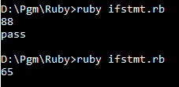
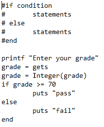
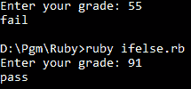
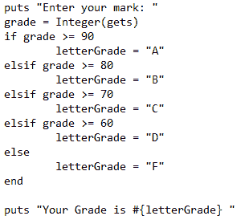
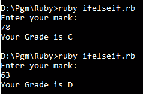
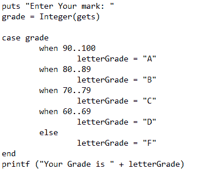

# Ruby 中的决策

> 原文：<https://www.studytonight.com/ruby/decisions-in-ruby>

**决策语句**用于根据某些条件运行一组语句或另一组语句。

## Ruby: `if`语句

让我们使用 ruby 脚本。键入`notepad filename.rb`。这将提示您创建一个新文件，键入 yes。你也可以根据自己的喜好选择其他文本编辑器。

```
#if comparison (relational expression)
#   statements
#end

grade = gets
grade = Integer(grade)
if grade >= 70
    puts "pass"
end

```

这是程序的代码片段。任何以`# sign`开头的语句都是注释。它们是不可执行的语句，用于更好地理解程序。

`If`语句的语法:

```
if (condition)
    statements
end
```

如果条件为真，则执行`if`块内的语句。

运行程序时，提示用户输入等级，转换为`Integer`。如果输入的等级大于 **70** ，则显示`pass`。



您可以看到，当输入大于 70 的值时，它会显示 pass。如果输入的值小于 70，则不显示任何内容。为了处理这个问题，我们需要另一种类型的语句`If - else`。

## Ruby: `if...else`语句

如果条件为**真**，If else 语句执行一组语句，如果条件为**假**，则执行另一组语句。

**If- else** 语句的语法:

```
if (condition)
    statements1
else
    statements2
end
```

如果条件为真，则执行 If 块中的语句，如果条件失败，则执行 else 块中的语句。



如果输入的值小于 70，则显示`fail`。



If else 语句用于双向决策。如果要有两个以上的决策，可以使用`If - Else If`语句。

#### If - Else If 语句:

它用于制作更复杂的分支语句。

**If - Else If** 语句的语法为

```
if (condition1)
    statements1
elsif (condition2)
    statements2
elsif (condition n)
    statements3
else
    statements4
end
```

它计算条件 1，如果为真，它执行语句 1，如果为假，它计算条件 2，如果为真，它执行语句 2，依此类推。如果这些条件都不成立，它就执行语句 4。



执行此程序时，会提示输入标记。根据输入的值，它检查程序中给出的条件，并显示您的`Grade`。



## 鲁比:案例陈述

**If - else if** 语句的替代语句是`Case statement`。它也用于做出多个决策。我们可以使用 Case 语句以结构化的方式做出多个决策。

**Case 语句**的语法:

```
case (expression)
when expression1
    statements1
when expression2
    statements2
else
    statements3
end
```



如果变量**等级**的值在 90 到 100 之间，它会将`A`分配给变量`letterGrade`。同样，当满足相应的表达式时，基于输入执行以下语句。


* * *