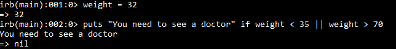
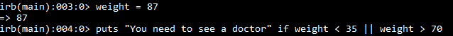
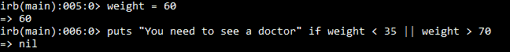
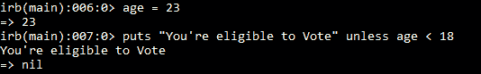

# Ruby `unless`条件

> 原文：<https://www.studytonight.com/ruby/unless-in-ruby>

在我们开始`unless`之前，让我们来看看一些我们之前已经看过的基本东西。我们这样做是因为，它解释了你的问题**为什么除非？**所以，我们看到关于`or`运算符、`if`关键字和`unless`关键字。`OR`运算符返回 true，即使其中一个条件为 true。



在上面的代码中，变量**权重**被赋予一个值 **32** 。然后使用`OR`操作符检查条件。

> 体重小于 35 或大于 70 显示**“需要看医生”**。

现在，检查第一个条件**重量< 35** ，这个条件变为真，因为**重量**的值是 32，如果第一个条件为**真**，则`OR`操作员不检查第二个条件。它只是返回真。

当条件为真时，显示**“需要看医生”**信息。现在，将**重量**的值视为 **87** 。



第一个条件检查**重量< 35** ，条件失败，检查第二个条件**重量> 70** ，条件为真，显示信息。现在，如果**权重**包含 35 到 70 之间的值会怎么样？



像往常一样，检查第一个条件，它失败，检查第二个条件，它也失败。因此不执行`puts`语句。

当我们谈到`if keyword`的时候，它是用来做决定的，是不是执行那组代码。但是，如果想要测试 if 的反义词呢？也就是说，您只想在条件为 false 时执行代码。这就是`unless`出现的地方。



当年龄大于 18 岁时，该程序显示消息**“你有资格投票”**。存储在变量**年龄**中的值是 **23** 。

当检查条件时，它返回 false 并执行 puts 语句。这可能会令人困惑。

```rb
Remember that unless is opposite of if.
```

你，可以把这个代码声明理解为**如果你的年龄不低于 18 岁**，你就有资格投票。也就是类似`puts "You're eligible to Vote" if age > 18`

如果你在阅读`unless`语句时感到困惑，只需以与`if`语句相反的方式阅读即可。

* * *