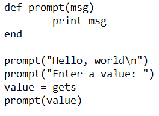
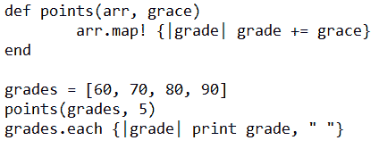
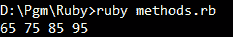

# 不返回任何东西的 Ruby 方法

> 原文：<https://www.studytonight.com/ruby/methods-contd-in-ruby>

**方法**可以返回值，也可以不返回值。没有规定它们必须返回值。这些方法可以用来显示某种类型的消息。



这里有一个名为`prompt`的方法，它显示传递给它的消息。我们可以用这个方法显示短消息，从主程序中抽象出代码。我们通过传递**“你好，世界\ n”**来调用这个方法，它会显示消息。

我们从用户那里获得输入，并将其存储在变量`value`中，我们通过传递变量**值**来调用函数提示，以显示用户输入的消息。这个方法不返回任何东西。

* * *

## Ruby 方法:使用数据结构

使用不返回值的方法的另一个原因是，当您想要创建一个可能必须返回多个值的方法时，或者当您必须对该方法中较大的数据结构进行操作时。



在这个方法中，我们已经声明并初始化了名为`grade`的数组。我们定义了一个名为`points`的方法，它将用户指定的值添加到数组的每个元素中。此法取<two arguments="" an="">阵和**另一变量**。</two>

```
arr.map! { |grade| grade+= grace }
```

这个语句使用了一个叫做`map`的方法。**地图法**属于**类阵**。Map 方法从数组中取出每个元素，并将其存储在某个变量中，使用该变量我们可以执行所需的操作。

这里，对于每个实例，它将数组的元素存储在变量`grade`中，并将值`grace`添加到其中。第一次迭代时， **60** 存储在`grade`中，`grace`的值为 **5** (调用函数时传递)被添加到数组`grades`的元素中。因此，当我们使用`each`迭代器打印等级时，显示等级数组元素的值。



* * *