# 红宝石异常处理

> 原文：<https://www.studytonight.com/ruby/exception-handling-in-ruby>

**Ruby 中的异常处理**涉及到我们如何处理程序中出现的错误。通过错误，我们不是在谈论语法错误，例如拼写错误 **Ruby 关键字**。我们指的是程序无法恢复的错误，程序员不会预料到但它可能会发生。好的程序员预见到它们并采取行动来处理它们。

**异常**由于程序运行时系统无法处理的事情而发生。

## 红宝石:例外的例子

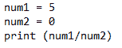

在上面的程序中，我们试图用零除一个数。运行程序时，它会给出以下结果:

出现一个`ZeroDivisionError`是因为我们试图用一个数字除以**零**，而这个操作在 **Ruby** 中没有定义。

让我们看另一个例子:

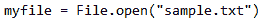

以下是上述程序的结果:

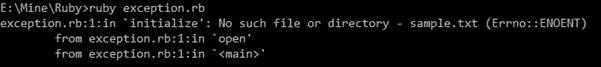

当我们执行这个程序时，我们会得到一个**错误(没有这样的文件或目录)**，因为程序试图打开磁盘中不存在的文件。同样，当我们键入程序时，编译器无法知道该文件是否存在。

在这两个例子中，程序完全终止，这不是我们所期望的。所以，我们必须处理`exceptions`，防止程序崩溃并退出**操作系统**。

* * *

## 鲁比:处理异常

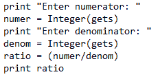

当我们为分母输入 **0** 时，我们得到除以零的结果。

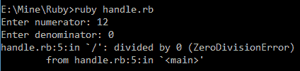

我们必须隔离导致`exception`的代码。因此，如果出现异常，我们可以将控制转移到处理该异常的程序的另一部分。

我们是这样做的:

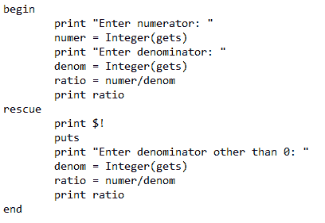

导致异常的代码写在`begin`块中，`rescue`块包含处理异常的代码。当`begin`块中的代码引发异常时，控制自动转移到`rescue`块，然后救援块中的代码执行，程序终止。

异常存储在全局变量`!(exclamation mark)`中。语句`print $!`打印异常。

上述程序的输出是:

当输入分母值 **0** 时，`exception`升高，控制转移到`rescue`块，并执行语句。它打印异常并提示为分母输入另一个值，然后执行操作，程序终止。这里程序不**崩溃**也不**完全停止**。但是这并不是这个问题的完美解决方案，因为当用户再次输入数值 **0** 时，会导致`exception`再次被处理。我们必须使用**循环**以完美的方式处理`exception`。

* * *

## Ruby:处理多个异常

当一段代码引发`multiple exception`时，我们必须以不同的方式处理它。例如，考虑下面的代码

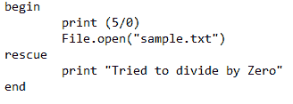

`begin`块包含引发**“被零除”**异常以及**“文件未找到异常”**的语句。我们只处理了**“除零”**异常。

现在，考虑一下这段代码:

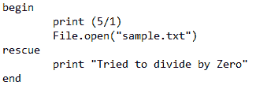

这里处理**“除零”**异常，没有用。因此，在**多个异常**的情况下，我们必须特别注意异常的处理。

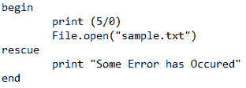

这里处理所有类型的异常。我们可以通过使用异常的名称来处理特定的异常。

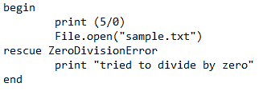

我们通过指定名称处理了`ZeroDivisonError`异常。

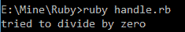

我们也可以有**多个救援区块**来处理每个**异常**。

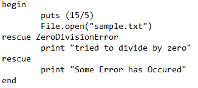

我们有两个`rescue`区块，一个用来处理`ZeroDivisionError`，另一个用来处理未知的`exception`。像`ZeroDivisionError`这样的未发现异常的文件没有特定的异常名称。但是我们可以用`SystemCallError`例外来处理一般的例外情况。

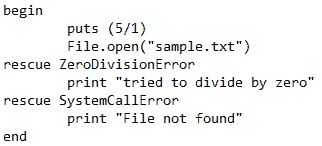

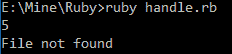

当发生一般异常情况时，控制转移到第二`rescue`块处理`exception`。我们还可以将异常消息存储在变量中。像这样，

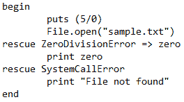

输出结果是:

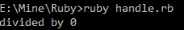

异常`ZeroDivisionError`的实际错误信息存储在变量**零**中，我们打印该变量。

* * *

## Ruby:引发异常

我们可以在 Ruby 中创建自己的异常来处理 Ruby 无法识别的**错误**。**使用`raise`关键字创建用户定义的异常**。

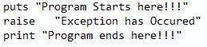

程序的输出是:

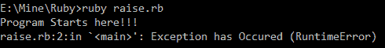

这里，执行第一条语句，我们已经提出了我们的**异常**。但是最后一条语句没有打印出来，因为当**异常**出现时，程序完全终止。

* * *