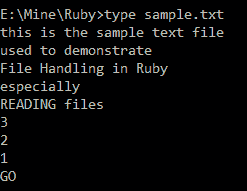
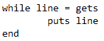
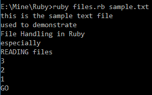
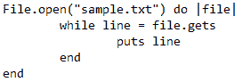
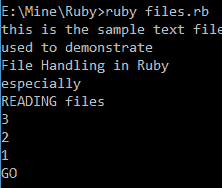
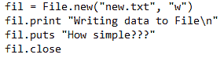
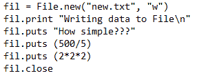
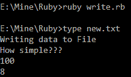

# 红宝石文件处理

> 原文：<https://www.studytonight.com/ruby/file-handling-in-ruby>

在本教程中，我们将学习 Ruby 编程语言中的文件处理。我们将通过简单的代码示例学习如何从文件中读取数据、将数据写入文件、将数据追加到现有文件中。让我们开始吧。

* * *

## 鲁比:阅读文件

**读文件**在 Ruby 中比其他语言非常简单。



这是名为`sample.txt`的文件的内容。现在，我们将阅读这个文件的内容。



这段小代码可以读取任何文件的内容。你可能会困惑于文件名没有**声明**。我们可以在运行程序时在`Command Prompt`中指定文件名。

```
We run by: ruby files.rb sample.txt
```

输出如下:



这是读取文件的一种方法。我们也可以通过在程序中指定文件名来读取文件。像这样:



这里，我们使用`open`方法打开文件。变量**文件**在这里充当**文件处理程序**。因此，对于每一行，我们使用`variable`文件调用`gets`方法，并将其存储在变量行中，使用`puts`方法打印。

程序的输出是:



* * *

## 鲁比:在文件中写作

我们必须使用`new`方法创建一个`File object`来从文件中读取数据或将数据写入文件。



这里 **fil** 是使用`new`方法创建的文件对象。新方法有两个参数，第一个参数是文件的`name`，第二个参数是`mode`。`w`代表文件的**写入模式**。我们使用带有`print`和`puts`方法的文件对象`fil`来直接写入文件。

当我们完成时，我们应该总是`close`文件。完成后总是`close`文件是一个很好的做法。如果我们不关闭文件，有时当我们稍后尝试打开它时，文件可能会损坏。使用`print`和`puts`方法打印的数据存储在**缓冲区**中，**缓冲区**在我们关闭文件时被**刷新**。

程序的输出是:


实际上，当我们执行程序时，什么也不会发生。但是当我们查看**文件**时，内容是写在文件中的。这是另一个例子，





* * *