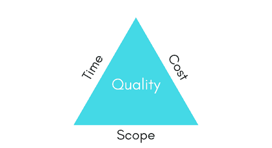
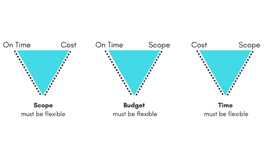

# 游戏项目管理和商业环境

> 原文：<https://www.studytonight.com/3d-game-engineering-with-unity/business-context-of-game>

每一个游戏项目，从预算超过 600 万美元的大型多人游戏开发到小而有趣的游戏(比如糖果粉碎)，都需要有一个合适的商业计划。

在这种情况下，如果你没有一个从游戏中获利的计划，或者如果你的游戏项目没有与任何商业风险挂钩，仍然有一条很好的路线来识别——你为什么开发游戏，以及为游戏的未来设定了什么目标，你的计划。所以可以说，无论如何，业务端也很重要。

* * *

## 项目管理三角

项目管理三角形是分析任何游戏项目的目标和计划的有用工具，其中三角形的 3 个顶点代表:

1.  **预算**
2.  **时间**
3.  **范围**

为了形成一个好的商业计划，你将不得不遵循一些项目管理程序来定义项目的需求以及各种其他方面。

项目管理三角就是这样一个模型，它允许项目经理根据预算、时间和范围因素，预测项目开发步骤在质量方面的公平性。

它有助于项目经理在计划阶段提前了解游戏项目开发过程中可能出现的困难，从而使项目管理更好。

软件开发和/或游戏开发行业有一条商业法则，规定你的项目可以实现一个项目的三个目标中的任意两个，但是没有办法同时实现这三个目标。

有一些项目开发人员没有理解这样一个事实，即三个项目三角形属性中一次只能有两个是可能的，这导致项目错过了所有这三个目标！因此，我们必须记住这样一个事实，我们必须努力使我们的游戏在任何两个指定的三角形属性中变得更好，并将第三个属性提升到一个适度好的水平。

* * *

## 三大制约因素

1.  **Budget**:

    每个项目都有一个附加成本，在设定的预算内完成项目很重要。有些时候，由于最初开发阶段的项目管理不善，按时完成项目变得困难。在这种情况下，额外的资源(更多的开发人员)被雇佣来处理项目，这增加了项目成本/预算。

2.  **Time**:

    当我们在一个项目上工作时，时间起着非常关键的作用，因为最后期限必须遵守。如果项目延迟完成，直接影响(增加)项目预算。

3.  **Scope**:

    任何项目的范围都是在需求和规划阶段预先决定的。项目团队在开发阶段开始之前就知道项目的可交付成果，并且必须在设定的期限内完成它们。另一方面，项目经理必须有能力处理需求/范围中影响时间和成本的任何变化。

### 质量

质量不是项目管理三角的三个约束之一，但它是最终目标。毕竟，每个团队都希望生产出最优质的产品。有些人混淆了质量和成本，认为只有高成本才能产生高质量的产品。这在某种程度上是正确的，因为没有好的资源，整个项目永远不会成功。

* * *

### 使用项目三角形

项目三角形的三条边由三个约束之一表示。通过对实际项目的研究和实验发现，一个项目遵守所有 3 个约束是非常罕见的，这意味着项目在设定的预算内按时完成，并且项目的所有可交付成果都已完成。

在现实生活中，如果一个项目开发计划在**时间**和**成本**方面保证了完成期限，那么它将错过项目的**范围**。同样，如果一个项目必须在设定的**预算**内完成，并且完成**范围**，那么它将花费比决定更多的**时间**。最后，如果你相信*“时间就是金钱”*这句话，并希望在**时间**截止日期之前完成开发，完成**范围**，那么你将不得不投入更多的资源，这将影响**成本**。

开发人员可以遵循市场上许多不同的应用开发策略之一，如*瀑布*、*螺旋模型*、*迭代*等。但是没有一个列出的开发技术和模型会神奇地解决所有的问题。在项目开发阶段，你迟早会面临这样一个问题:如何根据业务模型和三个约束有效地管理你的项目。遵循项目三角的可能结果可以是:

*   **在预算和时间上:**意味着你必须接受质量的牺牲
*   **高质量和预算:**意味着你必须接受一场迟到的比赛
*   **高质量准时:**表示你必须接受额外支出

* * *

* * *