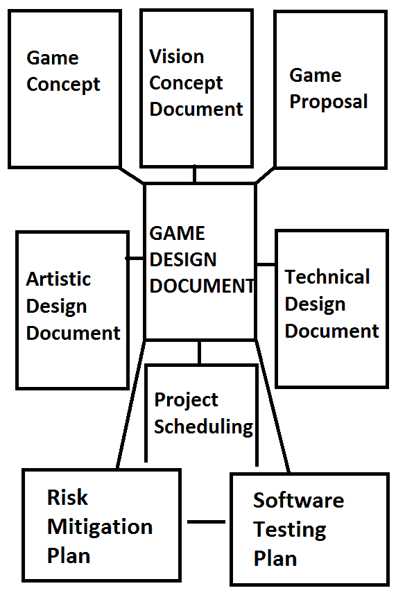

# 技术设计文件和游戏设计文件

> 原文：<https://www.studytonight.com/3d-game-engineering-with-unity/tdd-and-gdd>

本教程将讨论技术设计文档和游戏设计文档，教你如何讲述你将在游戏中使用的技术特性和元素。本课将向您介绍一份技术设计文档和一份整体游戏设计文档，以及在创建游戏时整合技术计划所涉及的工作。

* * *

## 面向对象设计

现代数字游戏可以被认为是大型软件项目，由数千行代码到数百万行代码组成。**面向对象设计(OOD)** 应运而生，处理大型软件项目。GDD 或 TDD 是牢记 OOPs 的所有要求以及其中的实施细节(技术细节的 TDD 和整个游戏细节的 GDD)。

* * *

## 技术设计文件

技术设计文档为您团队中的软件工程师提供了一个蓝图，以实现和编码您游戏的功能。技术设计文档将让您的开发人员指定需求是什么，它们应该如何实现，以及实现所需的工具和技术。软件的结构设计和技术设计文档之间的联系是技术设计文档比软件架构图范围更广，细节更少。

TDD 通常包含以下信息:

1.  所有功能的列表。
2.  游戏引擎的选择
3.  高级图表
4.  关于 3D 对象、地形、场景的详细信息。
5.  物理引擎的使用
6.  游戏逻辑与人工智能
7.  视听细节和规格
8.  建立关系网
9.  交付平台&在系统上运行游戏的硬件/软件要求。

这里我们有一个非常好的 TDD 示例(由一些学生为他们的大学项目设计): [TDD 示例](https://computergamesmmu.files.wordpress.com/2012/10/technical-design-document-final.pdf)

* * *

## 游戏设计文档(GDD)

任何人说 ***【签入设计文档】*** 的时候，基本都是指游戏设计文档(GDD)。本文档详细解释了游戏中的所有角色、阶段或关卡、游戏机制、视图和场景、故事情节、各种菜单和选项等。

游戏设计文档是一组文档的一部分，这些文档指定了您正在创建的游戏的完整细节。所有这些文件，统称为生产计划:

*   **概念或愿景文件(提案)**
*   **艺术设计文件**
*   **技术设计文件**
*   **项目进度表**
*   **软件测试计划**
*   **风险缓解计划**

游戏设计文档可以内部分为三个子部分，其中文档的每个部分描述了游戏项目的一个特殊阶段。描述了从概念到设计到生产的三个发展阶段*。这些是:*

### 概念文件

概念文件是一份建议书，其中规划了整个目标以及工具和人力资源需求。这有助于清晰地设定我们(或整个团队)的目标，以便每个目标都在同一页上。

它也是合作伙伴的销售工具，他们会将产品带到市场上进行销售和宣传。在这个阶段，你也可以开始使用一个微型原型，这将会给你一个实验和修改你的想法的机会。

在这份文件中，诸如:故事情节叙述，类型，目标受众，最引人注目的特点，成本，开发时间等信息被指定。

* * *

### 设计文件

在这个游戏设计文档中，艺术家、动画师、声音工程师和开发者之间有一个活跃的讨论。这些文档经常被用来通过添加注释、分享想法等来消除混乱。游戏设计和开发所需的工具和软件也是用适当的预算编写的。

设计文档是为了确保最终产品与您预期的一样。

* * *

### 生产文件

这是游戏设计文档的最后阶段，在这里，生产管理人员和开发人员的团队共同创建最终产品。大部分的游戏设计者只是为了一些特定的游戏设计目的而被外包。而游戏制作团队和游戏开发者纯粹是该公司的内部人力资源。这个阶段还保留了关于开发人员数量以及分配给他们的工作的细节。

该文档充满了时间管理图表、任务数据库、预算电子表格、技术规范等。

这里我们有一个非常好的 GDD 例子(由一些学生为他们的大学项目设计): [GDD 例子](https://computergamesmmu.files.wordpress.com/2012/10/game-design-document-final.pdf)

* * *

* * *