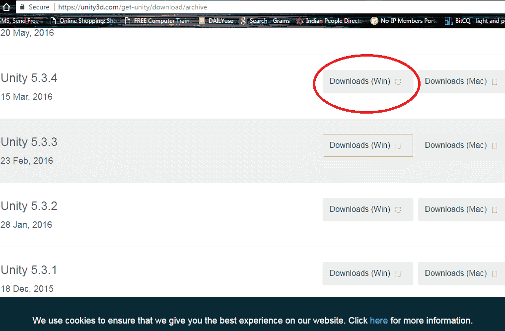
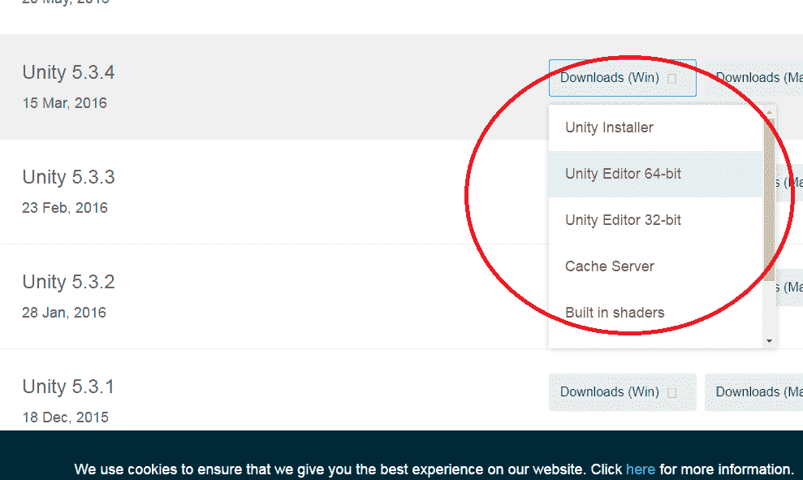
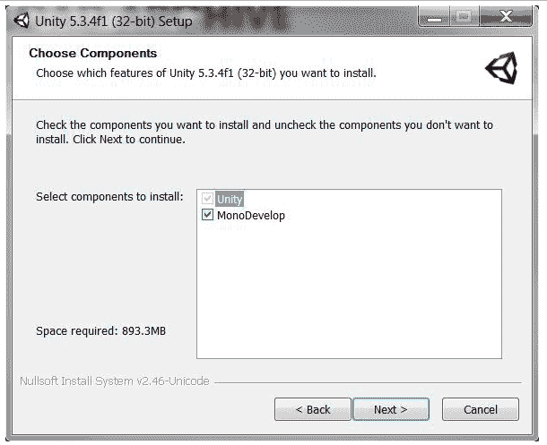
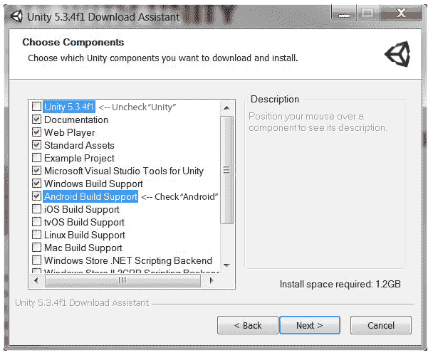
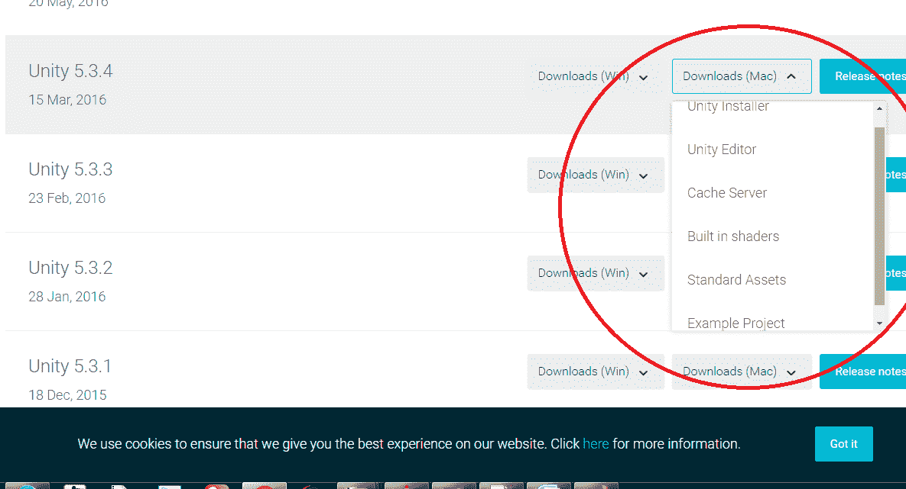
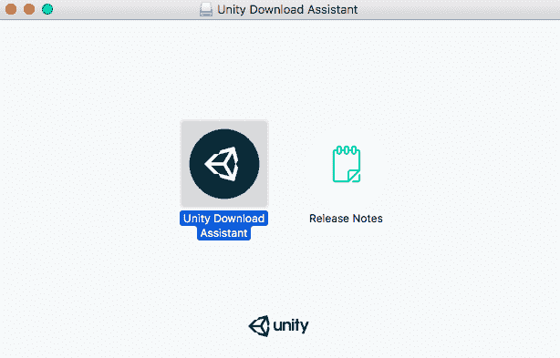
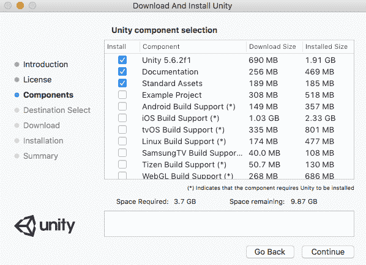

# 安装 Unity3D 游戏引擎

> 原文：<https://www.studytonight.com/3d-game-engineering-with-unity/installing-game-engine>

游戏开发需要使用一个 IDE 和一两种编程语言。这个 IDE 将是你开发游戏项目的游戏引擎。在本教程中，我们将学习如何安装/设置并使用 **Unity 游戏引擎**将其用作您的游戏开发环境。

## 为窗口设置 Unity3D 环境

要使用 Unity3D，您必须从 Unity 的官方网站下载安装程序。为此，只需遵循给定的步骤。

1.  从链接下载并安装 Unity 编辑器:[unity3d.com/get-unity/download/archive](https://unity3d.com/get-unity/download/archive)

    

3.  点击下载(适用于 Windows)按钮，将显示如下选项的下拉列表:

    

    选择您需要的选项并开始下载。

5.  安装程序使用下载助手，并有您需要遵循的详细说明。 **Unity 下载助手**是一个重量轻、体积小的可执行文件(。exe)程序，该程序将允许您选择要下载和安装的 Unity 编辑器的组件。

6.  选择要安装的编辑器组件，然后点击**下一步**按钮。

    

8.  下一步，如果不确定要安装哪些组件，可以保留默认选择，点击**下一步**继续，按照安装者的说明进行。

    在下面显示的截图中，一些复选框是:

    1.  用于 Unity 的 Microsoft Visual Studio 工具(是必需的)。
    2.  Windows 构建支持(如果你也计划制作基于 Windows 手机的游戏)。
    3.  安卓构建支持(如果您计划使用 Unity3D 制作基于安卓的游戏)。
    4.  休息，保留默认选中的复选框。

    

10.  现在，让该安装程序下载并在您的电脑上安装 Unity，然后在安装完成后启动 Unity 游戏引擎。

* * *

## 在 macOS X 上安装 Unity

我们可以使用命令行在 Mac OS X 上安装 Unity3D，也可以使用 Unity 下载助手。

#### 使用下载助手安装

1.  从链接下载苹果电脑的**Unity 安装程序**文件:[unity3d.com/get-unity/download/archive](https://unity3d.com/get-unity/download/archive)

    

3.  将下载一个`.dmg`文件名**unitydownloadstant**。双击它开始安装过程。

    

    双击 Unity 下载助手图标开始安装。

5.  同意条款和条件，点击**继续**。然后你会被要求选择要安装的软件包，坚持默认的，如果你是初学者。

    

* * *

### 使用命令行安装 Unity

1.  从链接下载苹果电脑的**Unity 编辑器**文件:[unity3d.com/get-unity/download/archive](https://unity3d.com/get-unity/download/archive)

2.  单独的 Unity 编辑器作为`.pkg`文件提供，您可以使用命令行安装。

3.  这将被安装到指定目标卷上的文件夹*/应用/Unity*中。首先键入以下命令-

    ```cs
    sudo installer [-dumplog] -package *Unity.pkg* -target /
    ```

    这里 **Unity.pkg** 是我们在第一步下载的文件名。

4.  现在，要安装标准素材，将其安装到指定卷上的文件夹*/应用/Unity/标准素材*中，请使用以下命令-

    ```cs
    sudo installer [-dumplog] -package *StandardAssets.pkg* -target /
    ```

    文件 **StandardAssets.pkg** 可以从我们在步骤 1 中下载 **Unity Editor** 文件的同一个下拉列表中下载。点击选项**标准素材**。

5.  要在指定卷上安装位于文件夹*/用户/共享/Unity/标准-素材*中的示例项目，命令将是-

    ```cs
    sudo installer [-dumplog] -package *Examples.pkg* -target /
    ```

    文件 **Examples.pkg** 可以从我们在步骤 1 中下载 **Unity Editor** 文件的同一个下拉列表中下载。点击选项**示例项目**。

* * *

## 素材商店

基于 Unity 的游戏开发者也可以从素材商店获得素材。只需遵循下面给出的链接:

参观:[Unity 素材店](https://docs.unity3d.com/Manual/AssetStorePublishing.html)

* * *

* * *