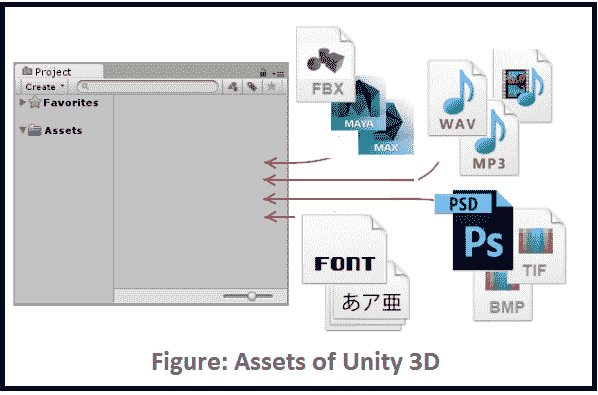
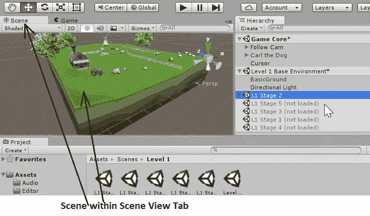

# Unity3D 的游戏项目元素

> 原文：<https://www.studytonight.com/3d-game-engineering-with-unity/elements-of-unity3d>

有一组元素(或组件)共同组成了一个游戏，使用 Unity 引擎开发。这些元素在使游戏具有互动性以及增加能够生动表达游戏目标的功能方面发挥着重要作用。让我们讨论一下这些元素及其功能。

## 素材

素材是可以在游戏或项目中实现的项目项的表示。素材可以是从 Unity 外部导入的文件，如 3D 模型、音频和声音文件、图像(jpeg、gif、png 等)、纹理或 Unity 支持的任何其他文件类型。还有一个可以在 Unity 中生成的素材类型集合。

这类素材的例子有:

*   动画师控制器
*   音频混频器
*   渲染纹理
*   图片
*   动画文件

* * *

## 项目

Unity 中的项目是一个文件夹或位置，它保存着你完整的游戏项目以及它的所有相关资源，可能还包含库和资源子文件夹。

* * *

## 包装

这是一个预编译的游戏素材集群。Unity 附带各种包装。

* * *

## 游戏对象

游戏中的每一个物体都是一个游戏物体。从技术上来说，它们不会给你的游戏项目添加任何功能，而只是充当像**变形**、**光**、**脚本**和**刚体**等组件的持有者。您将在接下来的章节中了解它们，并以小项目的形式实际实现。

* * *

## 成分

组件是基本的构建模块，即游戏中对象及其活动的具体细节。它们充当每个游戏对象的功能块。默认情况下，每个游戏对象都有一个自动设置的**变换组件**，因为它规定了游戏对象在 Unity 环境中的位置，以及如何旋转和缩放。

* * *

## 景色

场景可以被定义为基础或父对象，在那里你可以放置你的游戏对象来制作一个游戏级别。一个或多个场景(又名关卡)通常被放入一个游戏中，它们被链接在一起，你的观众会通过清除一些特定的目标来穿越或通过。所有这些目标和游戏的逻辑都将被放入在场景中与玩家一起运行的方法中。

* * *

## 预制的

预设是放置在项目视图窗口中的可重用游戏对象组件。预设可以被引入到任何数量的场景中，你想引入多少次就引入多少次，每个场景。你可以创建这些预置的实例，链接到主预置。项目中有多少实例并不重要；当您对 Prefab 进行任何更改时，您可以可视化应用于所有其他实例的更改。您将在后面的章节中使用预设，同时开发小游戏项目。

* * *

## 建设

这是一个导出的改编你的游戏，将包含所有必要的场景播放在特定的平台。

* * *

* * *