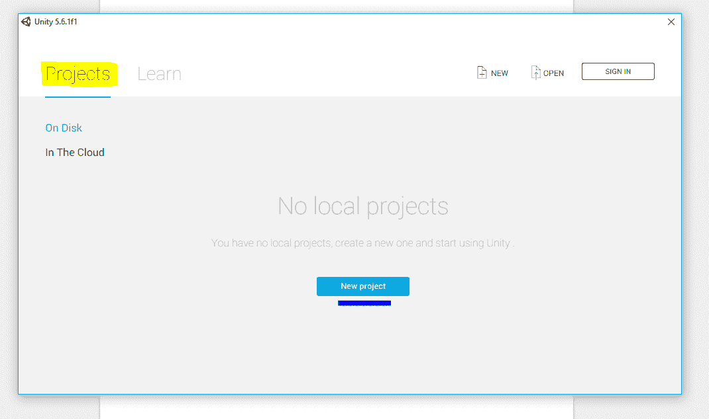
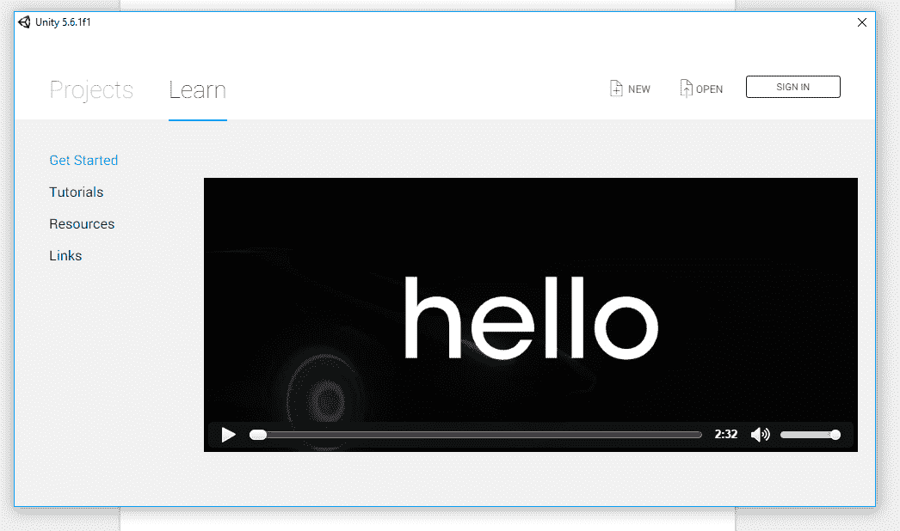
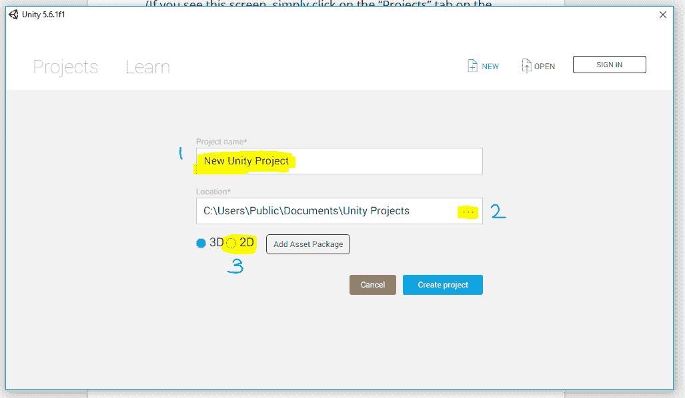
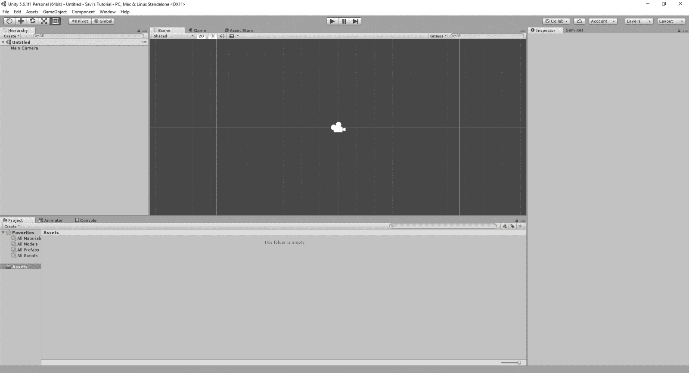
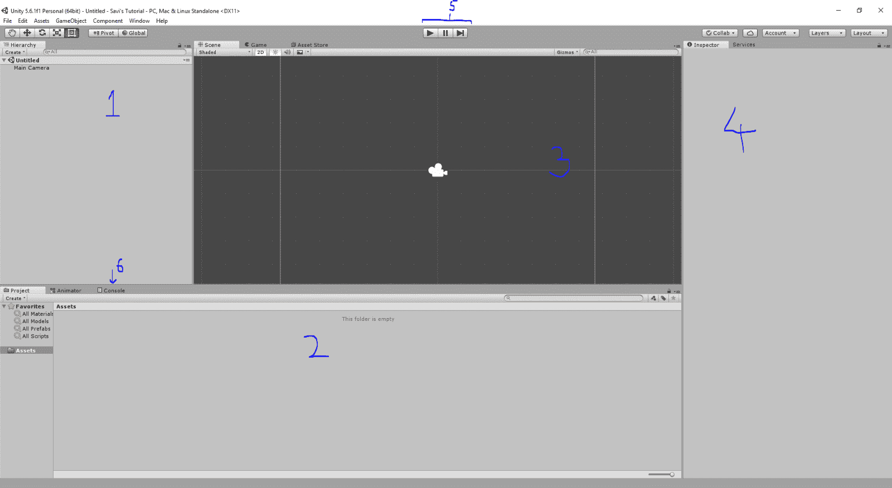

# 使用 Unity3D 创建第一个项目

> 原文：<https://www.studytonight.com/game-development-in-2D/hello-unity>

开始做游戏你一定很兴奋吧！让我们不要再等了，点燃团结。闪屏后，您应该看到的第一件事是:

如果您看到此屏幕，只需点击左上角的**项目**选项卡。

点击**新建项目**，应该会看到如下画面。

您可以通过在标有 <u>**1**</u> 的字段中输入名称*来为您的项目命名一个***，您也可以通过单击标有 <u>**2**</u> 的**三个点**来选择项目在您的计算机上的存储位置。**

 **现在，由于我们将在本系列中处理 2D 游戏设计，我们将继续点击单选按钮，在标有 <u>**3**</u> 的字段中显示 **2D** 。这告诉 Unity 我们想在 2D 奥运会上工作，因此它相应地建立了我们的基础项目。点击按钮**创建项目**，开始滚动！我们在做第一场比赛。

* * *

## 探索你所看到的

我们标记了**的字段称为**层级**。这是您将在场景中添加*对象*、*相机*、*光源*等类似的东西的地方。稍后我们将在场景和项目中进行更多解释。**

 **接下来我们有场号 <u>**2**</u> 。这是你游戏的**素材**存放的地方。素材是游戏使用的所有外部资源。这包括图像、字体、脚本、场景、文本文件、XML 文件、音乐、声音、视频等。

场号 <u>**3**</u> 为**景景**。在那里你会看到场景本身实际发生了什么。您还将在这里添加您的素材，拖动它们，进行更改，所有这些都在场景视图中。

在<u>**【4】**</u>我们有**检查员**。这是您将*修改*、*添加*和*移除*组件以及您在场景中添加的对象的属性的地方。它现在看起来是空的，但是我们很快就会到达那里。

编号 <u>**5**</u> 是一套**播放按钮**。这些按钮用于在编辑器中启动您的游戏，因此您可以测试您的工作。你甚至不用担心游戏在出错的情况下崩溃，Unity 一遇到它无法处理的错误就会停止游戏。

并且，在编号**处，我们有**控制台选项卡**。如果您熟悉编程，您会知道所有的输出消息、错误、警告和调试消息都显示在这里。这对 Unity 来说是完全一样的，只是输出消息的处理方式与您想象的有些不同。**

 *** * *

* * *******