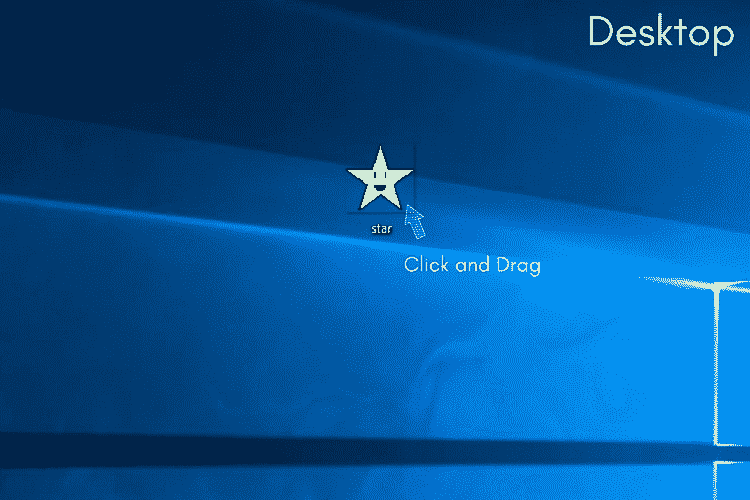
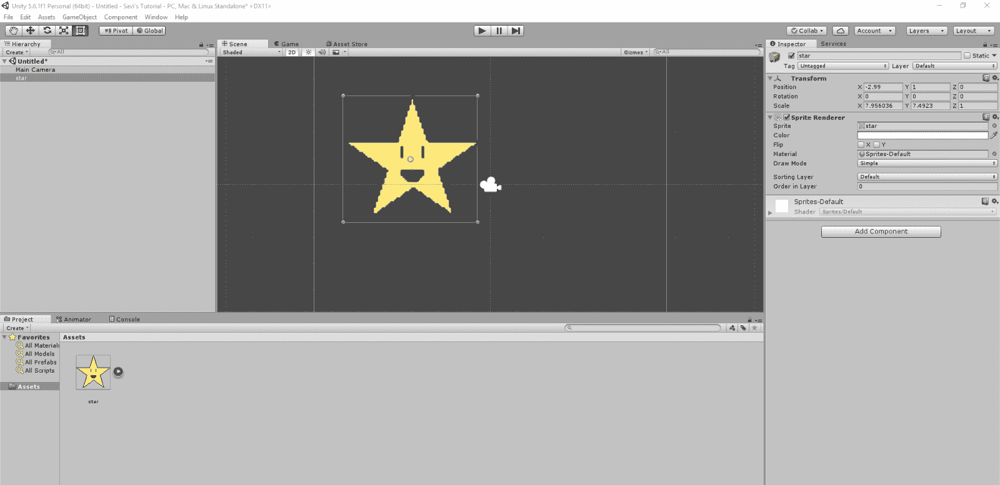
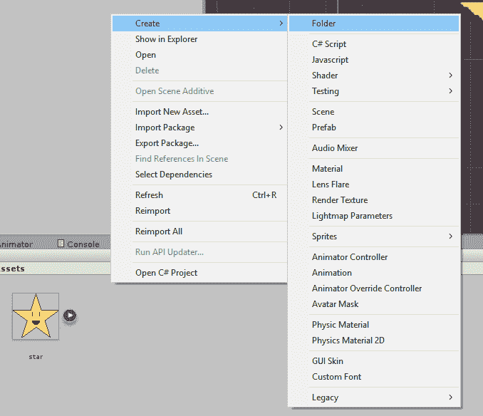

# 在 Unity3D 中添加和管理素材

> 原文：<https://www.studytonight.com/game-development-in-2D/adding-and-managing-assets>

我们看到我们的游戏现在看起来很空。让我们解决这个问题。抓住一个你想让你的球员的形象。例如，我们将使用这个快乐的小星星。

我们的**桌面**上有**石凡星**，因此我们可以轻松访问他。要将他添加到 Unity 中，我们只需将图像拖放到我们的**素材**中。

到目前为止，我们所做的只是将**星**图像添加到我们的项目中，但没有添加到当前场景中。要将其添加到场景中，只需将图像从**素材视图**拖放到**场景视图**或**层次结构**(在场景视图中添加的对象会自动添加到层次结构中)。

当你在 2D 工作时，你添加为图像的对象被存储为*精灵*。**精灵**是 Unity 记住你用这些图像在 2 维空间而不是 3 维空间工作的方式。

您只添加了一个图像，并且您一定已经注意到 Unity 窗口中不同视图的一些变化。首先，似乎最值得注意的是**检查器视图**不再是空的，下面列出了**雪碧渲染器**和**变换**等选项。这些被称为**组件**，它们很重要。

你看，*变换*是 Unity 中任何存储一些最基本数据的对象的属性。**基础数据**下有什么？

*   每个对象都有一个位置。
*   它有一个旋转角度。
*   它有一个比例因子。

这些值告诉 Unity 一个对象在游戏世界中的确切位置和方式。尝试将这些属性的`X`、`Y`和`Z`元素更改为不同的值，看看会发生什么。

**精灵渲染器**是一个处理屏幕上精灵(即图像)的组件。它有一些属性，如渲染的**图像、图像的**颜色**(白色表示图像未修改)、**翻转**和**排序图层**。目前，我们不想改变雪碧渲染器中的任何东西，所以让我们保持原样。**

如果你现在点击**播放**按钮，你会看到你添加的图像现在在游戏中可见！哇哦！但是，有一个你不太记得添加的蓝色背景。这是因为背景是由场景中的摄像机添加的。如果您想更改背景颜色，只需点击**层级**中的**主摄像头**，然后点击*检查器*中*摄像头组件*的**背景**属性更改背景颜色。

到目前为止，我们只添加了一项素材。但是随着您的项目越来越大，并且您添加了越来越多的素材，管理您所有的素材可能会变得困难。这就是为什么确保你的素材从一开始就被合理地组织起来可以减少很多未来的麻烦(相信我，我一直是受害者)。

您可以将您的素材组织到文件夹中，右键单击*素材*部分的任意位置，然后选择，**创建→文件夹**。

* * *

## Unity 是如何工作的？

让我们脱离在 Unity 上的工作，深入了解 Unity 实际上是如何与兜帽下的游戏一起工作的。

想象你是一个完全正常的人。你不是一个游戏设计师或任何东西，你只是去你的日常业务。

想象有一天你去看一场戏。你买票，你在座位上坐下，也许在路上买些零食，心情享受夜晚。

真正的乐趣从这里开始。如果是一部剧，你对它有什么样的期待？肯定有一个舞台，在那里一切都会发生。还有，一部剧不是没有装饰好的舞台，人们在舞台上移动的剧，对吗？谁会愿意盯着一个空荡荡的舞台看一个小时，更不用说付钱了？你可以说舞台上有很多东西，很多物件。

大多数戏剧通常是分场景的。可能会有这样一个场景:一片黑暗的森林，有巨大的树木，一个湖，周围有仙女。城堡内部可能还有另一个场景，到处都是黄金铺成的，天花板上挂着吊灯。我接下来要说的是，在一部剧中有不同的场景，舞台上的物体可能不同，甚至可能相同(人们可以使用山中或矿井附近的岩石的相同切口)

Unity 只是**一个巨大的舞台剧**。Unity 中的一切都发生在场景中。你的游戏的标题屏幕将是一个场景，结束信用将是一个场景，你的游戏将发生在一个屏幕(或其中几个)，见鬼，甚至你的选项菜单将是一个场景。Unity 中的每一个场景都是用物体制作的，很像常规舞台剧中的一切。你在舞台表演场景中安排硬纸板剪贴，而你在 Unity 场景中安排音频源、光源、播放器、相机和地图。

戏剧中的演员通常有剧本，告诉他们在戏剧中的任何给定时间应该做什么、表演什么和说什么。我们也可以称演员为对象，对吗？毕竟人类也是物体。类似地，Unity 场景中的一些或所有对象可能都有脚本，告诉他们做什么，什么时候做。制作这些脚本，包括编写代码(通常是`C# `或`JavaScript`)并将它们附加到您希望代码影响的对象上。例如，如果我们的场景中有一艘宇宙飞船，我们会写一段代码，用箭头键移动它。我们会将这段代码保存为一个脚本，然后将该脚本附加到作为您的宇宙飞船的对象上(请记住，Unity 场景中的所有东西在某种程度上都是一个对象)。

这就是团结的全部，真的。你只是在做一个巨大的互动舞台剧。就像你通过学习 Unity 成为一名游戏设计师一样，你也成为了一名舞台剧协调员！(嗯，不完全是)

* * *

* * *