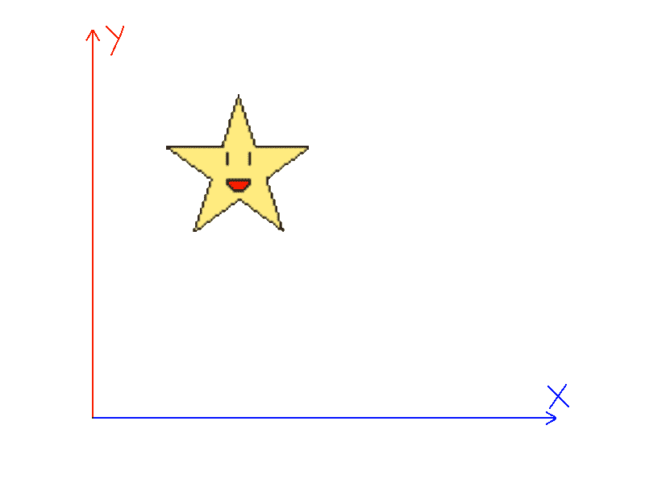
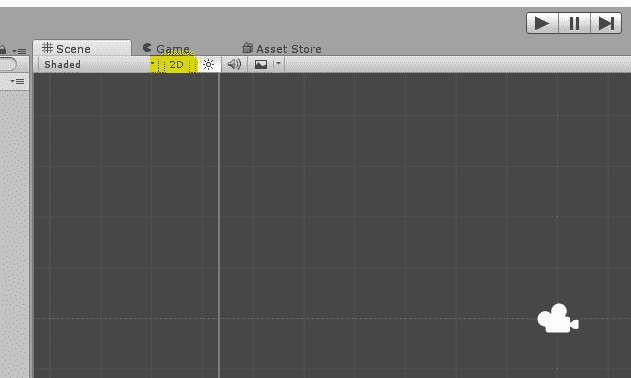
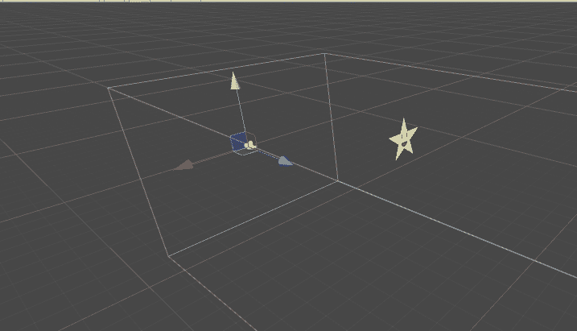
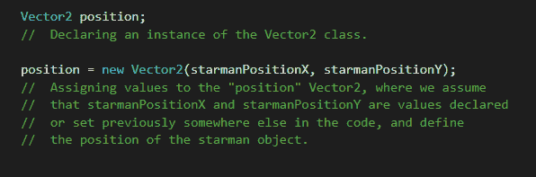

# Unity 引擎物理组件

> 原文：<https://www.studytonight.com/game-development-in-2D/2D-physics-components>

大多数游戏的核心基础之一，无论是 2D 还是 3D，都是其中涉及的物理。物理学不需要像波动方程和流体动力学那样复杂。甚至你在制作游戏时所做的最基本的事情都涉及到物理。

例如，移动玩家通常包括在玩家的物体上增加一个力，或者将其移动一定的量。让它漂浮或淹没在水中，或者只是滑下斜坡，也与物理学的工作原理有关。

Unity 中的物理，以及一般的游戏设计，真的很重要。很多时候，是游戏的物理特性导致了`"bugs"`或者`"glitches"`。其中的一些例子是 OOB(越界)和裁剪错误。

在这一节中，我们将研究如何在游戏中为对象添加物理属性，以及如何让它们按照我们想要的方式工作。我们还将了解更多关于引用对象和公共的魔力。

* * *

## 统一:从 2D 物理学开始

顾名思义，2D 意味着二维工作。因此，我们并不真正关心第三维(或 Z 轴)发生了什么。)就我们而言，我们只需要关心 X 轴(水平方向发生了什么)和 Y 轴(垂直方向发生了什么)。

事实上，在我们开始之前，这里有一个小东西你可以试试。在 Unity 中，尝试单击场景视图左上角的 2D 按钮。

你会看到这样的东西:

你会注意到 Unity 实际上只是让我们认为我们在 2D 工作，而实际上我们只是在制作一个平面的 3D 游戏！我们实际上可以利用 Unity 为我们自己所用的这个技巧，我们将在稍后发现灯光效果时看到。

好了，该开始了。以下是我们将合作的内容:

*   向量
*   刚体和力
*   对撞机和碰撞
*   你的第一场比赛

我们将在这里解释什么是单位矢量和力，从下一课开始，我们将从**刚体**和**碰撞**开始。

在 Unity 中，我们有两个脚本类，名为 **Vector2** 和 **Vector3** (实际上，也有一个 Vector4，但我们暂时不太关心这个)。 **Vector2** 和 **Vector3** 就是你可以称之为`containers`的若干数值，最常见的是浮点值，用末尾的数字表示。所以， **Vector2** 是两个单个值的容器， **Vector3** 是 3 个值的容器。当我们在 Unity2D 工作时， **Vector2** 类变得突出，虽然 **Vector3** 还有一些用处。

由于这可能对一些读者来说有点混乱，让我们用一个例子来理解。假设我们有一个物体的位置，比如石凡星。他在 2D 游戏世界中的位置由一个 X 值(即水平方向)和一个 Y 值(垂直方向)来定义。

在为 Unity 编写代码时，我们使用一个保存两个变量的**向量 2** 来代替石凡星位置的两个单独的值。这些变量既可以定义，也可以设置为其他用户定义的变量。

> **注意:**不用担心你的 C#代码写在哪里，我们很快会给你演示如何添加自己的脚本。

当然，一个**向量 2** 并不真正局限于定义一个位置。每当您处理修改(或定义)某个对象的位置、旋转或方向的值时，向量就有了最佳用途。

**注意:**如果你在安装 Unity 的时候没有安装 Visual Studio，你的脚本很可能会在 Unity 的默认界面 **MonoDevelop** 中打开。不要担心代码在颜色或类似的东西上看起来与你的不同；只要你跟上形势，你就会没事的。

* * *

* * *