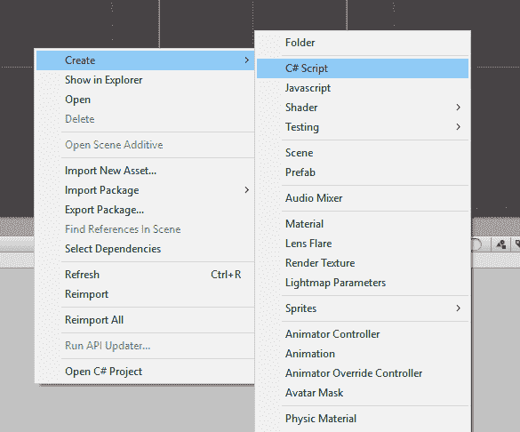
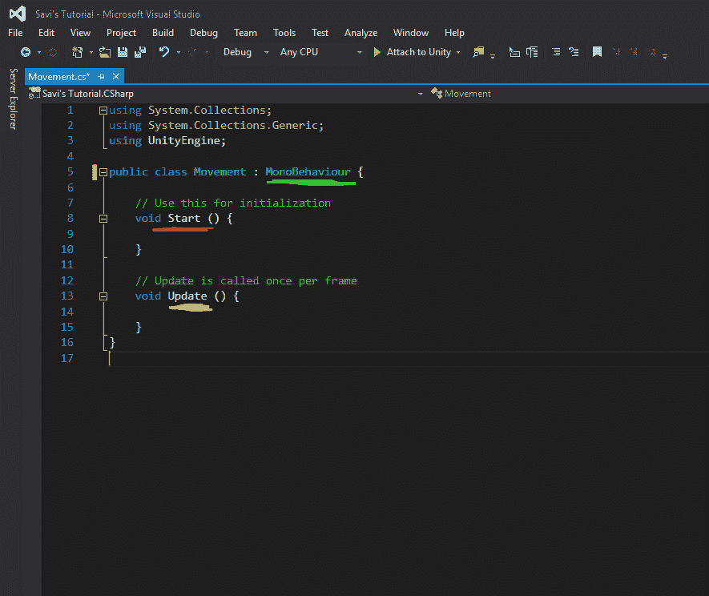
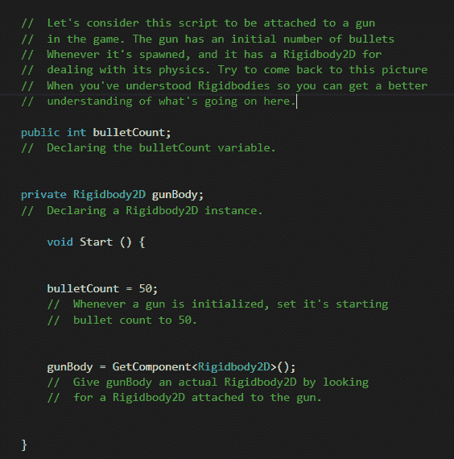

# 向 Unity 游戏项目添加 C# 脚本

> 原文：<https://www.studytonight.com/game-development-in-2D/basics-of-unity-script>

当然，在我们的游戏中有不动的物体并不能真正让我们的游戏变得有趣。那么，让我们来了解如何使用 Unity C# Script 来移动游戏对象，从这里开始，我们将转向刚体。

首先，让我们创建一个脚本。为此，**在**素材**区域右键**，转到**创建→ C# 脚本**。

这将创建一个新文件，默认名称为**新行为脚本**。将脚本重命名为**运动**，然后按回车键。这将在素材部分创建一个名为**运动**的新脚本。双击打开它，让我们看看会发生什么。暂时不要在这个脚本中键入任何内容。

既然我们现在进入脚本，让我花一些时间来提及 Unity 将场景中的对象称为**游戏对象**。所以，从现在开始，我们将场景中使用的对象称为*游戏对象*。石凡星现在将被称为游戏对象，而不是对象。

您会注意到，我们刚刚创建的脚本带有两个预定义的方法，并且您的脚本自动继承自一个名为`MonoBehaviour`的基类。让我们一个一个地看完这些，试着理解它们的意思。

* * *

## 整体行为

这是 Unity 中所有脚本继承基本属性的基类。这个类定义并提供了许多有用的值、方法和属性，您可以在脚本中使用它们，为您省去许多麻烦。例如，MonoBehaviour 包含游戏对象(`gameObject.transform.position.x/y/z`)位置的定义，这意味着您可以直接使用这些值，而不必定义它们。

您通常不应该去掉继承声明，因为大多数时候您需要这个父类提供的东西来完成您的工作。MonoBehaviour 还包含`Start()`和`Update()`方法的定义，我们将在前面解释。

* * *

### `Start()`方法

这个方法由脚本运行一次，在游戏对象初始化和启用的最开始。这意味着对象一激活，该方法就运行。如果场景打开时某个对象已经处于活动状态，则初始化和启用过程将被视为同时进行。当您需要声明组件或设置值时，此方法非常有用。例如，您可以使用 Start 方法来设置枪的子弹数量的初始值。您也可以使用它来访问附加到任何游戏对象的其他组件，我们将在后面看到。

查看下面的代码示例，并仔细阅读注释以理解它。

* * *

### `Update()`方法

Unity 每秒调用该方法 60 次(或者，每秒 60 **帧**)。这是代码的主要**动作**通常发生的地方。例如，检测输入，增加力量，增加分数，繁殖敌人或子弹等。

MonoBehaviour 类给了我们很多其他预定义的方法。您实际上可以在 Unity 文档中找到这些方法的列表。它们有各种各样的用途，但目前，为了简单起见，我们将只坚持这两种方法以及我们自己定义的方法。

* * *

* * *