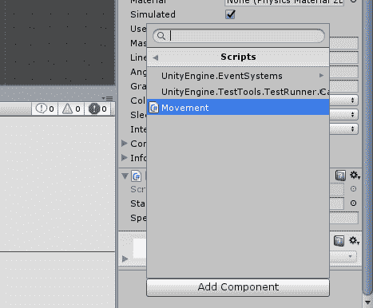
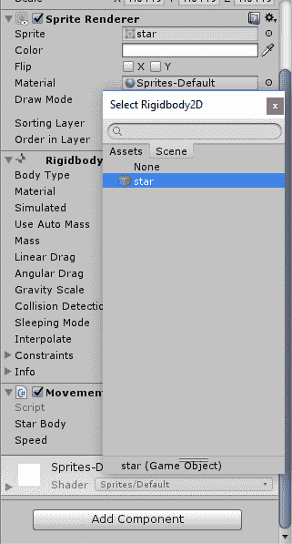
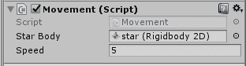

# Unity：使用 C# 脚本移动游戏对象

> 原文：<https://www.studytonight.com/game-development-in-2D/making-player-move>

现在你已经知道了什么是刚体以及如何连接它们，让我们继续把它们投入实际使用。我们能想到的解释刚体工作的最好方法之一是让玩家使用箭头键移动。

为此，打开我们之前制作的**运动**脚本。如果你删除了它，或者你正在做一个干净的新项目，只需创建一个新的脚本并命名为**运动**。在你的 IDE 中打开它，你会看到我们之前解释过的熟悉的`Start()`和`Update()`方法。

现在，让我们详细看看每一行代码，并尝试理解这里发生了什么。不要担心，如果你不能一下子掌握全部，你会随着我们的进步而学习。

```cs
using System.Collections;
using System.Collections.Generic;
using UnityEngine;

public class Movement : MonoBehaviour {

    public RigidBody2D starBody,
    public float speed;

    void start()
    {
        // use this function to initialize
        // anything
    }

    // Update is called once per frame
    void update()
    {
        starBody.velocity() = new Vector2(Input.GetAxisRaw("Horizontal")*speed, Input.GetAxisRaw("Vertical")*2);
    }

}
```

**线→ *公共刚体 2D 星体*** :简单声明`Rigidbody2D`的一个实例，命名为`starBody`。记下`public`访问修饰符，我们很快就会谈到这一点。

**线→ *公共浮点速度*** :简单声明一个名为`speed`的浮点值。再次，记下这里使用的`public`访问修饰符。

**线→ *虚空开始()*T5】:注意这个方法是完全空的。我们甚至没有给`speed`和`starBody`赋值。如果我们不给这些变量一些东西，你会期望得到到处都是的 **NullReferenceExceptions** 或**unassigned referenceexceptions**和普遍的混乱，对吗？然而，这种方法仍然神秘地空着。**

**线→** (【内部更新方法】 ***星体.速度=新矢量 2(输入。GetAxisRaw...)* :** 这就是主**动作**围绕你的游戏角色进行的地方。让我们深入研究这一行，好吗？前几个字是`starBody.velocity =` 的意思，我们给`starBody`当前引用的刚体指定一个速度。而`new Vector2(...)`意味着刚体的速度被定义为`Vector2`，其中输入参数分别是沿 X 轴和 Y 轴的速度。

现在，对于这个代码中的实际魔法:`Input.GetAxisRaw("Horizontal")`和`Input.GetAxisRaw("Vertical")`这是什么东西？好的，输入类提供了 MonoDevelop 来处理输入。它有你所谓的输入轴的定义，定义为**水平**和**垂直**。

基本上是游戏在检测**水平**和**垂直**输入轴对应的输入，根据你按的按钮设置为`-1`、`0`或`1`。因此，当您按下**右箭头键**时，这意味着您正在将横轴的值设置为`1`。一旦放开箭头键，该轴上的值就会跳回 0。现在，在游戏语言中，它只是意味着，

> *按下右箭头键时，每帧水平移动字符 1 个单位。*

将它保持在 1 意味着该物体将行进得相当慢。因此，我们将该值乘以速度浮动，这样说，

> *以 1 倍的速度移动角色，因为我们知道任何东西乘以 1 都是相同的值，所以我们实际上是说当按下轴按钮*时，以这个速度水平移动角色。

**注意:**默认情况下，标准键盘上的轴按钮是**向上**和**向下**箭头，纵轴是 **W** 和 **S** ，横轴是**左**和**右**箭头，横轴是 **A** 和 **D** 。

继续，这一行的内容基本上是下面的句子:

> *给这个刚体一个游戏世界的速度，其中水平速度为(横轴*速度)，垂直速度为(纵轴*速度)*

现在，为了完成，保存这个脚本并返回到 Unity。要将脚本附加到对象上，只需将其拖放到该对象上，或者转到**添加组件→脚本**。



现在，还记得我们写脚本的时候是如何要求你记下`public`访问修饰符的吗？看看脚本的组成部分。


您会注意到，随着脚本的执行，Unity 自动生成了两个字段，用于输入刚体 2D 和速度浮动。这就是团结的魔力。在编辑器中可以看到公开声明的`Values`和`class`实例，您可以在其中进行调整，而不必一直查看代码。

要为第一个字段设置刚体 2D，请单击字段旁边带有点的小圆。这将打开场景中可用刚体的列表，您可以使用。目前，由于我们在整个场景中只有一个刚体，请单击列表中出现的刚体。



你这么做是为了什么？还记得我们写脚本的时候是怎么不给`starBody`变量赋值的吗？这是我们指定的地方。我们可以用一个简单的用户界面来完成组件和值的赋值，而不必在代码中编写它。

接下来，在下一个字段中设置速度值。不要把它定得太高，否则你的角色可能会在你看到他去了哪里之前就飞走了。这是一个问题，因为我们的相机是固定的，所以把它放回视野将成为一项说起来容易做起来难的任务。我们建议将速度设定在`5`左右。

完成后，您的脚本组件应该是这样的:



现在点击播放按钮，让我们看看会发生什么。如果一切顺利，你会注意到你现在可以用箭头键移动你的角色。太棒了。

* * *

* * *