# Unity：使用 Prefab 在运行时创建游戏对象

> 原文：<https://www.studytonight.com/game-development-in-2D/basic-fundamentals-of-game-objects>

既然您已经了解了使用 Unity 的一些基本知识，并且已经自己制作了一两个游戏，那么让我们试着深入挖掘一下，好吗？毕竟我们刚刚刮到了冰山的表面，那就是 Unity！

首先，是时候和石凡星说再见了。到目前为止，他一直是我们旅途中的好朋友，但对于我们前方的道路，我们需要更复杂一点的东西，而一颗仅仅在 13 秒钟内在 Paint.NET 匆忙画出的星星并不真正符合这个描述。

那么什么符合这个描述呢？我猜是这个...

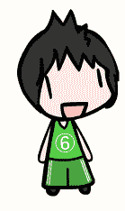

现在，我们将理解与 Unity 相关的更基本的概念，更专注于**游戏对象**和**预设**。

* * *

## 理解预设和实例化

好吧，所以`Prefab`这个词看起来有点吓人，不是吗？别担心，不是，事实上，它是游戏设计师实时创建**游戏对象**时最好的朋友之一。那么到底什么是预制构件呢？嗯，一个 Prefab 实际上是一个特定游戏对象的蓝图或模板。我们知道一开始理解起来有点混乱，所以让我们举一个非常基本的例子。

想象一下，我们正在制作一个基本的太空射击游戏，小家伙，这是一个敌方角色。

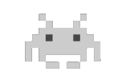

现在，如果我们想在 Unity 中用我们的主角和一个敌人构建一个游戏场景，它看起来会像这样:

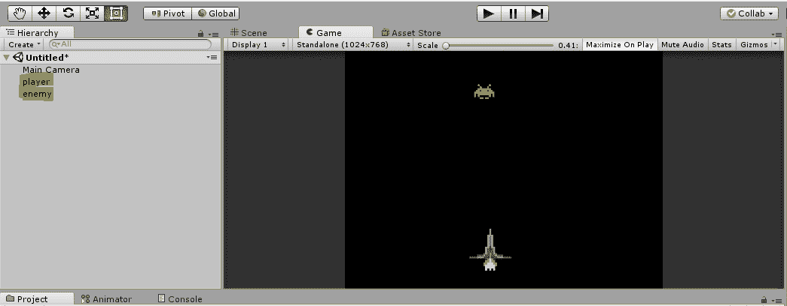

当然，当你有一个敌人时，这是非常好的，但是如果你想要很多敌人呢？不是 2 或 3，假设是 15 或 20。作为一个学习 Unity 的初学者，你可能会沿着这些思路思考一些事情:*通过创建副本多次使用同一个素材。*

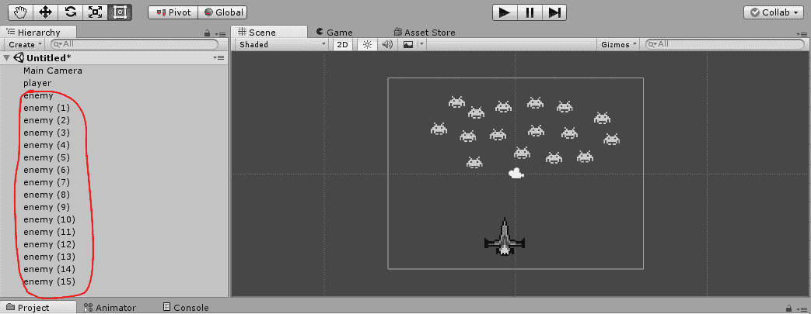

好吧，我们认为这也是一个可行的解决方案，但是如果每个精灵都有自己的人工智能和自定义属性呢？你真的愿意为每一个精灵增加一个**刚体**和**对撞机**吗？如果你想在游戏中产生更多的敌人，而不是在场景制作过程中呢？我们真的不建议把每个敌人都放在自己身上，否则你的游戏可能会变得非常可预测和无聊。

如果我们可以定义一个敌人，并让某个东西生成这个敌人的副本，因为他们都是一样的呢？嗯，正是**预制**解决了这个问题。

一个**预设**是我们想要生成的游戏对象的定义，它会在你需要的时候，在你需要的地方生成一个定义好的游戏对象的精确副本。事实证明，当你需要动态生成游戏对象，比如子弹、外星人、硬币等时，这非常有用，因为 Unity 完成了这里的大部分工作，使游戏对象立即可供我们使用。

* * *

## 运行时使用 Prefab 生成游戏对象

让我们利用这个。我们将从一个非常简单的练习开始，每次按空格键时*生成一个框。首先，让我们创建一个**spaowner**。现在我们真的不需要一个空间所有者来拥有图形，只需要一个**空的**游戏对象就可以了。所以，你要做的就是在层次中右键点击，点击**创建空**。*

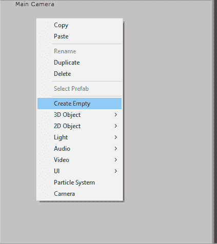

您应该会看到一个新的**游戏对象**出现在层次结构中。但是屏幕上什么也没有出现。因为这是一个**空**游戏对象，它没有任何组件，除了一个**变换**。请记住，精灵渲染器也是一个组件。因为这个游戏对象没有这样的组件，所以它根本不渲染任何东西。很简单，就在那里。空游戏对象对于像空间所有者和参考点这样的东西非常有用，因为它们在游戏中是不可见的。

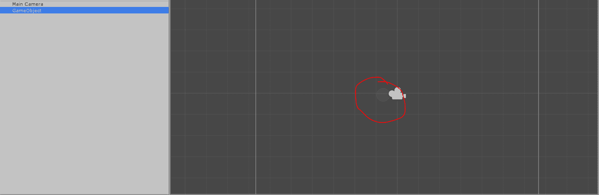

你可以通过点击层次结构中的游戏对象来检查空的游戏对象在哪里。然后它会用一个**半透明的圆圈**显示游戏对象的位置。不管怎样，让我们把我们的空游戏对象重新命名为**生成器**，这样我们就知道它到底是什么了。我们将留给你去找出如何重命名游戏对象，这很简单。

现在，让我们创建实际的盒子来生成。使用默认的精灵菜单创建一个精灵，我们在前面的教程中使用它来生成封锁。(其实不一定非得是盒子，可以用任何雪碧。为了简单起见，我们使用默认的方形精灵)。

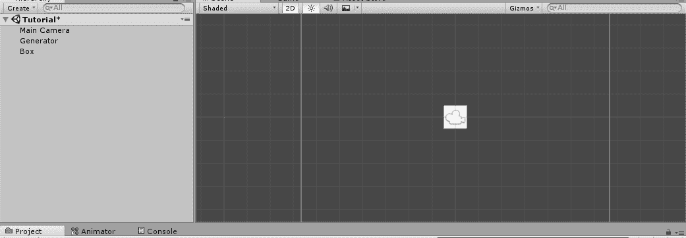

现在，让我们给盒子添加一个`Rigidbody2D`，只是为了给它一个权重，这样它在生成时就会掉下来。这意味着我们不会修改我们的重力尺度。(或者，如果您是持久类型，请将其设置为零以外的任何值)。点击播放按钮测试你的盒子。如果它掉下来，你就在正确的轨道上。

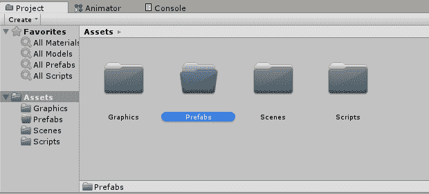

现在，还记得你刚开始的时候是怎么把石凡星加入场景的吗？您将精灵从**素材**拖到了**层级**。

创建一个**预制**是这个过程的逆过程。您将现有游戏对象从**层级**拖动到**素材**。然后，Unity 会在您拖到的文件夹中生成该游戏对象的预设。因此，既然我们想制作一个盒子的模板，我们就把盒子精灵从层次结构拖到我们的 Prefab 文件夹中。

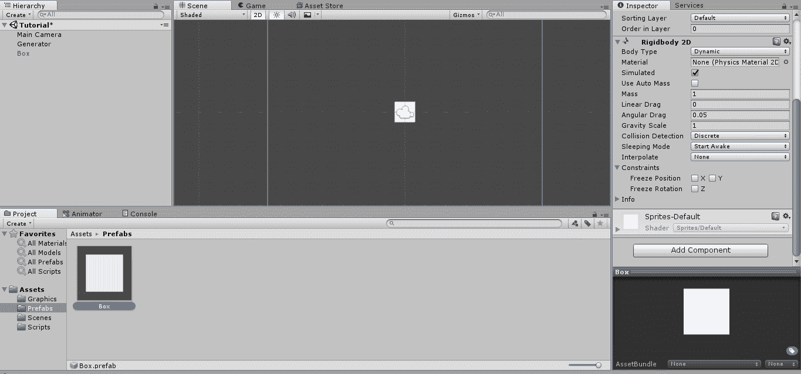

你应该看到一些新的东西出现在你的预设文件夹中。它与盒子的图像完全相同，但它出现在一个灰色的容器中。那是你的预制屋！很简单，不是吗？现在，只要按下**空格键**，我们就需要为**生成器**编写一个小脚本来生成这个**预制**的实例。为了在您按空格键时生成一个框，下面的代码是完美的。

```
using System.Collections;
using System.Collections.Generic;
using UnityEngine;

public class Generator : MonoBehaviour
{
    public GameObject boxToGenerate;

    void update() 
    {
        // When spacebar is hit
        if(Input.GetKeyDown(KeyCode.Space))
        {
            // instantiate the box object
            Instantiate(boxToGenerate);
        }
    }

}
```

你记得如何创建一个新的脚本并重命名它，对吗？如果没有，请查看上一个教程。我们也将我们的脚本命名为`Generator`。

注意这里怎么少了`Start()`方法。去掉空的`Start()`和`Update()`方法是你应该做的事情，在 Unity 开发的时候非常推荐。

*   **7 号线:**你现在应该熟悉这条线了。这是对 Unity 的一个声明，要求它生成一个 gameObject，通过在我们前面看到的编辑器中创建那个槽。

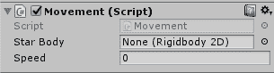

*   **Line 11:** This has some interesting stuff going on. The `Input` class, as we know, contains definitions for various methods of providing input to the game. This includes *mouse buttons*, *gamepad keys* and *keyboard keys*.

    在我们的例子中，我们使用`GetKeyDown`方法。这将检测某个键何时被按下。键盘的其他方法有`GetKey`(检测一个按键，然后按住)和`GetKeyUp`(检测刚刚释放的按键)。在`GetKeyDown`方法中，我们有一个枚举作为参数，`KeyCode`枚举。它基本上是键盘上所有键的枚举列表。

*   **12 号线:**如你所猜，这是我们一直称之为魔法主线。`Instantiate`方法是`GameObject`类中的一个方法(注意大写的 G)，它有一些重载的变体。然而，所有这些重载的主要参数是要实例化或生成的实际游戏对象。由于我们想要生成我们在编辑器中插入的盒子，我们将提供`boxToGenerate`作为参数。只需保存这个脚本，并将其附加到编辑器中的生成器游戏对象中。

现在，要填充出现在脚本属性中的**框以生成**槽，我们只需点击圆点，并选择我们的**框的预设**。或者，你可以直接将预制好的盒子拖放到插槽中。这是在告诉 Unity 要生成什么。 **boxToGenerate** 只是 gameObject 变量的名字，那个变量还是要有东西的。

在新场景中保存您的作品，然后点按“播放”。如果一切顺利，只要您按空格键，就会生成一个新的框。

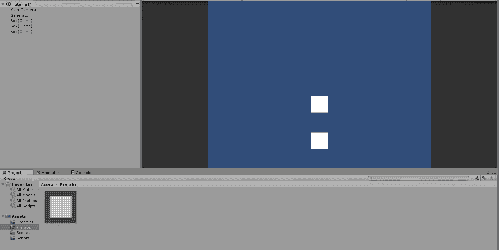

如果您注意层次结构，您会注意到您每次都会生成一个新的盒子(克隆)。即使他们从屏幕上掉下来，他们仍然在等级中。

这里我们应该警告你不要生成太多，因为它们会无限期地下降，太多的可能会开始滞后于计划。稍后我将解释如何摧毁物体。

* * *

* * *