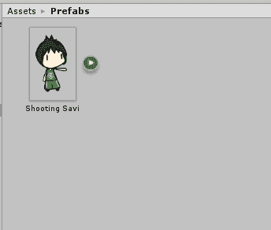
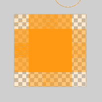
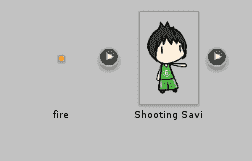
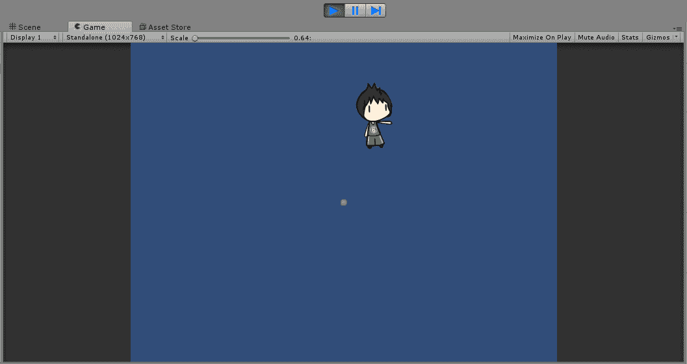
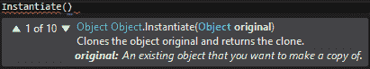
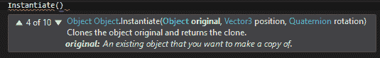
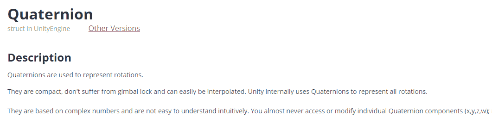
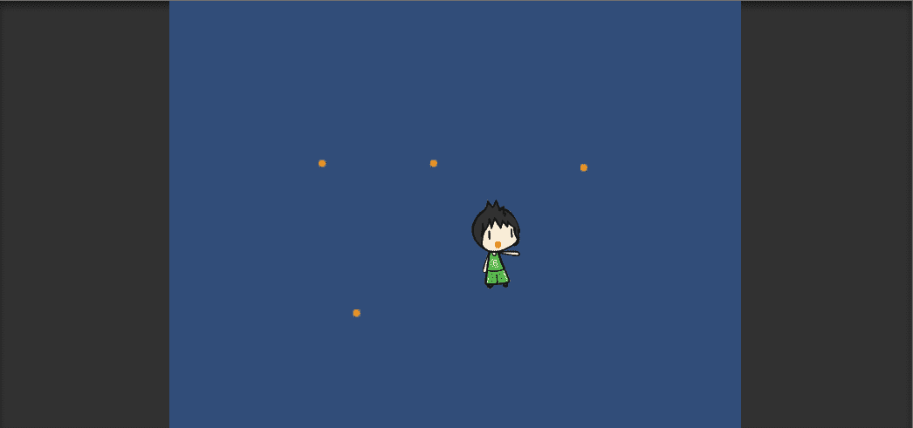
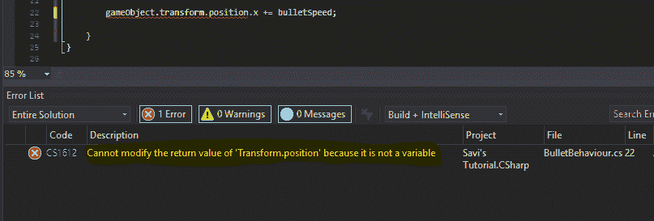

# 统一:预置实例化，使其移动并设置速度

> 原文：<https://www.studytonight.com/game-development-in-2D/more-complicated-instantiation>

当然，我们可以将实例化用于更好的用途。让我们试着从一个会移动的玩家身上发射一颗子弹。首先，让我们让我们的小伙伴进入游戏。



接下来，我们会给他点东西拍。一个小火球怎么样？





太好了。现在，让我们用箭头键让他移动。我们已经知道如何做到这一点，所以我们将跳过这一部分。现在，让我们用那个火球创造一个**预制**。再次将火球拖放到*层级*中，使其成为活动的**游戏对象**，然后将其拖回*资产*中，从中生成一个预设。

**注:**如果存在预制体，一个很好的测试方法是简单地查看*层级*中**游戏对象**的名称。有预设的游戏对象会有蓝色的名字。

现在，我们将继续创建一个名为`Shooter`的新脚本。

```
using System.Collections;
using System.Collections.Generic;
using UnityEngine;

public class Shooter : MonoBehaviour
{
    public GameObject fireball;
    public RigidBody2D body;
    public float speed;

    void Update() 
    {
        body.velocity = new Vector2(Input.GetAxisRaw("Horizontal")*speed, Input.GetAxisRaw("Vertical")*speed);

        // When spacebar is hit
        if(Input.GetKeyDown(KeyCode.Space))
        {
            // instantiate the fireball object
            Instantiate(fireball);
        }
    }

}
```

到目前为止，这只是我们为**移动**和**实例化**编写的代码的组合。没什么太复杂的。如果你保存这个脚本并把它附加到你的主角身上，你现在可以移动他，如果你按下*空格键*，火球就会出现并落下。



* * *

## 设置新预制构件的位置

子弹并不是真的在做什么，只是下落(你可以通过将`gravity`属性的值设置为`0`来让它们停止下落，就像我们之前做的那样)，它们总是在屏幕中间产卵，而不是从我们主角的手(手掌)中产卵。你能猜到为什么会这样吗？

那是因为我们只是告诉游戏，只要你按空格键，就会生成一个火球克隆体，就是这样。它不知道在哪里生成，所以游戏只是在坐标`(0, 0)`处生成，也就是游戏世界的死点。

我们如何解决这个问题？好吧，让我们探索`Instantiate`方法的重载(一个方法的其他变体)，我们可能会得到一些帮助。



以上是我们到目前为止一直使用的`Instantiate`方法的默认重载(变体)。让我们滚动重载，看看哪一个可能有用。



上面的重载(变异)方法取`Object` (gameObject)的一个实例作为参数生成，取`Vector3`的一个实例作为参数定义在哪里生成！太好了。不要担心`Quaternion`参数值，我们将简单地将其设置为 0。

现在让我们稍微偏离一下我们的游戏，大致说说`gameObject`。任何普通游戏对象都有一个**位置**属性，该属性存储为 2D 元素的`Vector2`(或 3D 元素的`Vector3`)。该位置属性可通过以下方式访问:

```
// For X
gameObject.transform.position.x
// For Y
gameObject.transform.position.y
```

这两个值都存储为`float`。如果我们可以为我们的主角(射击萨维)读取这些值，我们就可以计算出当按下空格键时我们角色的确切位置，以发射火球，然后我们在那里产生一个新的火球。我们每次都需要捕捉主角的`x, y`坐标，因为我们的角色可以用箭头键移动。

所以，让我们用重载方法代替默认的`Instantiate()`方法。用角色脚本中的这个替换旧的`Instantiate()`方法并保存:

```
using System.Collections;
using System.Collections.Generic;
using UnityEngine;

public class Shooter : MonoBehaviour
{
    public GameObject fireball;
    public RigidBody2D body;
    public float speed;

    void Update() 
    {
        body.velocity = new Vector2(Input.GetAxisRaw("Horizontal")*speed, Input.GetAxisRaw("Vertical")*speed);

        // When spacebar is hit
        if(Input.GetKeyDown(KeyCode.Space))
        {
            // instantiate the fireball object
            Instantiate(fireball,
                new Vector3(gameObject.transform.position.x, gameObject.transform.position.y, 0),
                new Quaternion(0, 0, 0, 0));
        }
    }

}
```

这里到底发生了什么？我们新的重载方法接受三个参数:

1.  **游戏对象:**要生成的游戏对象。
2.  **矢量 3:** 在 3D 空间中的何处生成游戏对象。
3.  **四元数:**与游戏对象在三维空间中的旋转相关的数据。

现在，由于我们在 2D 环境中工作，我们简单地考虑任何三维值，即`Z`值为`0`。你会注意到我们在代码中使用了`gameObject.transform.position`。术语`gameObject`只是指脚本当前附加到的任何游戏对象。这意味着在我们的例子中，游戏对象指的是我们的主角射击萨维。

*   **20 号线:**我们新建一个`Vector3`，由三个元素组成。这三个元素是火球产生位置的`X`、`Y`和`Z`坐标。

我们在这里做的基本上是告诉游戏在玩家按空格键时的确切位置生成一个新的火球精灵。我们将四元数值(取 4 个参数，一个`x`、`y`、`z`和一个附加的`w`值)设置为零，因为它们非常复杂。事实上，即使是官方的 Unity 手册也说，除非你知道自己在做什么，否则你不应该真正与他们打交道。



为什么我们首先要创建一个四分之一(四元数)？你一定在想。好吧，看看我们再次使用的重载方法的输入参数。如果你现在运行游戏，你现在会看到火球在角色所在的地方产生，就在你按空格键的时候。



* * *

## 创建新的预设时移动它们

嗯，我们已经走得更远了，但是火球还是静止的。好像我们在到处制造萤火虫。那么我们如何让火球自己移动呢？为此，让我们通过创建一个名为`Fireball`或`FireballBehaviour`的新脚本(记住，名称中不要有空格)来重新开始编写脚本。

```
using System.Collections;
using System.Collections.Generic;
using UnityEngine;

public class FireballBehaviour : MonoBehaviour
{
    private float fireballXValue;
    public float fireballSpeed;

    void Start()
    {
        // getting the initial position where prefab is created
        fireballXValue = gameObject.transform.position.x;
    }

    // Update is called once per frame
    void Update() 
    {
        // adding speed value to the X axis position
        // value
        fireballXValue += fireballSpeed;
        // setting new X value to position
        gameObject.transform.position = new Vector2(fireballXValue, gameObject.transform.position.y);
        }
    }

}
```

看到我们在这里做什么吗？我们使用了一个名为`fireballXvalue`的私有浮动变量(我们并不想让其他脚本看到这个`x`值)来存储火球位置的`X`值。

当我们初始化一个新的火球时，这个新的火球运行它的`start()`功能(记住，当`gameObject`激活并启用时，`start()`功能在最开始运行一次)。我们正在做的是在初始化时将`fireballXvalue`的值设置为对象位置的`X`值。这将确保火球从我们发射它的点开始移动，而不是从死点开始。

接下来，看一下`update()`法。第一行只是将速度变量添加到每一帧的`fireballXvalue`中。下一行很重要。如果你仔细阅读，你可能会奇怪为什么我们不能直接修改`position.x`和`position.y`的值，而是使用变量。如果我们试图直接修改 x 和 y 位置的值，我们会得到一个编译错误。



**注:**我们尝试直接更改第 22 行位置的`x`值。

取而代之的是，我们在每一帧的空间中将位置设置为一个新的`Vector2`位置。每一帧的数值都会改变，使得子弹在游戏时间内移动。以下是脚本对每个实例化的子弹(火球)所做的工作:

1.  将名为`fireballXvalue`的全新变量的值设置为项目符号的初始位置。
2.  每帧将`speed`的值加到`fireballXvalue`上。
3.  将每帧子弹的位置设置为`fireballXvalue`和原来相同的`Y`值(我们不希望火球垂直移动，只希望水平移动)。

保存这个脚本，让我们返回 Unity。现在，既然我们希望每个新的火球都有那个脚本，为什么不简单地将其添加到**模板**中呢？为此，只需点击*火球的**预制**T5。您会注意到，您可以像普通的活动游戏对象一样更改组件和属性。然后，您在这里所做的更改将应用于从该预设生成的每个新游戏对象，这意味着如果您将脚本附加到火球预设，每个生成的火球都将拥有该脚本，就像它在预设中一样。*

所以，在不浪费任何时间的情况下，将`FireballBehaviour`脚本附加到火球预制体上，并设置速度值(如果你想看到子弹实际移动而不是飞出屏幕，我们建议在`0.4`周围做一些事情)。耶！如果我们用空格键射击，我们的火球会不断向右移动。

看看我们如何利用实例化来获得优势？它非常适合创建场景制作过程中不需要的游戏对象，而是在实际游戏中需要的对象。有些人相当疯狂，可以使用一系列 for 循环和对`Instantiate()`方法的调用来生成整个级别。当然，如果你好奇的话，这是你应该自己尝试的。

* * *

* * *