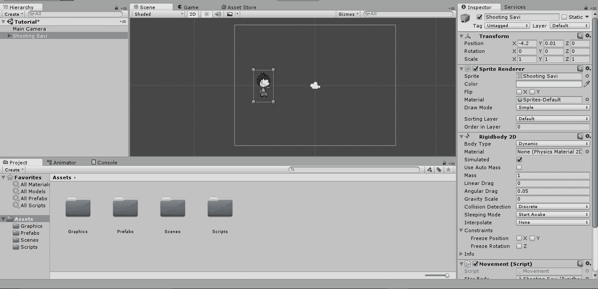
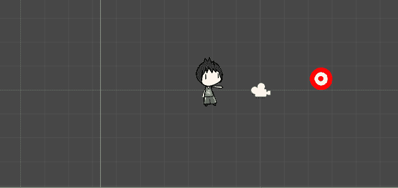
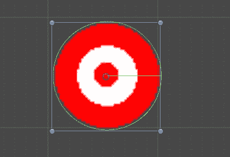
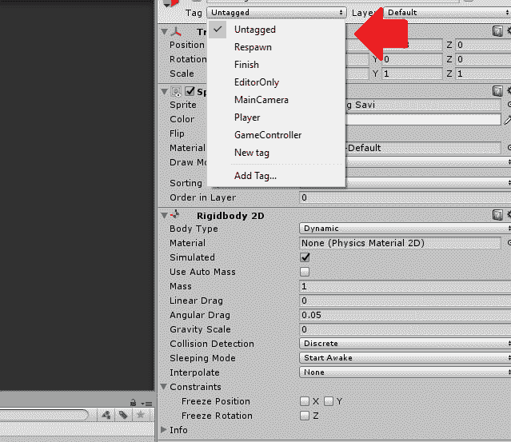
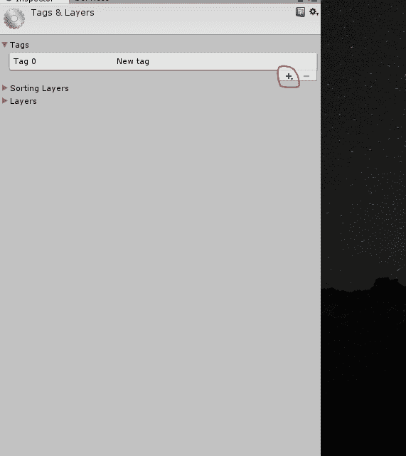
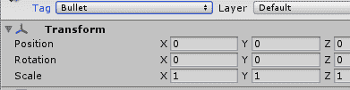
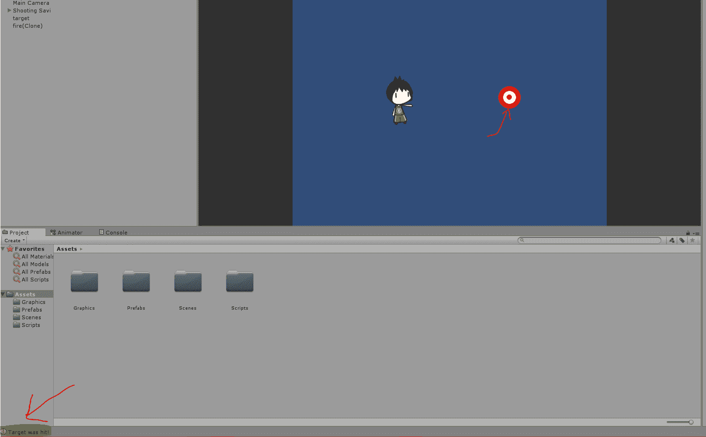
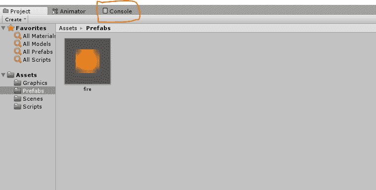
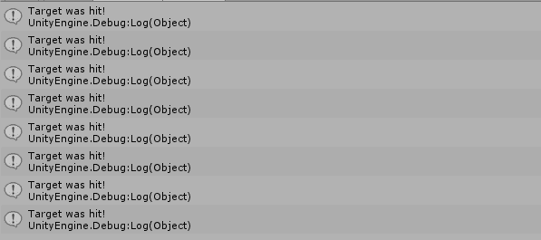

# Unity：用 CollisionEnter 检测碰撞

> 原文：<https://www.studytonight.com/game-development-in-2D/detecting-collisions>

在本教程中，我们将学习如何使用简单的 C# 脚本检测两个游戏对象之间的冲突，以及如何在对象冲突时执行一些代码。

我们还将学习如何使用**游戏标签**以及它们为什么重要，我们还将学习**如何使用 Unity 的控制台**来输出定制的消息，这些消息对我们作为开发人员和测试人员来说非常方便。

首先，让我们打开目前正在进行的项目:



一切似乎都井井有条。现在，让我们给我们的子弹(火球)添加一个新的 **2D 盒子对撞机**，这样它就可以探测碰撞(记住，**对撞机**实际上是定义碰撞的东西，而不是*刚体*)。

想看看如何给游戏对象添加对撞机？你会在这里找到它。

**<u>这里有一个快速的问题:</u>** 如果我们想要所有生成的子弹(火球)都有一个盒子对撞机，我们要修改什么？**预制**当然。在预制构件上安装一个 2D 箱式对撞机，这就是子弹。

现在，让我们给我们的主角一些可以拍摄的东西。目标怎么样？我们这附近有一个。


开始了。让我们将这个目标导入到我们的游戏项目和场景中(到目前为止，你应该对添加新的*精灵*到场景中感到相当舒服)。



现在，让我们给我们的目标添加一个 **2D 圆对撞机**(毕竟是圆)以及一个`Rigidbody2D`。



现在，让我们继续写一些**脚本**来检测子弹(火球)和目标之间的碰撞。再一次，复制下面的代码，我们将详细解释发生了什么。

```cs
using System.Collections;
using System.Collections.Generic;
using UnityEngine;

public class TargetBehaviour : MonoBehaviour
{

    void onCollisionEnter2D(Collision2D col) 
    {
        // When target is hit
        if(col.gameObject.tag == "Bullet")
        {
            Debug.Log("Target was Hit!");
        }
    }

}
```

记得吗，我们说过`MonoBehaviour`类除了`start()`和`update()`之外还提供了很多其他的默认方法？嗯，`OnCollisionEnter2D()`(带参数`Collision2D`)就是这样一种方法。这是一个由 Unity 触发(调用)的方法，每当它检测到这个脚本附加到的对象和任何其他游戏对象之间的冲突时。

注意我们提供的`Collision2D col`参数。(当使用这种方法时，将变量名用作`col`或`coll`在开发人员中非常流行)。我们还没有设置甚至实例化任何`Collision2D`对象/变量，我们如何使用它？

`Collision2D`是 Unity 在碰撞过程中生成的一组关于碰撞的数据。它包括像击中的游戏对象，击中的点(存储为一个点变量，实际上是一个`Vector3`)等等。`col`只是我们给这组碰撞数据起的名字。

因此，每当检测到冲突时都会调用该方法，Unity 将确保参数`col`(实例`Collision2D`)中存储了所有需要的值。我们只需要使用它们并对它们进行操作。

接下来看看`if`语句中的条件。

```cs
(col.gameObject.tag == "Bullet")
```

这句台词是什么意思？简单的说就是包含在`col`数据变量中的 gameObject，也就是发生碰撞的 gameObject，应该有一个名为 **Bullet** 的标签，这样`if`语句才会触发。标签？什么事？暂时不要担心标签，我们很快就会谈到这一点。

#### `Debug.Log`是干什么的？

下一条线很重要，因为它是我们的魔法线。`Debug`类是一个包含在你开发游戏时非常有用的工具的类，在你测试代码或任何其他组件时更是如此。

`Debug`类中包含的方法之一是`Log(string parameter)`方法，我们在上面的代码中使用了该方法。只要您调用该方法，它就会将参数定义的新消息打印到**控制台**。保存该脚本，并将其附加到目标。记得在编辑器中将**重力**比例设置为`0`，另外，你应该在约束菜单中冻结`X`和`Y`坐标，以防止你的目标飞出。

#### 什么是游戏标签？

在运行游戏之前，让我们先研究一下标签。**标签**对于你和 Unity 来说，基本上是一种识别和分组游戏对象的方式。默认情况下，游戏对象没有标签，也就是说，它们没有标签。我们可以通过点击游戏对象(或预设)检查器顶部的标签选项来设置标签并创建自己的标签:



Unity 默认给了我们一堆标签使用，我们甚至可以通过点击**添加标签**来添加自己的标签。点按“添加标签”会将我们带到检查器中的此菜单:



点击`+`按钮，您将获得一个新标签名称的输入字段。由于我们编写了碰撞脚本来检测与带有标签项目符号的物体的碰撞，我们将给这个新标签命名为**项目符号**。一旦你这样做了，只需打开你的预设，给它子弹标签，现在将出现在你的列表中。



如果您现在运行游戏，尝试向目标射击，您应该会看到如下内容:



看看 Unity 窗口的左下角。当你的子弹击中目标时，你应该看到你的信息。当然，我们编程让子弹移动的方式是，它只会碰到目标，然后一直移动下去。我们会提前解决这个问题，所以现在，我们将关注这里到底发生了什么。

1.  我们的主角发射一颗带有标签**子弹**的子弹
2.  一旦 Unity 检测到与标签名为**子弹**的子弹发生碰撞，则`if`语句将关闭`true`并执行其代码。
3.  代码要求 Unity 将`Target was hit!`打印到控制台。

**注意:**每次射击目标时都会重复这个动作。

如果您想查看完整的控制台窗口，如果 Unity 检测到脚本错误和警告，您也可以在其中看到它们，您可以通过单击*素材*部分正上方的**控制台**选项卡轻松找到它们。





* * *

### 练习练习

*   尝试将多个目标(命中时会打印不同的消息)发送到控制台。比如**目标 1 被击中！**、**目标 2 被击中！**等等。请随意探索更多的功能和组件，尽管尝试在一个单独的、新鲜的项目中做这些，这样当您探索时，您就知道游戏中发生了什么变化。

* * *

* * *