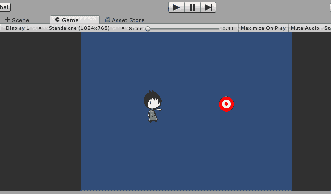
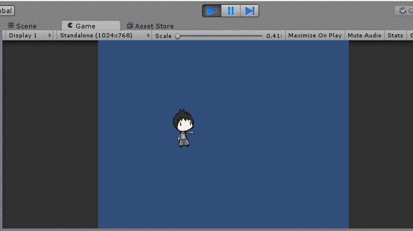

# 如何在 Unity 3D 中破坏游戏对象

> 原文：<https://www.studytonight.com/game-development-in-2D/destroying-game-objects>

在游戏中实例化和修改游戏对象很重要，同样重要的是在不需要的时候**销毁**它们。

破坏游戏对象的主要原因包括**管理内存**、**处理掉不需要的游戏对象**(像那些超出摄像头不返回的)，甚至游戏相关事件(被子弹击中)。

`Destroy(gameObject):`这是用来摧毁游戏对象的代码。相当简单，不是吗？让我们倒回去，更深入地看看发生了什么。如果您尝试在您的 IDE 中探索`Destroy`方法，您将看到销毁方法有 2 个变体(重载形式)。

第一种重载形式只是破坏作为参数输入的游戏对象，而不是其他。

而第二种重载形式涉及另一个参数`time, t`作为`float`变量。这将使**在破坏游戏对象**之前等待以秒为单位指定的时间。当你想让游戏对象在摧毁自己之前完成一些其他的东西/任务/计算时，`Destroy`方法的这种变体非常方便。例如，播放垂死的动画或添加乐谱。

直到我们的[最后一个教程](detecting-collisions)，我们已经成功地添加了一个目标，当被子弹击中时，它会向控制台输出一条消息。一旦击中目标，我们就让它消失，好吗？我们该怎么做？我们只需将以下几行添加到我们已经存在的目标脚本中:

```
using System.Collections;
using System.Collections.Generic;
using UnityEngine;

public class TargetBehaviour : MonoBehaviour
{

    void onCollisionEnter2D(Collision2D col) 
    {
        // When target is hit
        if(col.gameObject.tag == "Bullet")
        {
            Debug.Log("Target was Hit!");
        }
        // object which collided
        Destroy(col.gameObject());
        // object with which it collided
        Destroy(gameObject);
    }

}
```

这是怎么回事？我们告诉脚本销毁 col 数据中包含的游戏对象。简单来说，这意味着我们告诉脚本摧毁子弹(火球)，因为我们不希望我们的子弹在摧毁目标后继续前进。

在第二条`Destroy`语句(我们的*魔法*线)中，游戏物体会自我毁灭。请记住，简单地使用术语`gameObject`指的是脚本附加到的游戏对象，在我们的例子中是目标。保存脚本，启动游戏！



**信息:**处于编辑模式。



**信息:**在播放模式下，目标被击中后

一旦我们击中目标，子弹和目标就消失了！看看层次结构，你会注意到目标和子弹的克隆游戏对象都不见了。一旦在游戏中被摧毁，它们就消失了。由于我们在构建目标时将其放置在场景中，因此每当我们重新进入场景时，也就是说，每当我们进入播放模式时，它总是会回来。

原来你有！销毁游戏对象本身是一个非常简单的概念，因为它只涉及一行代码，但是当您调用方法和其他语句来使对象的销毁看起来和感觉起来真实和正确时，真正的魔力就出现了。

这次我们做了很多。我们给了我们的角色发射子弹的能力，我们也学会了预设和实例化的概念。接下来，我们给我们的角色一个要射击的目标，从而理解碰撞检测，最后，我们让目标一旦被击中就摧毁自己，用物体摧毁来完成事情。

* * *

### 练习练习

1.  试着给你的目标一个**生命值**，也就是说你要多次射击才能将其击破。这不仅会测试你制作游戏的逻辑，还会测试你基本编程逻辑的推理能力。

    **提示:**一个简单的`integer`变量和一个`if`语句可以大有作为。

2.  尝试在摄像机覆盖区域之外为子弹创建一个末端区域。如果一颗子弹从相机区域射出，并触及这个末端区域，它就会被摧毁，而不是漫无目的地进入死亡空间。当你进入更大、更复杂的游戏时，这是管理内存的有效方法。

* * *

* * *