# 在 Unity 中使用导航网格导航

> 原文：<https://www.studytonight.com/game-development-in-2D/navigation-using-navmash>

在本教程中，我们将了解 Unity 中的 Navmesh，以及如何创建它并将其作为导航的一部分在游戏中使用。

* * *

## 统一中的导航和寻路

你有没有想过游戏中各种各样的 NPC(不可玩的角色)是如何在游戏世界中移动的，避开物体，甚至有时会避开你，结果只是从你身后弹出来吓你一跳。这是如何如此现实地做到的？这些所谓的机器人如何决定他们应该走哪条路，避免哪条路？

在 Unity 中，这个奇迹(一旦你知道它是如何工作的，就不会这么多了)是使用**导航网格**实现的。

**导航网格**或**导航网格**是统一的**导航和路径寻找系统**的一部分。导航系统允许你使用从你的**场景**几何图形中自动创建的导航网格来创建可以在游戏世界中智能移动的角色。动态障碍允许你在运行时改变角色的导航，而离网链接允许你建立特定的动作，比如开门或从壁架上跳下来。

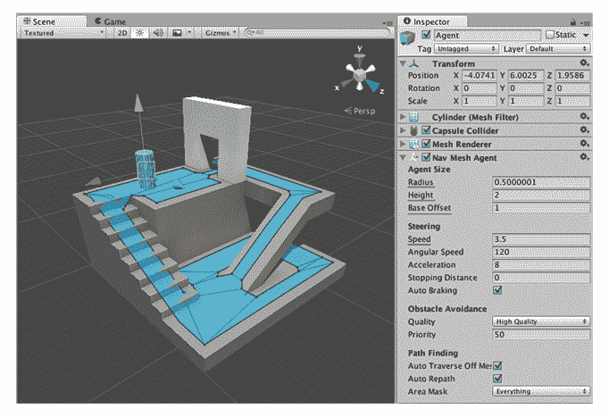

* * *

### 导航网格的不同组件

统一**导航网**系统由以下部分组成:

*   **导航网格**(导航网格的缩写)是一种数据结构，它描述了游戏世界的可行走表面，并允许在游戏世界中找到从一个可行走位置到另一个可行走位置的路径。数据结构是根据您的标高几何图形自动构建或烘焙的。
*   **导航网格代理**组件帮助您创建在朝着目标前进时相互避开的角色。特工们用导航网推理游戏世界，他们知道如何避开对方，也知道如何移动障碍物。
*   **离网链接**组件允许您合并导航快捷方式，这些快捷方式不能用可行走的表面来表示。例如，跳过沟渠或栅栏，或者在穿过之前打开门，都可以被描述为离网链接。
*   **导航网格障碍**组件允许您描述代理在世界导航时应该避免的移动障碍。由物理系统控制的桶或板条箱是障碍物的一个很好的例子。当障碍物移动时，代理尽最大努力避开它，但是一旦障碍物变得静止，它将在 navmesh 上雕刻一个洞，以便代理可以改变路径来绕过它，或者如果静止的障碍物挡住了路径，代理可以找到不同的路线。

<small>礼遇:[直到导航网文档](https://docs.unity3d.com/Manual/Navigation.html)T3】</small>

这一切都很好，但这只是理论。这只是告诉我们所有工具都存在什么。要知道如何使用它们，那完全是另一回事。学习这些工具的实现有什么比一个例子更好的呢？

* * *

## 是时候举个例子了！

我们在这里的目标是，我们希望创建一个迷宫式的场景，我们将在其中放置我们的玩家。我们将实现 **NavMesh** ，通过点击迷宫中的某个点，玩家对象将自动开始移动并到达迷宫中选定(点击)的点。容易吗？差不多吧。

### 设置和下载

我们将使用的组件不包括在标准安装中。

通过单击绿色的克隆或下载按钮，从 Unity Technologies GitHub 上的以下下载链接克隆或下载存储库。之后，使用 Unity 打开导航网格组件项目，或者复制

现有项目的资源/导航组件文件夹。(下载前检查 unity 版本)

[Unity 5.6 NavMesh 下载](https://github.com/Unity-Technologies/NavMeshComponents/tree/exp5.5)

[Unity 2017 NavMesh 下载量](https://github.com/Unity-Technologies/NavMeshComponents/tree/2017.2)

[Unity 2018 NavMesh 下载](https://github.com/Unity-Technologies/NavMeshComponents/tree/2018.3)

### 场景

我们将要使用的场景看起来像这样。绿色胶囊是我们的球员，我们将尝试和移动他。橙色的物体是我们要避开的墙，黑色的物体是我们要走过的地板。你可以尝试自己创造这个场景(一定要尝试)。如果没有，点击链接下载场景。

[下载场景](http://ww17.somethingsomething.com/)//放置正确链接。

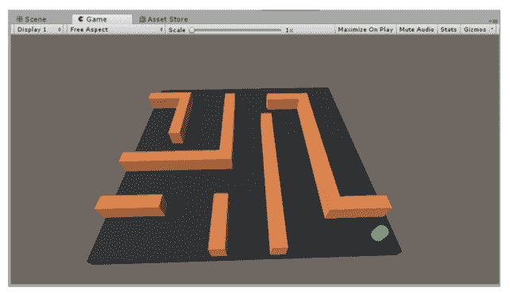

### 烘烤导航网

烘焙？导航网是一种蛋糕吗？良好的....在某种程度上，是的。请参阅，导航网格由统一引擎计算和生成。这个计算和生成导航网格的过程被称为烘焙。

所以我们现在需要做的是烘烤我们的 **NavMesh** 。

*   为此，在层次选项卡中创建一个空对象，将其命名为“导航网格”，并重置其转换(自己做)。
*   Select this “NavMesh” object in the Hierarchy and click on Components > Navigation > NavMeshSurface.

    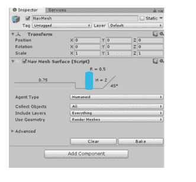

*   Now just to see the beauty of NavMesh, hit Bake.

    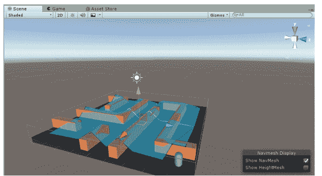

*   On hitting bake, we get the above image. The blue region shows the surface that is walkable. The current bake of the NavMesh is not what we want. What we want is that only the flat part of the floor is marked blue. To make this happen, we will change the properties of the agent to match our Player. So, select the Agent Type drop down and click on Open Agent Settings.

    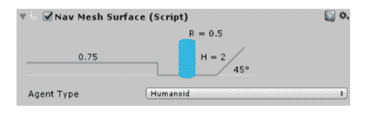

*   Now in the Navigation tab, click on the + icon to create a new Agent Type and input the parameters as shown in the image.

    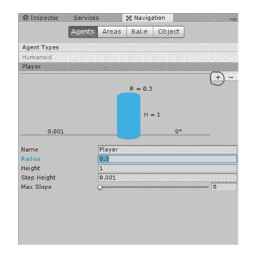

*   现在点击烘焙会有想要的效果。这是我们需要的道路。

    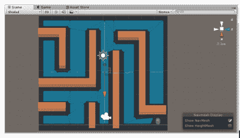

*   现在你会注意到路径把我们的玩家当作障碍，因此玩家下面没有路径。为了解决这个问题，我们需要将我们的播放器放入另一个图层，并从包含图层设置中取消该图层的标记。为此，单击图层下拉列表并选择添加图层...选项。

    

*   现在在图层视图中，在自由图层空间中输入“玩家图层”，然后点击回车。

    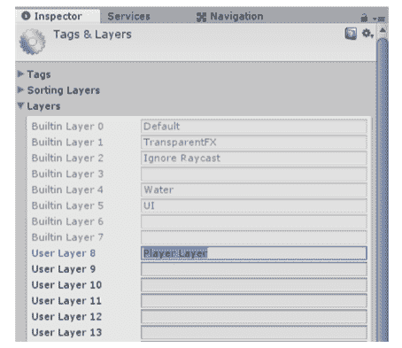

*   之后，从层次结构中选择导航网格对象，并在检查器中，单击包含图层下拉菜单，取消选中播放器图层。

    现在选择层次结构中的播放器对象，选择层下拉菜单，然后点击“播放器层”。我们已经改变了玩家对象所在的层。

    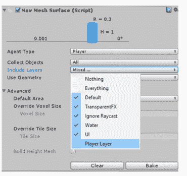

*   现在再次点击烘焙以获得导航可行走表面。

    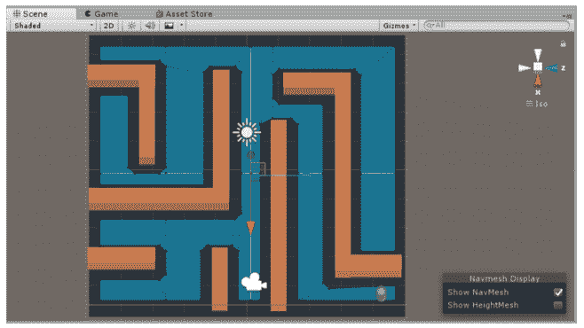

*   现在，即使看起来这些墙是禁区，我们也没有保证。为了确保这一点，我们必须特别使墙壁“不适合行走”。为此，首先选择层次结构中从墙(0)到墙(9)的所有墙对象，然后选择“添加构件”下拉列表。从该下拉列表中选择导航>导航网格修改器。现在所有的墙对象都有这个组件。

*   在所有墙对象仍处于选中状态的情况下，在检查器中检查导航网格修改器上的“覆盖区域”属性。现在选择区域类型下拉菜单，并选择“不可步行”。

    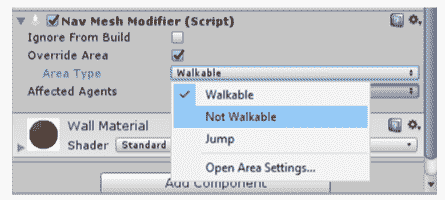

*   现在终于再次点击烘焙，晒晒你创建的 NavMesh 的美丽。

### 设置播放器

设置播放器非常容易。我们只需要将**“导航代理”**组件添加到播放器对象中。

为此:

*   在**层级**中选择**玩家**对象。
*   在检查器中，点击**添加组件**下拉菜单。
*   从下拉列表中，选择**导航>导航代理**。

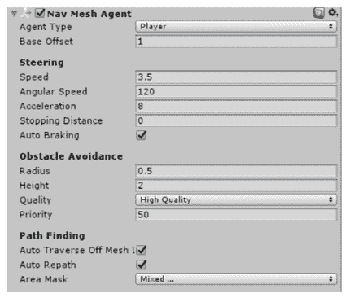

我们把这个组件连接到**播放器**上。现在我们的玩家可以访问**导航界面**。您可以尝试使用**转向**和**避障**设置，因为它们处理我们的**玩家**的实际移动。

### 让我们的玩家动起来

为了让我们的玩家移动，我们将在上面附加一个脚本，这将使**导航网格**将我们的玩家移动到我们点击的地板上的点。

为此，将名为**“控制器”**的新 C#脚本附加到**玩家**对象。

```
 using UnityEngine;
using UnityEngine.AI;

public class Controller : MonoBehaviour 
{
    public NavMeshAgent playerAgent;

    void Update () 
    {
        if (Input.GetMouseButtonDown (0))
        {
            Ray camRay = Camera.main.ScreenPointToRay (Input.mousePosition);

            RaycastHit hit;

            if (Physics.Raycast (camRay, out hit))
            {
                playerAgent.SetDestination (hit.point);
            }
        }    
    }
} 
```

现在让我们理解代码背后的逻辑。在这里，我们希望做的是获得鼠标左键被点击的位置，并从相机投射出一条光线到该点。相机有一个名为 ScreemPointToRay(位置)的功能，它从相机向给定的输入点发射光线。使用光线，我们可以计算出属性、组件、属性等。光线末端的物体。

一旦光线到达地面，我们将在 if 语句中得到一个真值，我们将让玩家向目标点移动。这是使用导航代理类的 SetDestination (Vector3)函数来完成的。该函数将代理移动到作为参数给定的点。

现在写完这段代码后，在 Unity 中，从层次结构中选择 Player 对象，并在检查器中将 Player 对象拖放到控制器脚本中的 playerAgent 变量中。

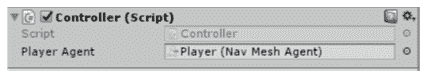

现在我们可以走了！继续按播放！看到魔法发生了！

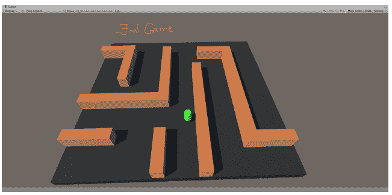

这只是一个简单的迷宫。你可以玩这个。创建您自己的关卡，烘焙导航网格，并观看我们的玩家在迷宫中导航。最后，也是最重要的一点，玩得开心！

### 导航网格的力量

我们看到的只是使用 NavMeshes 的绝对基础。在**运行时也可以使用 NavMeshes。**

例如，拿一个有活动墙的地板来说。这种环境的导航曲面不断变化。因此，NavMeshes 的运行时计算已经完成(尽管这在资源上非常昂贵；避免)。

NavMeshes 也可以用于程序生成的关卡。我们要做的就是在 Start 上烘焙 NavMesh。为此，我们使用导航网格表面类的 **BuildNavMesh()** 函数。

因此，我们现在有了一个工具，它既强大又易于使用。但请记住，烘焙是处理器繁重的过程，所以要明智地使用它。

* * *

* * *