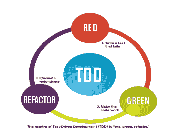
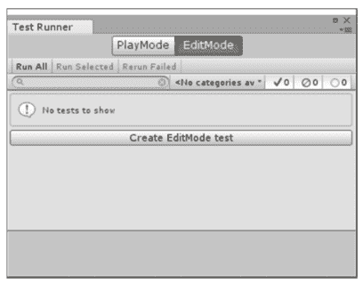
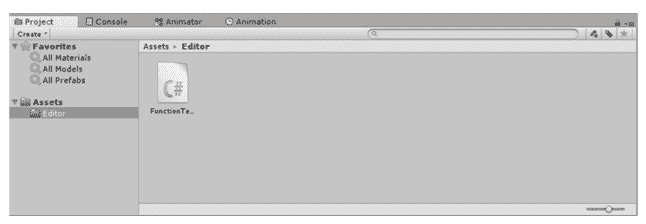
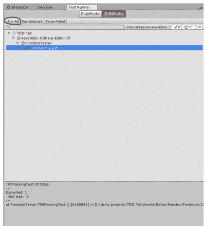
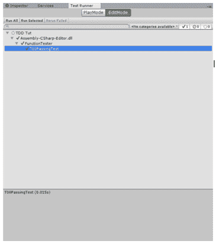
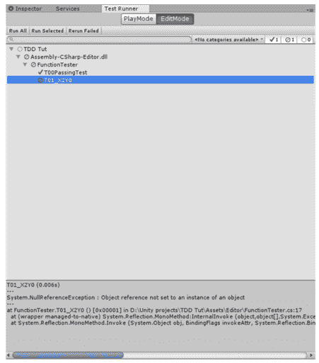
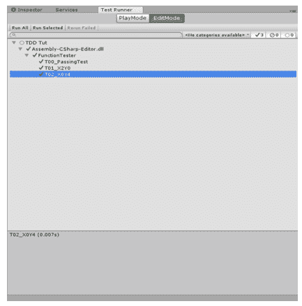
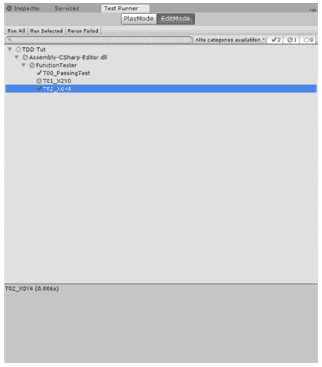

# Unity3D 中的测试驱动开发（TDD）

> 原文：<https://www.studytonight.com/game-development-in-2D/tdd-unit-testing>

测试驱动开发(TDD)是在编写代码本身之前为一段代码编写自动化测试的实践。这基本上意味着我们在测试的基础上创建和重构(改变结构而不改变行为)我们的项目代码。编写代码、测试代码和重构代码的过程都是循环往复的，直到达到令人满意的状态。

通常遵循以下步骤顺序:

*   添加测试(最初会失败)
*   运行所有测试，看看新测试是否失败
*   写一些代码
*   运行测试
*   重构代码
*   重复

遵循这一工作流程可以加快重构代码和进行更改的过程，因为您可以直接看到哪些地方出了问题以及原因。

你可能想知道为什么我们在编写代码之前先编写测试。这是因为在编写代码之后编写测试通常会导致开发人员编写测试来使它们通过。当您首先编写一个失败的测试时，您要确保它失败是有充分的理由的(比如没有正确地实现所需的功能)，并且排除误报。

* * *

## 红绿重构循环



要记住的最重要的事情是红绿重构循环。它是 TDD 过程的核心和灵魂。这里每一步都有意义:

1.  **RED:** 指写一个肯定会失败的测试用例。
2.  **绿色:**是指更改/编写代码，使在“红色”阶段创建的测试通过，使得之前通过的所有测试仍然会通过。这意味着开发者不能为了通过一个测试而中断项目的工作。
3.  **REFACTOR:** 指消除冗余，增加编写代码的可读性等。

这些步骤一遍又一遍地重复，直到所有测试都通过，或者遇到失败的测试是不可能的。

* * *

## 单元测试

单元测试是软件测试的一个层次，其中软件的单个单元/组件被测试。目的是验证软件的每个单元都按设计运行。一个单元是任何软件中最小的可测试部分。它通常有一个或几个输入，通常只有一个输出。

### 是时候举个例子了！

现在我们相信行动胜于语言。因此，执行任务是最好的学习方式。因此，我们的目标是建立一个基本的单元测试场景，在这个场景中，我们可以测试一个特定类的函数是否如预期的那样运行。

我们将创建一个二次值解算器，当输入为“x”时，我们将得到 f(x)的值。

**对于例如**让 f(x) = x2 -4x+4 现在对于 x=2 的值，我们得到 f(2)=0。

我们的目标是使用 TDD 流程来创建它。

现在在 Unity 中，打开一个新项目后，点击菜单栏中的**窗口>测试运行器**。

现在出现了这样一个窗口。



这是 Unity 内置的单元测试器模块。我们将为 TDD 提供服务。

通过将此标签拖到检查器旁边来附加它(自己操作)。

现在我们要知道**测试脚本**和我们的常规脚本不一样。要使 unity editor 将特定脚本视为测试脚本，第一步是将脚本保存到名为**“编辑器”**(不带引号)的特定文件夹中。

因此，在**素材**中创建一个**“编辑器”**文件夹，并在其中创建一个名为**“功能测试器”**的脚本




现在设置已经完成，我们将开始开发过程。这里我们将使用**红绿重构循环**。因此，首先我们将编写一个未通过的**测试(我们必须让测试失败)。之后，我们将尝试**更正代码**，以便测试给出肯定的结果。然后最后我们将尝试**使我们的代码尽可能干净和可读**。**

打开 FunctionTester 脚本，并在其中键入以下代码。

```
using System;
using System.Collections.Generic;
using NUnit.Framework;
using UnityEngine;
[TestFixture]
public class FunctionTester
{
    [Test]
    public void T00_PassingTest () 
    {
        Assert.AreEqual (1, 0);
    }
} 
```

现在在测试运行器标签中，点击**运行所有**。



这是我们第一个红色州的完成。标签底部提到测试失败的地方。

现在，对于绿色状态，我们需要更正代码，以便案例测试为真。为此，请将代码的第 11 行改为

```
Assert.AreEqual (1, 1);
```

现在点击运行所有的测试返回真。

在这个迭代中，我们不需要重构状态，因为代码是最简单的形式。如果开发人员认为代码令人满意，则只能跳过重构状态。

现在你一定在想这段代码是做什么的。s

在第 5 行，我们将这个类描述为一个[测试夹具]。这告诉 Unity，这个类是我们的 Tester 类，将用于单元测试。

现在我们将作为函数执行我们的每一个测试。在定义函数之前，我们提到它是一个[测试]。这允许测试运行人员访问它并向我们显示结果。

正如您所看到的，第一个测试非常琐碎，但是编写第一个测试是一个很好的实践，因为它确保测试系统正常运行。

```
[Test]
public void T00_PassingTest () 
{
    Assert.AreEqual (1, 0);
} 
```

断言。AreEqual 是 Nunit 库中 Assert 类的一个函数。它检查传入的两个对象是否相等。如果对象不相等，将引发 AssertionException。



这就结束了我们的第一次迭代。

接下来我们将测试当 x=2 时，我们应该从二次方程中得到一个值 0。

现在在第二次迭代中，我们将修改代码如下:

```
using System;
using System.Collections.Generic;
using NUnit.Framework;
using UnityEngine;
[TestFixture]
public class FunctionTester
{
    public Function function = new Function();
    [Test]
    public void T00_PassingTest () 
    {
        Assert.AreEqual (1, 1);
    }
    [Test]
    public void T01_X2Y0()
    {
        Assert.AreEqual(function.Value(2f) ,0f);
    }
} 
```

这里我们已经开始了第二个 RGR(红绿重构)循环。运行此测试时，我们将在测试 T01 中失败。

现在，您将看到这不会编译。这是因为我们没有函数类。这是我们真正测试的开始。

现在，您将看到这不会编译。这是因为我们没有函数类。这是我们真正测试的开始。

it 内部类型代码:

```
using System.Collections;
using System.Collections.Generic;
using UnityEngine;

public class Function 
{
    public float Value (float x)
    {
        return 8f;
    }
} 
```

现在运行测试，我们得到一个失败。



转向绿色状态，我们将函数脚本的第 9 行改为

```
return 0f;
```

现在再次进行测试，我们会得到一个肯定的结果

你现在一定在想，为什么我们不在函数中计算任何东西。你必须意识到，我们在 TDD 中唯一的目标就是让所有的测试都通过，并且这个方法能很好地通过测试。

在下一次迭代中，我们将测试 x = 0，f(0) = 4。在函数测试器中为这个测试迭代实现测试(挑战！).尽量不要复制代码，自己写。记住，错误是最好的老师。

查看下面的代码并比较错误:

```
using System;
using System.Collections.Generic;
using NUnit.Framework;
using UnityEngine;
[TestFixture]
public class FunctionTester
{
    public Function function = new Function();
    [Test]
    public void T00_PassingTest () 
    {
        Assert.AreEqual (1, 1);
    }
    [Test]
    public void T01_X2Y0()
    {
        Assert.AreEqual(function.Value(2f) ,0f);
    }
    [Test]
    public void T02_X0Y4()
    {
        Assert.AreEqual (function.Value (0f), 4f);
    }
} 
```

该测试将失败，因为我们的值函数返回 0f，与输入无关。

现在是绿色国家。我们想要的是计算 x 的二次方程值的值函数，其中 f(x) = x2-4x+4。

因此，我们将把我们的价值函数改为:

```
public float Value (float x)
{
    return (Mathf.Pow (x,2) - (4f*x) + 4f);
}
```

现在我们到达了重构状态。看看我们的函数，我们可以看到它非常小，所以重构对我们的代码影响不大。重构在大型脚本中变得很重要。

现在作为一项任务，尝试在 FunctionTester 类中编写尽可能多的测试，并遵循 RGR 循环使测试通过。测试次数越多，模块的准确性越高。




* * *

### 如果绿色状态期间先前的测试失败，该怎么办？

考虑这样一种可能性:为了通过某个特定的测试，您需要对脚本进行更改。这种变化导致之前通过的一个测试失败。如果出现这种情况，我们将再次进入该测试用例的红色状态，而不是进入下一个文本。只有在所有以前的测试用例都通过的情况下，我们才会进入新的测试用例。



* * *

### 结论

这是 TDD 创建一个极其基础和琐碎的项目的一个例子。在这个例子中，这看起来像是一个痛苦，但是当扩大规模(对于更大的项目)时，TDD 是一个福音。它有助于快速有效地识别和纠正错误。因此，尝试在可能出现大量场景的项目中使用它。这也有助于跟踪所有已测试的场景。

* * *

* * *