# Unity3D 中的动画和动画师

> 原文：<https://www.studytonight.com/game-development-in-2D/animation-animator>

**动画**是一款游戏的两个组成部分之一，将它带入生活(另一个是**音频**)。Unity 的动画系统叫做 Mechanim，它的力量在于将人形模型带入生活。在以前的版本中，使用了另一个名为“动画”的组件，但在 Unity 的最新版本中，它已经贬值了。

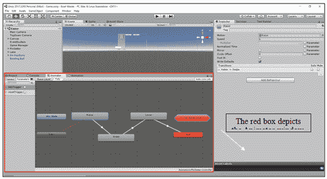

在本教程中，我们将看到如何使用动画师创建动画的基础知识。我们将制作一个迷你游戏模块，它的一扇门在我们按下空格时打开，如果我们再次按下空格，它就会关闭。所以让我们开始我们的旅程，希望最终，我们都能通过那扇门。

* * *

### 1.创造我们的环境

在本模块中，我们将设置我们的环境。这意味着我们将创造:

*   基地/地面
*   四壁结构
*   户外的

1.  要创建基础**右键单击层次面板>三维对象>立方体**。双击层次结构中的多维数据集对象。场景窗口聚焦在立方体上。
2.  现在，在“检查器”面板中，您将看到变换组件。确保立方体的**位置**和**旋转**为(0，0，0)**刻度**为(1，1，1)。将刻度值更改为(5，0.5，5)。这将是我们的楼层。通过在层次结构中选择立方体，按 F2 键，键入名称并按回车键，将对象重命名为“地板”(不带引号)。

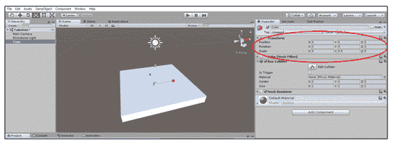

4.  Similarly create 3 more cubes and arrange them in such a way that they make 3 walls for the floor. This is a task for the reader.

    

5.  现在开门。基本门有两种类型，滑动门和铰链门。我们要去滑动门。现在类似于最后一步，创建另一面墙来创建一个没有屋顶的房间。将第四面墙命名为“门”。这将是我们的门。

* * *

### 2.设置我们的视图

这个模块是为那些没有打开动画面板的人准备的。如果有，请跳到下一部分。

要打开动画师面板，单击菜单栏上的窗口**选项，并从下拉列表中选择动画师。**

同样在同一窗口菜单中，选择**动画**选项打开动画面板。

我们将使用这两者来创建我们的推拉门动画。

* * *

### 3.为门创建动画

为了创建动画，我们首先创建动画动作，然后我们以状态机的形式对这些动作进行排序(查找！)以便我们能够从一种状态过渡到另一种状态。不要被下面的动画师图吓倒。完成本教程后，你将在睡梦中制作这些。

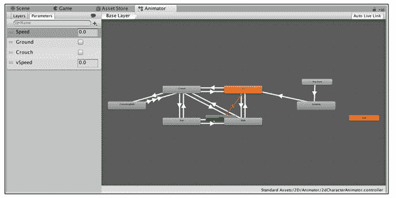

现在来创建动画

*   选择**动画面板**并点击创建。
*   Name you animation “DoorOpen” and save it in the Asset folder. Similarly make another animation called “DoorClosed” and save it.

    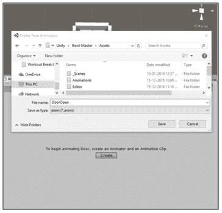

    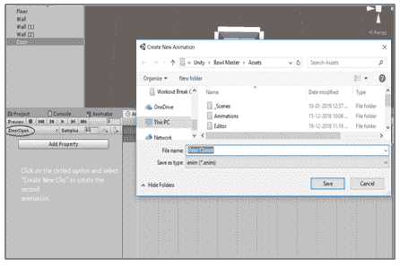

*   逐个选择创建的动画文件，并取消选中“循环时间”选项。

    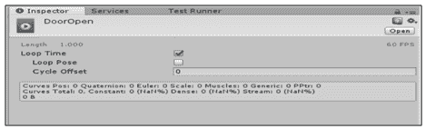

*   现在注意这一点，因为它是创造魔法的步骤。在“动画”面板中选择“开门”动画。你会看到一条时间线。这被称为“笨蛋”(也许因为它是“笨蛋”....我不知道)。它将作为动画中将要发生的事情的时间线。

    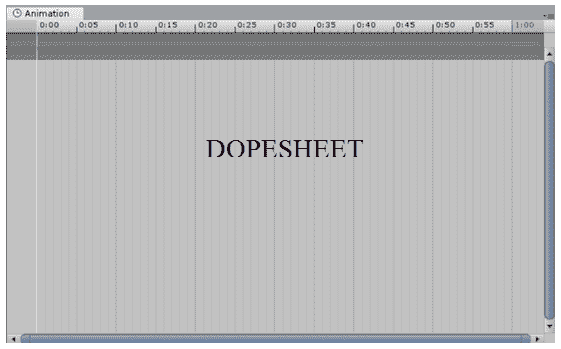

*   单击添加属性按钮，然后选择变换>位置。这里我们可以看到在时间线上形成了 2 颗钻石。这些描述了我们知道物体属性的关键点。给定一组关键点，Unity 会自动插值并生成这两个关键点之间将要发生的移动。继续前进时，请记住这一特性。

    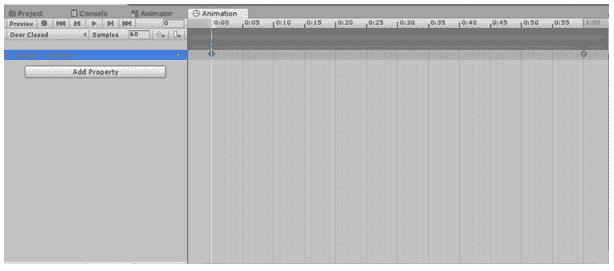

*   在上面的时间线上，写有描述时间的数字。点击末尾关键点(菱形)上方的数字。关键点上应该出现一条白线。这表示将对白线下的那部分时间进行修改。现在点击红色按钮开始记录运动。

    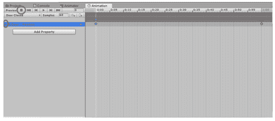

*   使用变换工具，移动场景视图中的“门”对象，使其根据您的需要达到打开状态。再次按下录制按钮停止录制。您可以按下录制按钮旁边的播放按钮来检查动画。

*   同样，创建“关门”动画。这是用户的任务。

    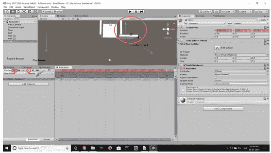

* * *

### 4.使用动画师状态机

现在你有了移动的门，我们的问题是让它们按照我们的意愿移动。为此，我们必须了解动画师及其实际工作。

就像上面提到的，动画师负责将一个动画状态转移到另一个动画状态。举个例子，想象你在玩一个第一人称射击游戏，比如 PUBG 或者 CS: GO。这里如果你只按 W，玩家角色走路或者慢跑，但是只要一按 shift 配合 W 键，玩家就无缝爆发出Sprint。这种从“行走状态”到“Sprint状态”的转变，正是动画师所关心的。

回到我们的门口，如果我们打开动画师，我们会看到各种彩色的盒子，上面写着“进入”、“任何状态”、“退出”等。这些是各种动画状态。

其中你会发现一个橙色的箭头，从进入状态开始，一直到开门状态。这个箭头(或任何这样的箭头)描绘了从一个动画状态到另一个动画状态的转换。让我们看看各种状态意味着什么。

*   **进入:**进入是指场景第一次出现时的动画状态。
*   **Exit:** This state is used to end the animation and begin again at the Entry state. To make it simple suppose your transition ends in state "foo". Try drawing a transition from "blablabla" to "Entry". You just can't.

    现在，如果你真的需要这么做，那就是你使用“退出”的时候。

*   **任何状态:**任何状态都是一种特殊的状态，总是存在的。它存在于你想去一个特定的状态的情况下，不管你当前处于哪个状态。这是将相同的向外转换添加到机器中所有状态的一种简化方式。请注意**任意状态**的特殊含义意味着它不能是过渡的终点(即跳转到“任意状态”不能作为选择随机状态进入下一个状态的方式)。

您还会看到一个箭头，从进入状态到开门状态。这不是我们想要的。在这里，场景一开始，门就打开了。我们想要的是门一直等到我们命令它移动。因此，我们需要一个“空闲”状态，即一个没有附加运动的状态。

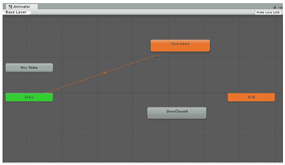

*   为此，**右键单击动画面板空间**并从下拉菜单中选择**创建状态>清空**。
*   现在将这个“新状态”状态重命名为“空闲”(自己动手)。
*   Now we need Idle to be the Default state (state transitioned to after Entry). TO do this right click on Idle and select the **Set as Layer Default State**

    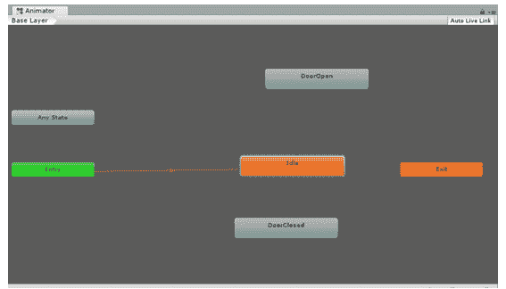

现在开始过渡。转变指的是控制从一种状态转移到下一种状态。您看到的橙色箭头代表过渡。

要创建过渡，请在初始状态> 上单击鼠标右键，从下拉菜单中选择进行**过渡>在下一个状态上单击**。

所以试着自己创建一个工作状态图，用下图检查它是否正确。

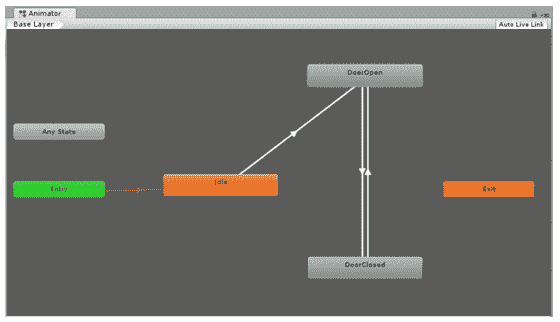

还没有结束。在这里，如果你按 play，门会自动打开和关闭。这是因为我们的过渡是无条件的。初始状态一旦播放完动画，就会发生无条件转换。我们需要控制这里。所以我们将条件应用于过渡。

为了应用条件，我们需要设置一个参数来开关门。为此:

*   从动画师面板的左上角选择**参数**选项卡。
*   点击下方的+图标，从下拉列表中选择**布尔**选项。
*   将其重命名为“isDoorOpen”(自己动手)。
*   我们选择一个布尔值，因为使用它可以很容易地描述门的打开和关闭状态。

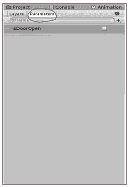

现在要将条件应用于过渡:

*   单击箭头选择过渡。
*   在“检查器”面板中，单击“条件”选项中的+。
*   按顺序设置条件的值。

“isDoorOpen”的转换 1、2 和 3 的值分别为真、假和真。


因此，我们已经完成了设置我们的条件。我们将通过代码触发这些转换。

* * *

### 5.编写代码

*   创建一个名为“门管理器”的空对象，并向其中添加一个名为“门管理器脚本”的新 C# 脚本。
*   要添加脚本，选择**添加组件** >新脚本>将脚本命名为“door managerscript”>按**创建并添加**
*   在脚本中，键入以下代码并保存:

```
using System.Collections;
using System.Collections.Generic;
using UnityEngine;

public class DoorManagerScript : MonoBehaviour 
{
    public Animator anim;

    private bool trigger;

    void Start()
    {
        anim.SetBool ("isDoorOpen", false);
        trigger = false;
    }

    void Update()
    {
        trigger = anim.GetBool ("isDoorOpen");

        if(Input.GetKeyDown (KeyCode.Space))
        {
            if(!trigger)
            {
                anim.SetBool ("isDoorOpen", true);
            }
            else 
            {s
                anim.SetBool ("isDoorOpen", false);
            }
        }
    }
}
```

* * *

### 6.穿过门到另一边

嗯，我想祝贺你在 Unity 中创建了你的第一个移动对象。更重要的是，它按照你的命令工作！干得好。这只是机械系统的力量的一瞥，如果它在你有能力的手中。

所以按 play，看看当你按空格键时会发生什么神奇的事情。

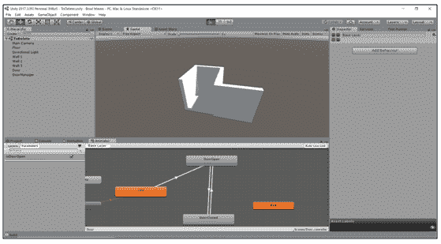

* * *

* * *