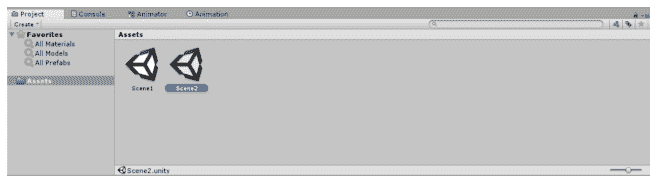
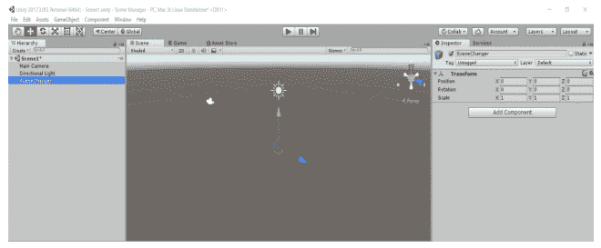
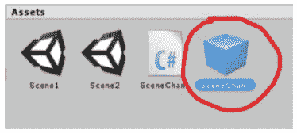
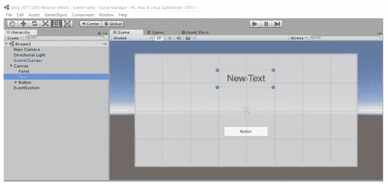
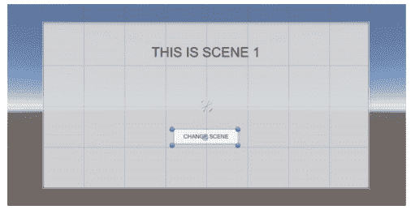
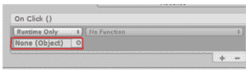
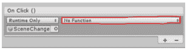
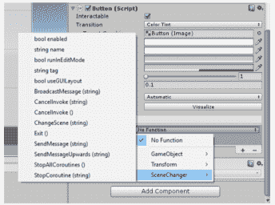

# 在 Unity3D 中更改场景

> 原文：<https://www.studytonight.com/game-development-in-2D/changing-scene>

场景管理库最常用的是场景之间的跳转。这是最简单的事情之一，但对游戏的创作至关重要

现在让我们看看它是如何实际完成的

现在在你的资源文件夹中，创建 2 个新场景，并命名为**“场景 1”**和**“场景 2”**。



要创建新场景，**右键单击素材面板区域**并选择**创建>场景。**

在这里，我们的目标是，我们应该能够在按下按钮(用户界面元素)时在场景之间跳转。我们可以用各种方法做到这一点，但是为了便于理解，我们将使用最简单的方法。我们将创建一个**场景生成器**对象，它将处理所有的场景变化代码(不管它有多少)。

一般来说，当一个场景从一个场景改变到另一个场景时，游戏对象、脚本等的所有实例都会改变。属于那个场景的被破坏，新场景的被加载。另一种方法是使用**dontdestoryonload()**函数，该函数将在场景变化时保持一个对象引用，但这将在另一个教程中涉及

* * *

## 场景交换对象创建和预置

好了，回到 Unity 中，在“场景 1”的**层次选项卡**中，创建一个**空游戏对象**，并将其命名为**“场景交换者”**(自己动手)。



在**变换**中，确保其位置和旋转在<0,0,0>处，刻度在<1,1,1>处。这并不影响工作，但保持游戏对象只拥有它们的转换放在原点是一个很好的做法。

现在给**“场景转换器”**对象添加一个脚本，并将其命名为“场景转换器”。(自己动手)。

现在在 mono developer/Visual Studio 中打开该脚本，并在其中输入以下代码:

```
using System.Collections;
using System.Collections.Generic;
using UnityEngine;
using UnityEngine.SceneManagement;

public class SceneChanger : MonoBehaviour
{
	public void ChangeScene(string sceneName)
	{
		SceneManager.LoadScene (name);
	}
	public void Exit()
	{
		Application.Quit ();
	}
}
```

在这段代码中，我们包含了**单元引擎。场景管理**库，允许我们使用**场景管理器**类。

在**变更场景(字符串名称)**功能中，我们取输入一个名称为**场景名称**的**字符串**。这然后被传递到**场景管理器。LoadScene()** 功能。该函数加载由其名称定义的新场景(如果存在)。

在**退出()**功能中，我们使用**应用。退出()**功能。该功能具有退出应用的基本任务，即类似于屏幕右上角的红色 X 或关闭按钮的功能

这里我们已经创建了一个对象。现在要创建它的**预置**，只需**在层次**中选择对象，然后**将其拖放到项目选项卡**中的素材文件夹中。完成此操作后，您将看到一个与对象同名的**蓝色立方体**。这是预制的物体。



现在保存场景，双击**“场景 2”**。在此场景中，只需**将**场景编辑器预设的**拖放到**视口**或**层次选项卡**中。将创建**场景生成器**的实例。**

* * *

### 创建用户界面和预设

在前一节中，我们已经创建了一个场景交换对象。现在我们将创建用户界面。

在用户界面中，我们将有一个文本对象来描述场景名称，还有一个按钮来为我们改变场景。

因此，**在**层级选项卡**中右键**，选择**界面>面板**。把面板的颜色改成你想要的(自己试试)。

再次**右键单击**层级选项卡**和**选择 UI >文本**。调整它的大小，并把它放在任何你想要的地方(自己试试)。**

再次在**层级标签**中**右键**，选择**界面>按钮**。调整它的大小，并把它放在任何你想要的地方(自己试试)。

你的最终结果应该是这样的



现在将文本改为**“这是场景 1”**。同时将按钮中的文本更改为**“更改场景”**(将按钮的文本对象作为按钮对象的子对象)。结果如下:



现在在**层级**中选择**按钮**对象。在**检查器**选项卡中，单击**按钮(脚本)**组件中的加号图标。


我们在按钮(脚本)窗口中得到这个。



现在将**层级**标签中的**场景切换**对象拖放到**对象参考空间**中(用红色突出显示)



现在选择**功能下拉**(红色突出显示)。从下拉列表中，选择**场景更改器>更改场景(字符串)**。



现在你会在**功能下拉**下看到一个空格。输入**“场景 2”**。这里我们所做的是选择我们的**场景生成器**对象并访问变更场景()功能。“场景 2”是输入。现在只要按下按钮，就会调用 **ChangeScene()** 功能，场景变为**“场景 2”**。

现在对**“场景 2”**进行同样的操作，但输入**“场景 1”**作为输入，并相应地更改场景 2 中的文本(自己动手)。

现在将场景添加到**文件菜单**中的**构建设置**中。这样做是必要的，因为没有这种 Unity 就不会承认场景，它们之间也不会发生任何转变。

当你按下播放键。点击按钮将导致场景改变。

注意:我们没有像在模拟中那样设置退出功能(在 Unity 中播放场景)，退出动作被忽略。然而，在游戏的真实构建中，我们可以使用应用 exit()退出。

* * *

* * *