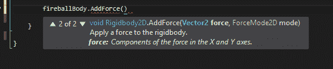

# Unity：使用`Rigidbody.AddForce()`方法移动游戏对象

> 原文：<https://www.studytonight.com/game-development-in-2D/right-way-to-move>

在 Unity 中移动游戏对象主要有两种方式:

*   **改变位置坐标:**通过直接改变游戏对象的位置，而不太考虑其物理或其他类似组件。这就是我们到目前为止所做的，只需在每一帧中给对象的`X`位置添加一个值。
*   **刚体物理:**在处理遵循物理规则的物体时，对物体施加力或改变其速度比直接位置更新更有意义。看起来更真实。

在本教程中，我们将涉及一个有趣的例子，使用刚体物理的运动，而不是位置改变技巧。到目前为止我们一直在研究射击子弹，对吗？但是我们的子弹只是利用位置变化来行进，而不管它们是什么以及它们在现实世界中是如何运动的。

这也导致了一些问题，比如我们的子弹击中目标后仍然继续前进(查看我们之前的教程中的例子)。

它根本不知道它应该在击中目标后停下来，因为我们对它进行了编程，让它一直向右走。

与其这样做，不如我们对子弹施加一个非常强大的**冲击力**，就像现实生活中的子弹一样？这样做将使子弹移动，因为它的动量，而不是因为一个编程的位置更新。

让我们来探索这个选项，并且，我们将理解类`Rigidbody`提供的`AddForce()`方法。打开定义子弹/火球行为的脚本:

```
using System.Collections;
using System.Collections.Generic;
using UnityEngine;

public class FireballBehaviour : MonoBehaviour
{
    private float fireballXValue;
    public float fireballSpeed;

    void Start()
    {
        // getting the initial position where prefab is created
        fireballXValue = gameObject.transform.position.x;
    }

    // Update is called once per frame
    void Update() 
    {
        // adding speed value to the X axis position
        // value
        fireballXValue += fireballSpeed;
        // setting new X value to position
        gameObject.transform.position = new Vector2(fireballXValue, gameObject.transform.position.y);
        }
    }

}
```

因为我们在这个脚本中写的几乎所有东西都是通过位置变化来处理运动的，所以让我们清除所有东西，这样我们就又有了一个干净的`Start()`和`Update()`方法。

```
using System.Collections;
using System.Collections.Generic;
using UnityEngine;

public class FireballBehaviour : MonoBehaviour
{
    private float fireballXValue;
    public float fireballSpeed;

    void Start()
    {

    }

    // Update is called once per frame
    void Update() 
    {

    }

}
```

* * *

## 使用组件控制游戏对象

现在我们知道，我们可以通过使用引用`gameObject`来访问附加到它的脚本中的游戏对象。

此外，我们可以使用`GetComponent`功能访问和组件(如刚体、碰撞器等)连接到游戏对象。

之前，我们使用检查器视图来更新任何组件的属性。在这里，我们将尝试在脚本中做到这一点。

首先，我们仍然需要声明`Rigidbody2D`变量，但是与其让它成为`public`，不如让它成为`private`。

```
private RigidBody2D fireballBody;
```

现在，在`Start()`方法中，我们将添加以下行:

```
void Start()
{
    fireballBody = GetComponent<rigidbody2d>();
}</rigidbody2d>
```

那么这条线是做什么的呢？这一行代码在某种程度上是检测和设置变量的自动方式。通过调用`GetComponent`方法，我们只是告诉 Unity 继续检测组件的类型，在尖括号`<>`中为我们的游戏对象指定。在我们的例子中，我们希望脚本检测一个刚体 2D 组件，所以我们将把它放在尖括号内。此方法没有任何重载(变量)。

* * *

## 向刚体组件添加速度和力

既然我们已经控制了火球的刚体，我们该怎么处理它呢？嗯，我们可以给它加上一个**速度**，或者给它加上一个**力**。请注意，这两个组件都是 gameObject 背后的物理学的一部分，而不是变换(以及其**位置**)本身的直接变化。

有什么区别？如果你给你的身体加上一个**速度**，你就忽略了身体的任何质量。它只是让它走，而不考虑身体有多重。然而，如果你加上一个**力**，你就考虑到了身体的质量。

也就是说，即使对像大型汽车这样的重物施加很小的速度也会使其移动，但对同一辆汽车施加很小的力只会使其轻微移动。就我们而言，我们会给火球增加一个速度，因为我们可以认为它本身的重量很小。

### 添加`velocity`属性

```
using System.Collections;
using System.Collections.Generic;
using UnityEngine;

public class FireballBehaviour : MonoBehaviour
{
    private RigidBody2D fireballBody;
    public float speed;

    void Start()
    {
        fireballBody = GetComponent<rigidbody2d>();

        // velocity is a property of RigidBody2D
        fireballBody.velocity = new Vector2(speed, 0);
    }

    // Update is called once per frame
    void Update() 
    {

    }

}</rigidbody2d>
```

等一下！你在`Start()`方法中加入了`fireballBody.velocity`代码，而不是`Update()`方法。为了理解这一点，让我们举个例子。想象一下，你妈妈让你换厨房的灯泡。你说“当然，我会做的”，然后你再做(或者不做，就像我们大多数人一样)。现在想象一下，不管你是否换灯泡，你妈妈都会要求你在你的余生里每秒 60 次更换灯泡*。有点可怕，不是吗？我们在这里做着完全相同的事情，在Unity。如果我们在 Start()方法中设置速度，我们只是告诉游戏改变一次速度，然后继续前进。*

 *但是，如果我们在 Update()方法中编写相同的代码，我们只会一次又一次地要求 Unity 将刚体的速度设置为我们定义的值。因为我们的价值观暂时不会改变，我们不一定要告诉脚本为已经完成的事情赋值。

### 使用`AddForce()`增加力

现在，让我们探索向游戏对象添加**力**的方法。



方法`AddForce()`的第一个参数只需要一个`Vector2`就可以知道要向哪个方向施力。例如，使用`new Vector2(4, 5)`的力将水平地**向右**施加 4 个单位的力，垂直地**向上**施加 5 个单位的力。

第二个参数有点意思。您将看到附加的第二个参数是名为`ForceMode2D`的**枚举**。强制模式 2D 是一对**模式**，用于向游戏对象施加力。这些模式被命名为**力**和**冲量**。根据您想要施加的力的类型，您可以输入`ForceMode2D.Force`(用于施加恒定的、一致的力)或`ForceMode2D.Impulse`(用于施加瞬时的、撞击力)。)

在我们的场景中，我们想在火球上施加一个突然的、巨大的力，让它向前发射。施加一个恒定的力会使它从低速加速，这看起来有点奇怪。

```
using System.Collections;
using System.Collections.Generic;
using UnityEngine;

public class FireballBehaviour : MonoBehaviour
{
    private RigidBody2D fireballBody;
    public float speed;

    void Start()
    {
        fireballBody = GetComponent<rigidbody2d>();

        // AddForce is a function of RigidBody2D
        fireballBody.AddForce(new Vector2(speed, 0), ForceMode2D.Impulse);
    }

    // Update is called once per frame
    void Update() 
    {

    }

}</rigidbody2d>
```

如果你在 Unity 中尝试这两种方法，你的火球应该仍然以相同的方式移动，但是这一次，不需要直接修改它的位置，而是使用物理。我们让 Unity 为我们处理这个问题。

* * *

* * **