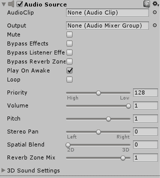
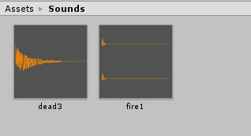

# Unity 3D:为游戏添加音效

> 原文：<https://www.studytonight.com/game-development-in-2D/audio-in-unity>

音频是一个非常有趣的概念，不仅仅是在游戏设计中，在研究它的本质时也是如此。它的感知方式取决于很多因素，当你试图控制或使用它时，必须考虑到这些因素。

对音频的感知一般涉及到声源的位置，以及如果它在移动的话，它移动的速度有多快(如果你学过物理学，你可能对**多普勒效应**很熟悉)。

在 Unity 中，音频源的**定位对于表征其来源很重要。例如，我们需要确保播放瀑布声音的游戏对象与实际的瀑布游戏对象相匹配，并且玩家对该声音的感知是真实的。随着玩家越来越近，声音越来越大，确保**声音平移**随着瀑布相对于玩家的相对位置变化而变化，等等。**

我们在 Unity 中处理与音频相关的两个主要组件，它们是:

1.  **音频监听器**
2.  **音源**

让我们来看看这些组件。

* * *

## 音频监听器

这是一个每次创建场景时都会自动附加到主摄像机的组件。它没有任何属性，因为它唯一的工作就是充当感知的**点**。建议让音频监听器保持原样。

* * *

## 音频源

这是实际上负责播放声音的组件。在常见的开发实践中，当您处理大型复杂结构时，通常最好制作一个**空游戏对象**来充当音频源，**将其制作成一个孩子**，这样您就清楚了音频源在哪里。



音频源组件有很多属性可以修改。这包括它的**音高**、**平移**、**空间混合**(我们稍后会讲到)，如果你打开*三维声音设置*，你会发现添加**多普勒效果**和**音量滚降**的选项。

然而，这里最让我们感兴趣的是**音频剪辑**槽。这就是要播放的音效。Unity 支持相当多的常见声音格式，包括`.mp3`、`.ogg`等。

* * *

## 添加您自己的声音效果

在支持声音的文档得到支持之前，我们必须创建自己的声音效果。我们做了一对小音效的包，可以从[这里](https://dl.dropbox.com/s/byx0rbg7fg0wj4h/SavisTutorial.zip?dl=0)下载。

让我们通过创建一个新的声音效果文件夹并将声音添加到其中，将这些声音效果导入到我们的项目中。



现在，由于主摄像机已经有了**音频监听器**，我们所要做的就是将**音频源**添加到我们相关的游戏对象中。

* * *

### Unity 3D:添加音频源

首先，我们将有一个声音效果，当我们的角色发射火球时播放。为此，我们将简单地为我们角色的射手游戏对象添加一个音频源。转到**添加组件→音频→音频源**。

在**音频剪辑**槽中，拖进您想要使用的声音效果。如果你下载了 soundpack，拖进 **fire1.mp3** 。现在，取消勾选【唤醒时播放 T4】复选框。这确保了这种声音不会在游戏对象一醒来就播放，在我们的例子中是在游戏一开始就播放。

在教程中，我们创建了一个类`Shooter`，每次空格键被击中时，它都会实例化一个新的**火球**，让我们在发射新火球时添加声音。

```
using System.Collections;
using System.Collections.Generic;
using UnityEngine;

public class Shooter : MonoBehaviour
{
    public GameObject fireball;
    private AudioSource source;

    void Start()
    {
        source = GetComponent<AudioSource>();
    }

    void Update() 
    {
        // When spacebar is hit
        if(Input.GetKeyDown(KeyCode.Space))
        {
            // instantiate the fireball object
            Instantiate(fireball,
                new Vector3(gameObject.transform.position.x, gameObject.transform.position.y, 0),
                new Quaternion(0, 0, 0, 0));

            // play the sound
            source.Play();
        }
    }

}
```

除了最初声明的**音频源**变量之外，当我们调用`source.Play()`时，神奇的事情就发生了。这一行代码使引用的音频源播放加载到其插槽中的音频剪辑。它还有一个重载(变体)方法，用于在特定延迟后播放声音效果。

现在，保存这个脚本，只需用您的声音效果填充播放器音频源音频剪辑插槽中的插槽。(使用 **fire1.mp3** 如果你使用的是我们刚刚下载的 soundpack。)

同样，对于目标，我们将更新教程[中使用的类`TargetBehaviour`的脚本，检测碰撞](detecting-collisions)，并为其附加一个音频源，然后使用该脚本:

```
public class TargetBehaviour : MonoBehaviour
{
    private AudioSource source;

    void Start()
    {
        source = GetComponent<AudioSource>();
    }

    void onCollisionEnter2D(Collision2D col) 
    {
        // When target is hit
        if(col.gameObject.tag == "Bullet")
        {
            Debug.Log("Target was Hit!");

            // calling AddScore method
            ScoreBehaviour.AddScore();

            // play sound
            source.Play();

            Destroy(col.gameObject);
            Destroy(gameObject);
        }
    }

}
```

当目标被摧毁时，用你的音效填充音频剪辑槽(如果你使用的是我们的 soundpack， **dead3.mp3** )。玩游戏，玩家发射火球和击中目标时，可以听到音效！

* * *

## Unity 3D:添加音效摘要

总而言之，您必须做以下事情才能将音频剪辑添加到游戏中:

1.  给你的游戏对象添加一个**音频源**组件，就像你添加一个**刚体**或**长方体对撞机**组件一样。
2.  在游戏对象附带的脚本中，初始化一个类型为`AudioSource`的变量
3.  在`Start()`方法中，使用`GetComponent`将`AudioSource`组件设置为`AudioSource`变量。
4.  想要声音播放时，调用`Play()`方法。

* * *

* * *