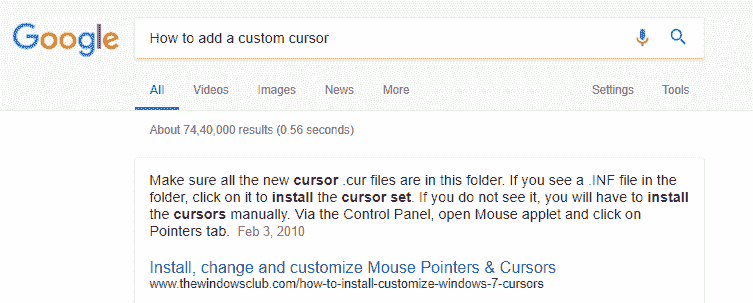
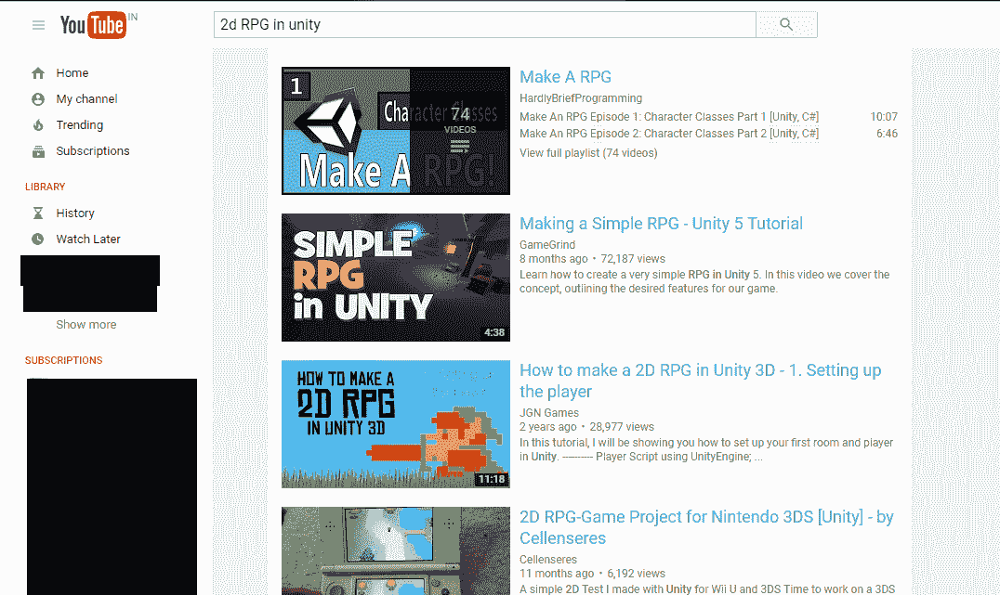

# Unity3D 教程：到目前为止我们学到了什么

> 原文：<https://www.studytonight.com/game-development-in-2D/a-quick-review>

我们几乎完成了本系列的开始阶段。让我们快速回顾一下到目前为止所学的内容。

*   我们已经学习了 Unity 的一般工作原理，如何将**精灵**和有用的素材导入到我们的项目中。
*   我们已经学会了如何将**物理**添加到我们的精灵中，以便它们与游戏世界正确互动。
*   我们已经了解了游戏中**对撞机**和**对撞机**是什么，以及如何使用它们。
*   我们已经学会了根据需要实例化、修改和销毁游戏对象。
*   我们已经学会了如何在游戏中加入自己的 **UI 元素**，以及如何加入**音效**和音乐。

当然，这只是你和 Unity 在制作令人敬畏的游戏的道路上所能做的冰山一角。还有很多东西要学。但是具体怎么做呢？

* * *

## 如何学习

那么，我们所说的**如何学习**到底是什么意思呢？嗯，我们的意思是说你应该如何去探索你的能力，以及你如何与 Unity 合作。正如我所说的，我们只是学习了使用 Unity 的基础知识。你很可能需要学习额外的东西，然后才能让游戏准备出版。当然，学习不一定意味着获得关于新概念的知识。这也意味着弄清楚如何解决错误，如何让事情按照你希望的方式运行，以及如何以创造性的方式使用特性和素材。

假设我们想学习如何将自己的鼠标光标添加到游戏中。你可能想到的最直接的答案就是谷歌一下。然而，谷歌搜索也有一门艺术。请看下面的图片。你认为哪一个会对我们的问题产生满意的结果？

在我们看来，第二个查询似乎更好一点。让你的问题简单明了是快速回答的关键。一定要在查询中加入 Unity，这样很容易将你的问题误认为是另一个程序或游戏开发环境。(就像下面的谷歌搜索，不，不是我们要找的。)

接下来我们要提到的是论坛。Unity 有一个巨大的、繁荣的论坛，里面充满了有想法的人，有更多经验的人，以及刚刚开始游戏开发之旅的人。我们个人的大部分好奇心得到了满足，因为有人已经在论坛上问过这个问题。许多老开发者后悔在事业巅峰时没有这种水平的社区互动，因为回到游戏开发的旧时代，你几乎是一个人。这就是为什么你应该尽可能多地利用社区论坛。

接下来，学习新东西的另一个很好的资源是 YouTube。一个简单的搜索就能让你找到你想知道的几乎所有东西，因为 Unity 社区在视频分享平台上也非常活跃。

最后，我们有 Unity 的官方文档。这是一系列非常有用的文章和代码示例，涵盖了 Unity 组件和内部工作的所有方面，是当你不能全神贯注于某事或需要弄清楚代码如何工作时的绝佳参考指南。Unity 的文档既可以在线获得，也可以下载。安装 Unity 时可以选择下载文档，也可以从[这里](https://docs.unity3d.com/Manual/OfflineDocumentation.html)下载。

* * *

* * *