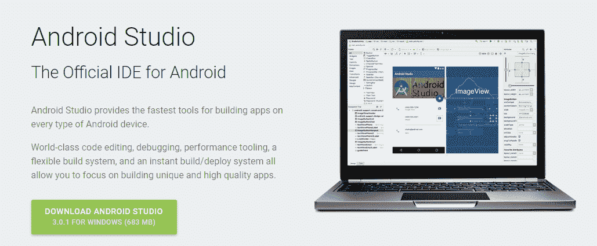
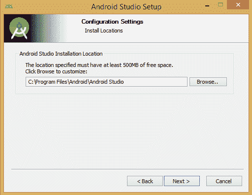
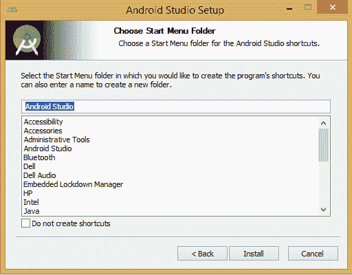
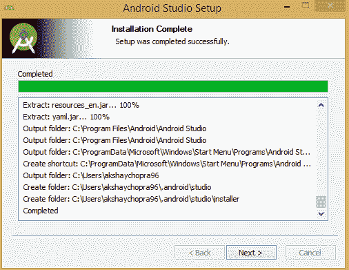
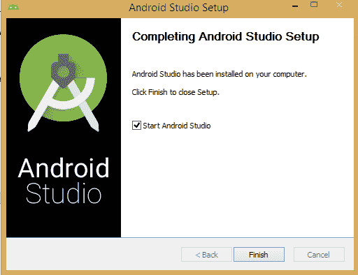
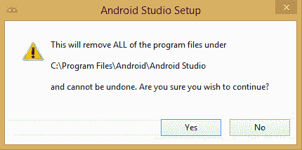

# 设置安卓开发环境

> 原文：<https://www.studytonight.com/android/setup-android-dev-env>

最后，摊牌时间到了。是时候开发你自己的安卓应用了。等等，你要在哪里输入代码？你需要一些环境来开发你的应用。因此，首先您需要下载必要的工具、SDK 和安装文件来设置开发环境。你可以使用苹果操作系统、视窗或 Linux 平台进行安卓应用开发。所有必需的包、工具和其他必需的文件都可以从互联网上下载。以下是这些文件的名称，以及它们的描述，这些描述是开发安卓应用所必需的。

## Java 开发工具包(JDK)

安卓 SDK 在 Java SE 开发工具包(JDK)上运行。因此，首先您的系统必须安装 JDK。如果系统上没有，可以从[这里](http://www.oracle.com/technetwork/java/javase/downloads/index.html)下载。

> ***注意:**请确保根据您的系统配置下载适当的 JDK，因为对于 macOS、Windows 和 Linux 平台有单独的设置文件。*

因此，设置环境的第一个要求是 JDK 必须安装在您的系统上。一旦你完成了这些，你就可以进行下一步了。

> ***注意:**一旦安装了 JDK，还需要设置 PATH 和 JAVA_HOME 变量。通常，这是由系统自动完成的。如果你在这方面遇到任何问题，你可以在这里阅读更多关于它的信息。*

## 安卓 SDK/AndroidStudio/Eclipse

接下来是 Android SDK。它包含库、调试器、仿真器、文档、示例代码和针对安卓发布版本的每个应用编程接口级别的教程。

> ***注:**在 Android Studio 发布之前，SDK 是 Android Application 开发工具的独立部分，可以借助 Android ADT Bundle 与 Eclipse 等其他 IDE 集成。后来，谷歌将安卓 SDK 作为 AndroidStudio 的一部分，这是安卓开发的官方 IDE。*

可以从[这里](https://developer.android.com/studio/index.html#downloads)的链接下载完整的安卓开发环境捆绑包(安卓 Studio + SDK)。

* * *

### AndroidStudio 的设置和安装

一旦你完成了安装 JDK 和下载 AndroidStudioIDE 安装文件，双击。AndroidStudio 的. exe 文件(设置文件)。它将为安装准备文件，并询问您要安装的位置，如下图所示。

选择一个合适的位置，然后单击“下一步”按钮。

点击安装按钮。它将开始安装，如下所示。

点击下一步按钮。

AndroidStudio 已经直接安装，可以使用了。点击完成按钮，AndroidStudio 将打开。

> ***注意:**如果你已经安装了 AndroidStudio 的任何早期版本，AndroidStudio 安装程序将首先删除你的早期版本，然后安装新版本，如下图所示。在此过程中，不会删除设置和配置。*

如果 AndroidStudio 和自己在同一个位置，它会自动获取安卓 SDK 的位置。但是如果它没有发现，那么它会要求你浏览到安卓 SDK 的位置。

在[下一个教程](adding-tools-packages-android-studio)中，我们将讨论 Android SDK 管理器以及 SDK 管理器中完成系统设置以进行开发所需的附加包。

* * *

* * *