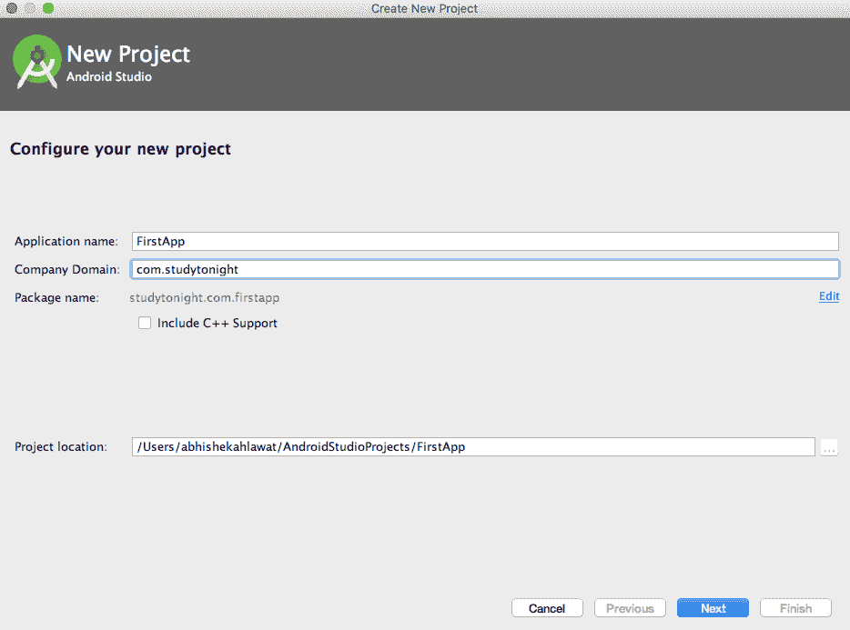
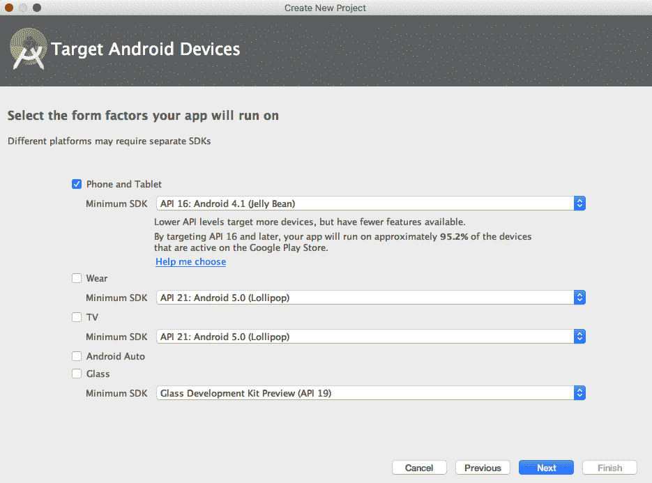
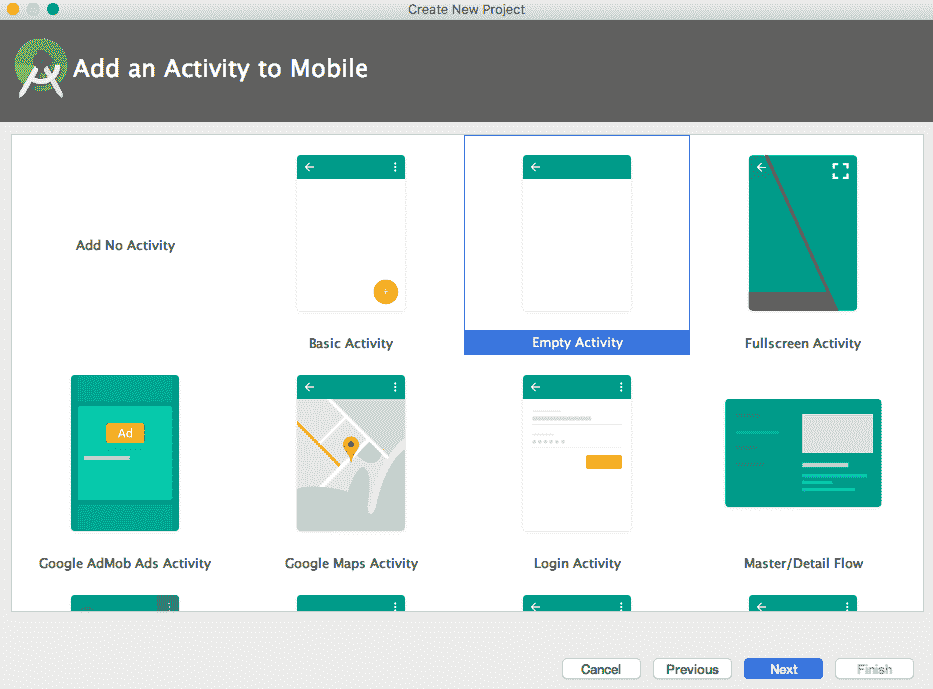
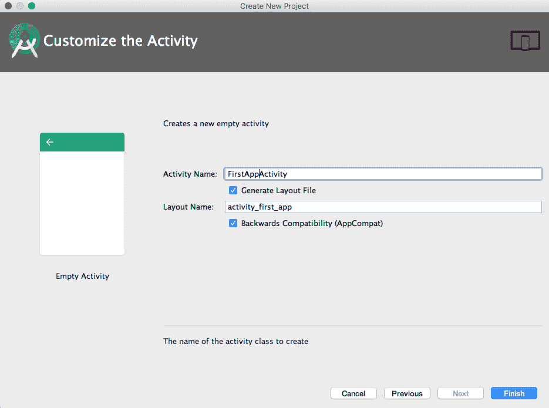
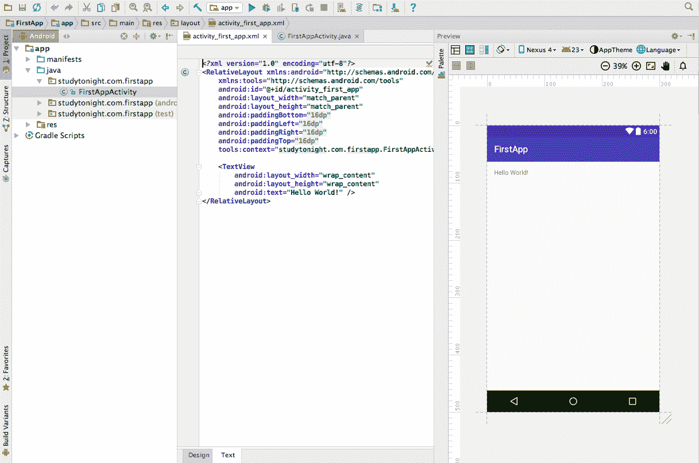

# 创建简单安卓应用项目的步骤

> 原文：<https://www.studytonight.com/android/first-android-application>

在[之前的教程](android-virtual-device)中，我们学习了如何为安卓应用程序开发设置系统，以及如何创建一个 AVD(安卓虚拟设备)来测试我们的应用程序。因此，现在在本教程中，我们将创建我们的第一个安卓应用程序，并尝试了解安卓应用程序开发的基础知识。

* * *

## 应用基础

我们的第一个应用程序将是一个简单的应用程序，有一个活动和一个布局，其中我们将只打印 **Hello World！设备屏幕上的**。以下是一些你必须知道的事情，不要担心，随着我们的前进，你会明白所有这些:

*   一个**活动**是`Activity`的一个实例，一个安卓软件开发工具包中的类。活动负责管理用户与屏幕信息的交互。每当我们创建一个新的活动时，我们实际上是在编写`Activity`类的子类。一个简单的应用程序可能只需要一个子类，而一个复杂的应用程序可以有很多子类。在我们的第一个应用程序中`FirstAppActivity`将是我们的活动子类。
*   A **[布局](introduction-to-layouts)** 定义一组用户界面(UI)对象(视图和小部件)及其在设备屏幕上的位置。布局由用 XML 编写的定义组成。每个定义都用来创建一个出现在设备屏幕上的对象(用户界面)，比如按钮、文本或图像。

简单来说，我们可以说后端将由扩展`Activity`类的类来处理，前端即用户界面在布局 XML 文件中定义。

* * *

## 创建安卓应用程序的步骤

第一步是创建一个新的安卓项目。安卓项目包含组成应用程序的所有文件。打开[安卓工作室](android-studio-for-android)，转到**文件→新建→新项目...**

您应该会看到新建项目向导。输入 **FirstApp** 作为应用名称。对于公司域名，今晚进入**网上学习**或者你可以使用你自己的名字，例如**网上约翰威克**。当您进入公司域时，您将看到软件包名称自动生成，就在公司域字段下方。让项目位置保持原样，您可以根据需要进行更改。



请注意，软件包名称(在“公司域”字段下方生成)使用了**反向域名系统**约定，在该约定中，您组织的域名被反向，并以其他标识符(如应用程序名称)作为后缀。这种约定保持包名的唯一性，并在设备和谷歌游戏上区分应用程序。

点击**下一步**。接下来是[安卓工作室](android-studio-for-android)向我们询问**目标安卓设备**，我们正在为其开发应用程序。我们的第一个应用程序将只支持手机，所以只需检查手机和平板电脑。选择 API 16 的最低 SDK 版本:安卓 4.1(果冻豆)。最低 SDK 版本指定了设备上运行我们的应用程序所需的最低安卓版本。



在下一步中，您将被要求为您的应用程序的第一个屏幕选择一个模板，选择**空活动**，然后单击下一步。



在该向导的最后一个对话框中，您将被要求命名您的活动子类。命名为`FirstAppActivity`。请注意类名上的活动后缀。这不是必需的，但这是一个很好的惯例。



布局名称将自动更新为`activity_first_app`以反映活动名称。布局名称颠倒了活动名称的顺序，全部小写，单词之间有下划线。

点击**完成**，安卓工作室会花一些时间为你准备项目。

* * *

## 在安卓工作室导航

安卓工作室将在如下所示的窗口中打开您的项目:



安卓工作室中不同的窗格被称为**工具窗口**。

左侧视图是**项目**工具窗口。从这里，您可以查看和管理与项目相关联的文件。

中间视图是**编辑器**。为了让你开始，安卓工作室已经在编辑器中打开了`activity_first_app.xml`和`FirstAppActivity.java`文件。

当布局 xml 打开时，您也可以通过单击编辑器窗口左下角的**设计选项卡**切换到**设计**模式，查看您的布局将如何显示。在设计模式下，你可以直接拖放元素，安卓工作室会自动在你的布局 xml 文件中为添加的小部件编写代码。


也可以进入**视图→工具窗口→预览**，打开**预览**工具窗口。

默认的活动布局定义了两个小部件:一个`RelativeLayout`和一个`TextView`。

当我们说小部件时，**小部件**是您用来组成用户界面的构建块。小部件可以显示文本或图形，与用户交互，或者在屏幕上排列其他小部件。按钮、文本输入控件和复选框都是小部件的类型。在接下来的课程中，我们将学习[视图](introduction-to-views)和小部件。

```
<?xml version="1.0" encoding="utf-8"?>
<RelativeLayout xmlns:android="http://schemas.android.com/apk/res/android"
    xmlns:tools="http://schemas.android.com/tools"
    android:layout_width="match_parent"
    android:layout_height="match_parent"
    android:paddingBottom="@dimen/activity_vertical_margin"
    android:paddingLeft="@dimen/activity_horizontal_margin"
    android:paddingRight="@dimen/activity_horizontal_margin"
    android:paddingTop="@dimen/activity_vertical_margin"
    android:background="@android:color/white"
    tools:context="com.example.android.myfirstandroidapp.FirstAppActivity" >

    <TextView
        android:id="@+id/textView1"
        android:layout_width="wrap_content"
        android:layout_height="wrap_content"
        android:text="@strings/hello_world"
        android:layout_centerHorizontal="true"
        android:layout_margin="10dp"
        android:textSize="15sp"
        android:paddingTop="5dp" />

</RelativeLayout>
```

我们的`FirstAppActivity.java`类将覆盖`onCreate()`方法，并且正在扩展`ActionBarActivity`。`ActionBarActivity`是 Android SDK 的`Activity`类的子类，其中默认增加了一个动作栏(Top navbar)。

```
// Some import statements

public class FirstAppActivity extends ActionBarActivity {
    @Override
    protected void onCreate(Bundle savedInstanceState) {
        super.onCreate(savedInstanceState);
        setContentView(R.layout.activity_first_app);
    }
}
```

这就是你的第一份申请。希望你已经了解了开发安卓应用的相关基本概念，现在知道如何使用安卓工作室了。

如果你不理解代码，不要太担心它。我们将在接下来的教程中详细解释每一个细节。从现在开始，只要记住任何扩展`Activity`类的类都会在 App 中创建一个视图，并且该视图的设计是使用`layout.xml`文件设置的。在`FirstAppActivity`类中，`setContentView(R.layout.activity_first_app);`行链接布局 XML 文件和`FirstAppActivity`类。

* * *

* * *