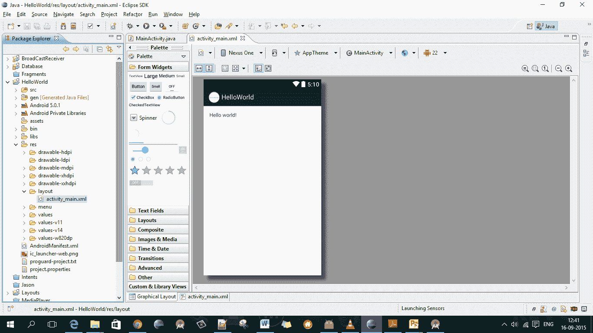
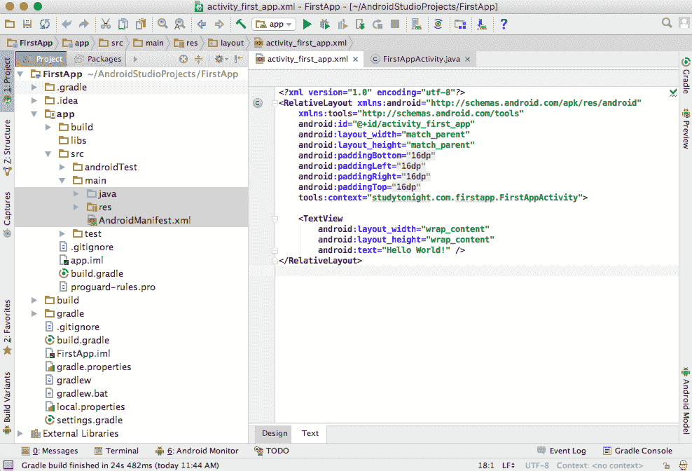

# 安卓应用项目包结构（AndroidStudio）

> 原文：<https://www.studytonight.com/android/android-app-package-structure>

在我们[之前的教程](first-android-application)中，我们学习了如何创建我们的第一个安卓应用以及如何运行它。当我们创建一个安卓项目时，[AndroidStudio](android-studio-for-android)用一些默认的包和文件夹生成应用项目。在本教程中，我们将讨论安卓应用的项目结构。

以前很多安卓应用都是在 [Eclipse IDE](using-eclipse-for-android) 上开发的，但是现在一天只能用 AndroidStudio 开发一个安卓应用，否则谷歌不会允许这个应用公开，甚至拒绝来自谷歌 Play 商店的应用。对于那些使用 Eclipse 开发的应用，现在计划将代码转移到 AndroidStudio 的人来说，这一课将帮助你理解这两个开发工具的结构。

首先我们将了解 **Eclipse IDE** 的项目结构(如果你是初学者，可以跳过这一部分)。为此，我们将假设你有一个基本的“你好世界！”在 Eclipse IDE 中创建的安卓应用。Eclipse 和 Android Studio 都需要相同的步骤来创建一个应用项目，只有细微的区别。

在 **Eclipse** 中，每个安卓项目结构都包含以下文件夹，

*   科学研究委员会
*   情报
*   安卓版本
*   资产
*   激光诱导击穿光谱仪
*   表示留数
    *   可拉的
    *   布局
    *   生命
    *   价值观念
*   AndroidManifest.xml
*   默认值.属性

这些是默认文件夹，它们和另外两个文件一起共同构成了一个安卓应用项目，一个是`AndroidManifest.xml`和`default.properties`。还有其他文件夹，如 **bin** 和**参考库**。

由于在 Eclipse 中创建的大多数文件夹仍然是在 AndroidStudio 中创建的，目录结构有一些变化，因此我们将在下一节解释 AndroidStudio 中安卓应用的包结构。

* * *

## AndroidStudio 中的包结构

在 Android Studio 中，现代的 Android App 包结构发生了一点变化，但变化非常微妙。

以下是创建的文件夹列表，当你在 AndroidStudio 创建一个安卓应用项目，并在**项目**查看模式下看到它时:

*   **app**
    *   建设
    *   激光诱导击穿光谱仪
    *   **src**
        *   androidTest
        *   **主**
            *   **java**
            *   **无**
            *   **AndroidManifest.xml**
*   毕业生

> **注:** *用黑体字书写的包裹是重要包裹。*

### src 文件夹

**src** 文件夹保存任何安卓项目上最重要的两个文件夹，即**安卓测试**和**主**。

创建 **androidTest** 包是为了保存测试应用代码和运行的测试用例。

而**主**文件夹，有 2 个文件夹和 1 个文件。它们是:

*   **java** directory

    该文件夹包含`.java` (JAVA)文件。在这里，您可以为应用创建接口、活动、片段或适配器。这个文件夹只包含 java 代码。您可以为其中的每一个创建单独的包，并在其中创建类，从而为您的应用项目提供一个定义良好的结构。

*   **AndroidManifest.xml**

    这个文件是任何安卓应用的必备文件。在这个文件中，我们提供了应用的所有活动、服务、广播接收器等信息，以及应用安装在任何设备上时所需的所有权限，如互联网、联系人、摄像头等。请记住，这个文件是任何安卓应用的核心。

*   **res** directory

    此文件夹包含所有与我们的应用项目相关的资源，如图标、图像等，它包含以下子文件夹:

    *   **可抽拉**

    该文件夹包含 xml、png、jpg 和 jpeg 文件。在这个文件夹中，您可以存储应用中使用的图像和其他`.xml`文件，这些文件用于许多目的，如创建按钮背景或阴影效果等。

    *   **布局**

    该文件夹仅包含应用不同屏幕和部分的布局`.xml`文件。

    *   **values**

        该文件夹包含`strings.xml`、`dimens.xml`、`colors.xml`、`styles.xml`等默认文件。

        *   在 **strings.xml** 中，您可以指定所有字符串常量，如屏幕标题或应用中经常使用的任何其他标签。
        *   在 **dimens.xml** 中，您可以创建不同的`.xml`文件，根据屏幕分辨率和尺寸定义尺寸，并在该文件中给出填充、高度、宽度、边距的任何尺寸。
        *   在 **color.xml** 中，您可以使用应用中使用的 hashcodes 来提及颜色列表。如果默认情况下没有创建，您可以自己创建。
        *   在**style . XML**中，您可以定义不同的现成样式，以便在您的安卓应用中的任何地方直接使用它们。

### 生成文件夹

该文件夹包含`R.java`文件，这是一个自动生成的文件。这个文件索引了安卓应用项目的所有资源，如**布局 xml** 、**字符串 xml** 等，并且是自动生成的。

在**构建**文件夹中，您将拥有应用的调试和发布 **apk 文件**，这是在您构建项目时创建的。

### libs 文件夹

如果你想使用任何外部库，你所要做的就是将`.jar`文件复制粘贴到 **libs** 文件夹中，然后你就可以直接在你的`.java`代码文件中使用它了。

### gradle 文件夹

在这个文件夹中有与 **gradle** 相关的文件，这些文件可以被修改以改变项目构建过程。例如:如果您希望在构建`.apk`文件之前运行所有可用的测试用例，您可以通过在 gradle 文件中提及它来实现。

所以现在你知道了你的安卓应用项目的每个现成文件夹的细节。随着我们继续学习课程，您将会对这些文件夹及其包含的文件类型有更多的了解。即将到来的课程包含关于 [Gradle](introduction-to-gradle) (为 AndroidStudio 构建系统)的信息。

* * *

* * *