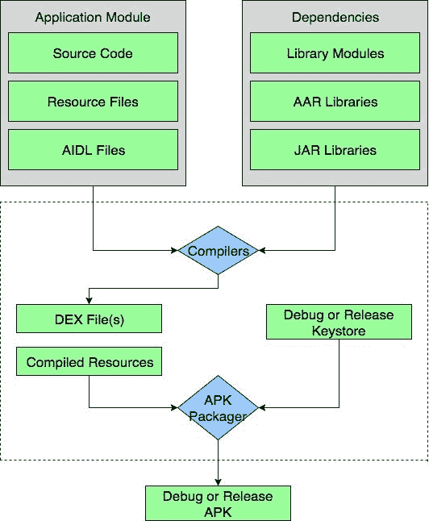
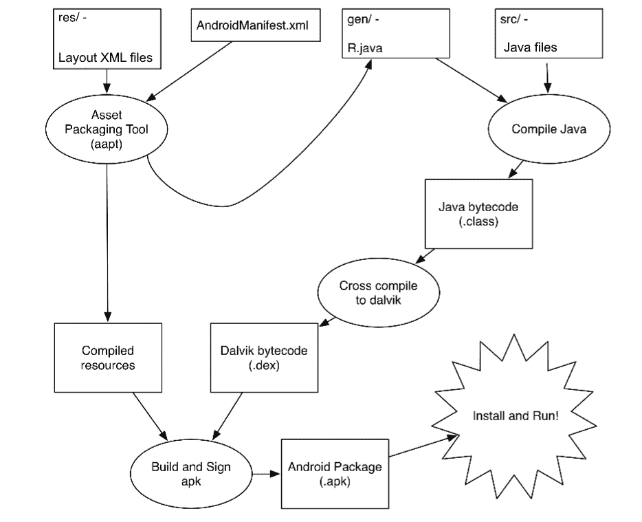

# 安卓工作室 Gradle 简介

> 原文：<https://www.studytonight.com/android/introduction-to-gradle>

在[安卓工作室](android-studio-for-android)中，Gradle 用于构建我们的安卓应用项目，因此扮演了构建系统的角色。在安卓工作室之前，在 [Eclipse](using-eclipse-for-android) 中，我们使用命令行工具编译和构建应用程序，该工具很快被基于图形用户界面的步骤所取代，以使用 ANT 在 Eclipse 中构建和运行安卓应用程序。每个 android 应用程序开发工具都必须编译资源、java 源代码、外部库，并将它们组合成最终的 APK。

**Gradle** 是一个构建系统，负责代码编译、测试、部署以及将代码转换成`.dex`文件，从而在设备上运行应用。

由于安卓工作室自带预装的 Gradle 系统，所以不需要安装额外的运行时软件来构建我们的项目。每当你点击 android studio 中的 **Run** 按钮时，一个 grade le 任务会自动触发并开始构建项目，在 grade le 完成任务后，app 开始在 AVD 或连接的设备中运行。

像 Gradle 这样的构建系统不是编译器、链接器等，但它控制和监督编译、文件链接、运行测试用例的操作，并最终为你的 Android 应用程序将代码捆绑到一个`apk`文件中。

每个安卓工作室项目都有两个`build.gradle`文件，一个是**应用**文件，另一个是**项目级(模块级)构建文件**文件。

构建过程如下图所示。

在构建过程中，编译器获取源代码、资源、外部库 JAR 文件和`AndroidManifest.xml`(包含关于应用程序的元数据)并将其转换为`.dex` (Dalvik 可执行文件)文件，其中包括字节码。所有安卓设备都支持字节码来运行你的应用。然后 **APK 管理器**将`.dex`文件和所有其他资源合并成单个 **apk** 文件。 **APK 打包程序**使用各自的调试或发布密钥库签署调试或发布 APK。

**Debug apk** 一般用于测试目的或者我们可以说只是在开发阶段使用。当您的应用程序具有所需的功能并且您准备发布您的应用程序供外部使用时，您需要使用发布密钥库签署的**发布 apk** 。

现在让我们来看看这些文件。

#### setting.gradle

**设置.梯度**(梯度设置)文件用于**指定您的应用程序**中使用的所有模块。

#### build.gradle(项目级)

*顶层*(模块) **build.gradle** 文件是项目级构建文件，定义项目级的构建配置。该文件将配置应用于 android 应用程序项目中的所有模块。

#### build.gradle(应用程序级)

*应用级* **build.gradle** 文件位于安卓项目的每个模块中。该文件包括您的软件包名称`applicationID`、版本名称(apk 版本)、版本代码、特定应用程序模块的最低和目标 sdk。当您包含外部库(而不是 jar 文件)时，您需要在应用程序级别的 gradle 文件中提到它，以便将它们作为应用程序的依赖项包含在项目中。

> **注意:**如果某个应用程序是针对智能手机、平板电脑或电视等单个模块开发的变体，则必须为所有模块创建单独的梯度文件。

你甚至可以通过**命令行工具**启动你的梯度系统。它使用以下命令:

*   `./gradlew build` -(建设项目)
*   `./gradlew clean build` -(构建项目完成从头开始)
*   `./gradlew clean build` -(运行测试)
*   `./gradlew wrapper` -(查看所有可用任务)

* * *

## 艺术-安卓运行时

**达尔维克虚拟机死了**。是的，谷歌在 2014 年就停止使用了，虽然你会在网上找到大部分的安卓教程，仍然没有更新，但是请注意 Dalvik Virtual Machine 已经不在安卓使用了。

新的运行时被称为 ART 或 Android Runtime，它与它的前身 Dalvik 非常兼容，但确实有很多新功能，比如:

*   **提前编译**
*   **改良垃圾收集**
*   改进的调试和诊断。

* * *

* * *