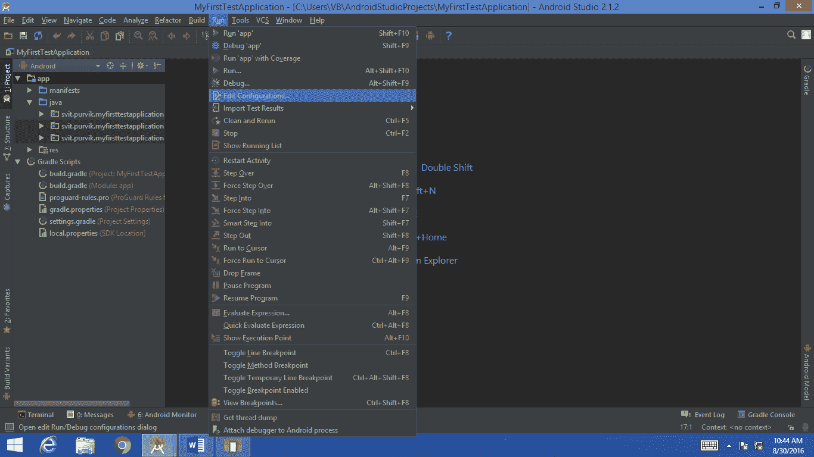
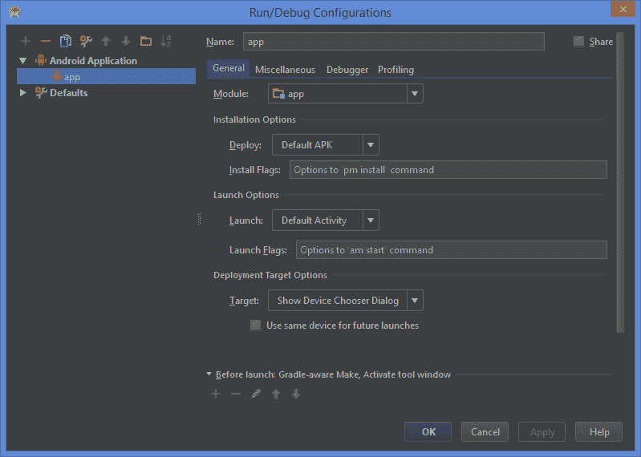
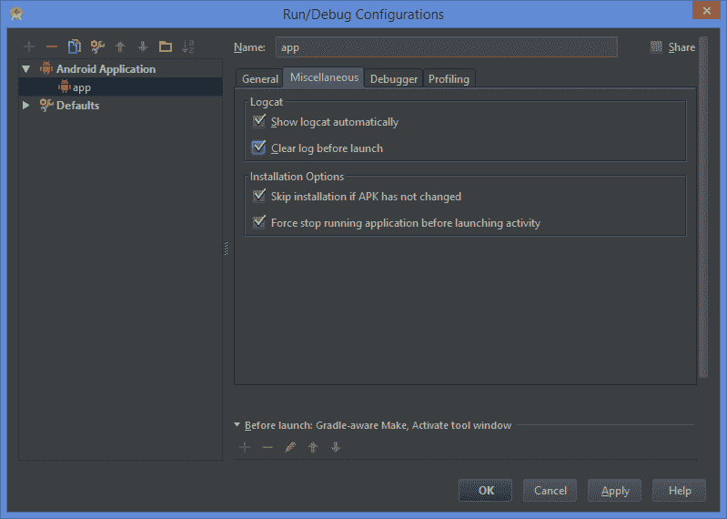
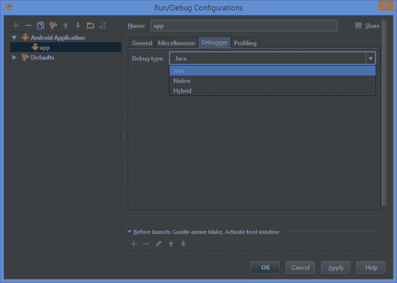
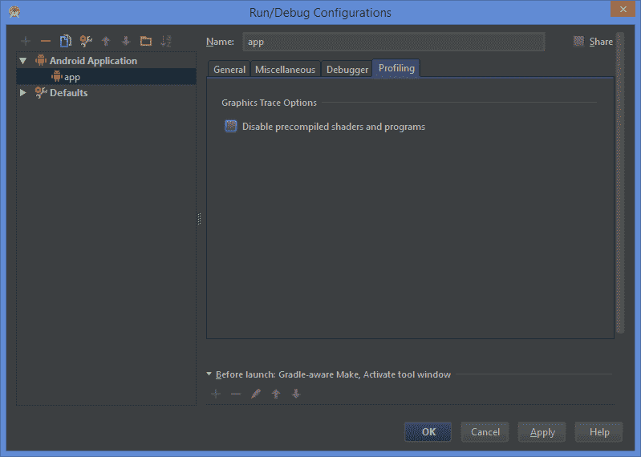
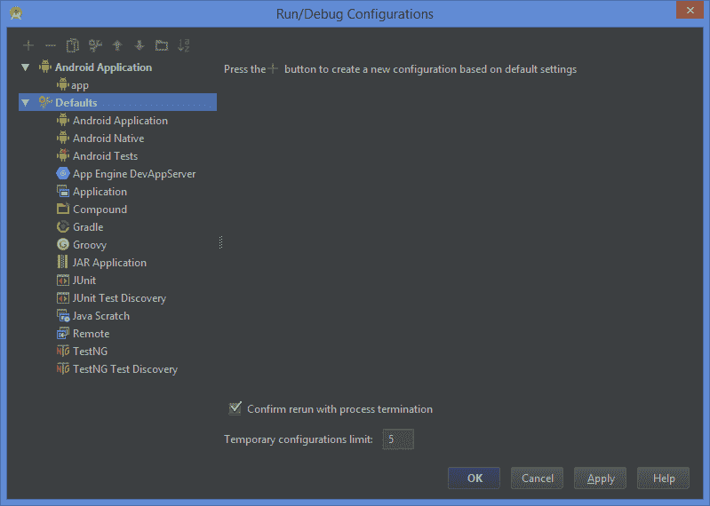
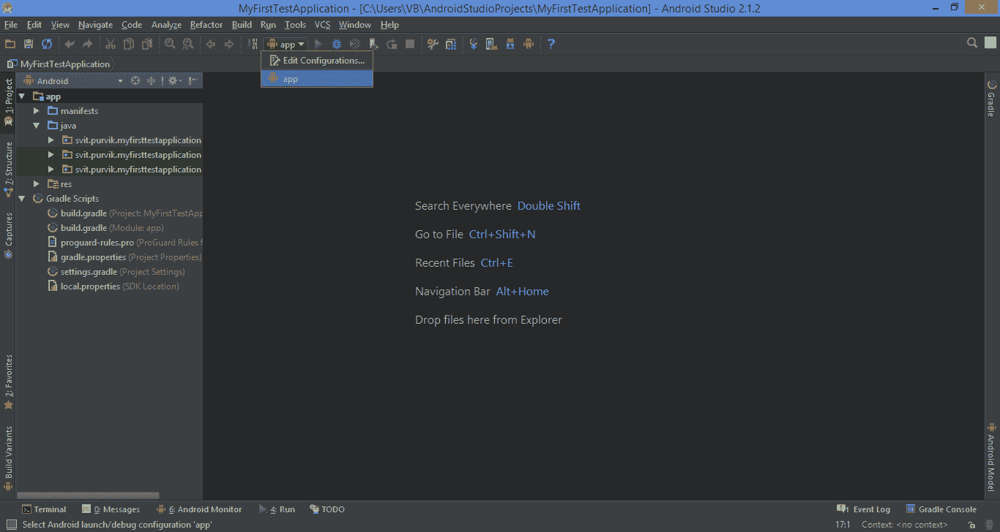
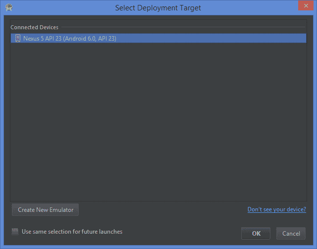
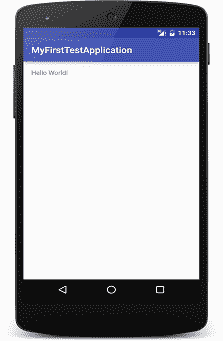
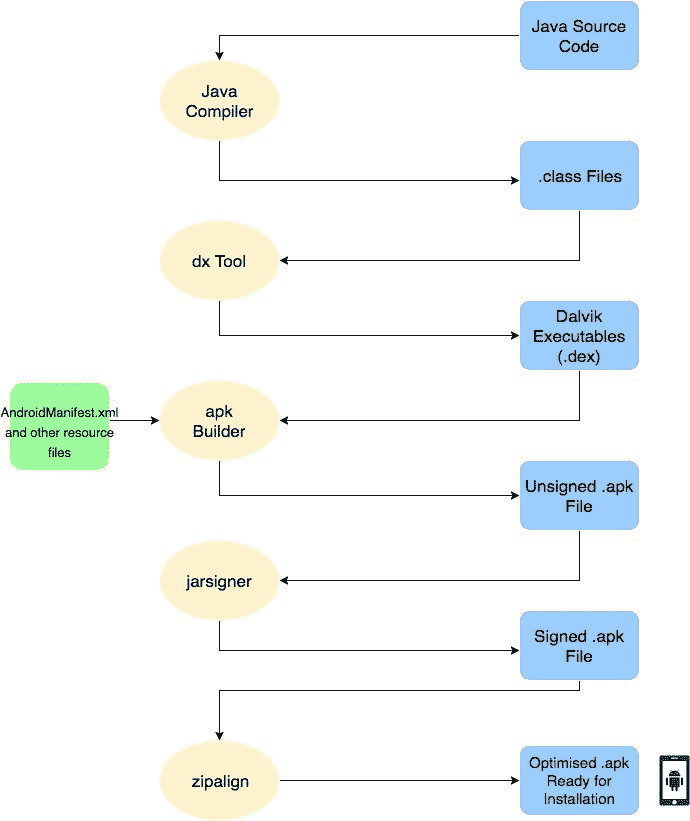

# 在模拟器或设备上运行您的第一个安卓应用

> 原文：<https://www.studytonight.com/android/running-first-android-application>

在[之前的教程](introduction-to-gradle)中，我们学习了如何创建我们的第一个[安卓应用项目](first-android-application)以及如何创建一个[安卓虚拟设备](android-virtual-device)用于测试。现在我们将在一个创建的模拟器上运行我们的第一个安卓应用。所以如果还没有启动 AVD，就去 **AVD 管理器**启动一个 AVD(虚拟设备)。

接下来，打开你的安卓应用项目(我们之前创建的项目)&让 **[Gradle](introduction-to-gradle)** 第一次完成它的构建。然后点击**运行**菜单选项，查找**编辑配置**。见下图。

点击**编辑配置**选项将打开如下图所示的窗口。将有两个配置选项，一个用于我们的**安卓应用项目**，另一个用于**默认配置**。点击安卓应用&中的**应用**，我们将看到为我们的安卓应用项目配置的其他几个选项。

如我们所见，在**常规**部分，我们可以指定**模块**(选择我们的第一个应用像手机、平板电脑、电视、穿戴的哪种应用)、**安装选项**(部署默认 APK 或其他)、**启动选项**(启动时启动应用的特定活动)和**部署目标选项**(是在仿真器上运行还是在物理(USB 连接)设备上运行)。

在**杂项**选项中，**日志**和**安装选项**可用。Logcat 向我们显示了当我们的应用在仿真器或 USB 设备上运行时触发的各种事件的日志。使用 Logcat 日志，我们可以检查我们的应用执行的状态和在我们的项目中使用的各种对象、字符串&实例的值。从这里我们可以配置自动启动 LogCat&在应用开始运行时清除之前的执行日志。

同样，当安装在测试过程中进行时，如果我们的应用与以前的安装相比没有任何变化，我们可以跳过新的安装。如果我们做了一些更改，然后开始测试我们的应用，我们总是可以选择选项来停止我们之前执行的运行活动。

另外两个选项是**调试器**和**分析**。从调试器中，我们可以选择调试器的类型来测试我们正在运行的安卓应用项目。它有几个可用的选项，如 Java、原生和混合。

而另一方面，概要分析将让我们选择**图形跟踪选项**，从这里我们可以删除预编译的着色器和要由 Graphics Tracer 跟踪的程序。

另一方面，**默认配置**部分包含了我们安卓应用项目的几个可配置设置。从上图中我们可以看到，类似**安卓应用**(与上一个相同)**安卓原生**(用于原生开发)**安卓测试**(测试目的配置)**应用引擎 DevAppServer** (应用引擎模块配置)**应用**(应用级别设置)**复合**、**[gradlee](introduction-to-gradle)**(用于项目构建的配置)等选项在这里都有。从这些选项中，我们可以为我们的 android 应用项目设置默认配置。这些都是我们在运行/调试应用时可以更改的可用可配置设置。

接下来，如果您对默认设置进行了任何更改，则点击**应用**，否则选择**确定**作为默认设置。现在点击**运行**菜单下的下拉菜单选项，选择**应用**，然后点击运行选项，绿色三角形(播放按钮)就在它的右边。

它将显示带有系统连接设备列表的窗口。在这里，我们可以选择应用部署目标，并在所需的仿真器或通用串行总线设备上运行我们的应用进行测试。如我们所见，如果我们需要的话，可以在左下角选择**创建新模拟器**。选择所需的连接设备，点击**确定**，AndroidStudio将开始构建您的项目，并在最后在选定的模拟器上安装调试`apk`。构建过程需要时间，所以我们应该有耐心，但最后我们会得到一个糖果破解如下图。

希望这个教程教你一些新的关于安卓应用项目的运行/调试配置，我们可以设置。按照程序，在模拟器中测试你的 android 应用项目。

* * *

## 幕后发生了什么？

最后，你已经在你的模拟器上运行了你的第一个 HelloWorld 应用，祝贺你！但是这里有一些当你点击**播放**按钮时发生的事情。

*   你所有的 Java 源代码都会被 Java 编译器编译成`.class`文件。
*   你所有的`.class`文件被 **dx** 工具转换成一个单一的`.dex`文件，这是安卓SDK工具的一部分。
*   `.dex`文件是一个 Dalvik 可执行文件，在应用启动时运行在 Android Runtime(ART)内部。
*   该`.dex`文件由**安卓应用打包工具** (aapt)与安卓 Manifest 等应用资源文件打包，生成安卓包文件`.apk`
*   只有经过签名的应用才能在设备/仿真器上运行，以确保其真实性，因此使用 **jarsigner** 实用程序对`.apk`文件进行签名。
*   **zipalign** 实用程序用于优化`.apk`文件，并最终使其准备好安装。

* * *

* * *