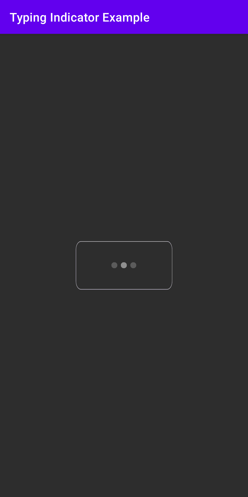

> 原文：<https://www.studytonight.com/android/android-typing-indicator>

[← Prev](/android/running-first-android-application "Running the Application")[Next →](/android/introduction-to-layouts "Introduction to Layouts/ViewGroups")

# 安卓打字指示器

我们在脸书、Instagram、Messenger、Twitter 等各种应用中看到了**打字指标**。如果我们想做一个聊天应用，那么打字指示器是其中一个功能，我们希望在我们的应用中。它将有助于实现更好的 UI。

为了了解它的实现，让我们在我们的安卓应用中添加一个**安卓打字指示器**。

## 步骤 1:创建新项目

1.  打开你的AndroidStudio点击“**开始一个新的AndroidStudio项目**”(学习[如何设置AndroidStudio](https://www.studytonight.com/android/setup-android-dev-env)[创建你的第一个安卓项目](https://www.studytonight.com/android/first-android-application))

2.  从项目模板窗口中选择**空活动**，点击**下一步**。

3.  输入 **App 名称**、**包名**、**保存位置**、**语言**([**Java**](https://www.studytonight.com/java/)/[**Kotlin**](https://www.studytonight.com/kotlin)，本教程我们将使用 **Java** )以及**最小 SDK** (我们使用的是 API 19: Android 4.4 (KitKat))

4.  填写以上详细信息后，点击**完成**按钮。

5.  现在，等待项目完成建设。

## 步骤 2:添加依赖项

转到**梯度脚本- >构建.梯度(模块:应用)**部分，导入下面的依赖项，点击顶部的“**立即同步**”。

```
dependencies
{
//Adding typing indicator 
 implementation 'com.qifan.typingIndicator:typingIndicator:0.1.0'
}
```

## 第三步:用户界面部分

在对 **activity_main.xml** 文件进行任何更改之前，我们需要一个圆形矩形图像作为打字指示器背景，您可以[下载](https://royalpng.com/)任何圆形矩形图像，并将该图像放入**app->RES->drawing able，**中，并给它一个合适的名称。

现在，转到**app->RES->layout->activity _ main . XML**并添加 **ChatTypingIndicatorView** 并将 RelativeLayout 的背景颜色更改为**# 2d 2d**，如下所示。

```
<?xml version = "1.0" encoding = "utf-8"?>
<RelativeLayout xmlns:android="http://schemas.android.com/apk/res/android"
    xmlns:tools="http://schemas.android.com/tools"
    android:layout_width="match_parent"
    android:layout_height="match_parent"
    android:background="#2d2d2d"
    xmlns:app="http://schemas.android.com/apk/res-auto"
    tools:context=".MainActivity">
    <!-- typing indicator -->
    <com.qifan.library.ChatTypingIndicatorView
        android:backgroundTint="#ffff"
        android:layout_centerInParent="true"
        android:gravity="center"
        android:id="@+id/oklIndicatorView"
        android:layout_width="160dp"
        android:layout_height="80dp"
        android:minHeight="40dp"
        android:padding="12dp"
        android:background="@drawable/round_rect"
        app:dotSize="12dp" />
</RelativeLayout>
```

## 第 4 步:编码部分

打开**MainActivity.java**文件，然后创建并初始化**聊天指示器视图**对象**确定指示器视图，**，然后使用该对象调用开始点动画。**MainActivity.java**的代码如下所示:

```
package com.studytonight.project;

import androidx.appcompat.app.AppCompatActivity;
import android.os.Bundle;
import com.qifan.library.ChatTypingIndicatorView;
public class MainActivity extends AppCompatActivity {

    ChatTypingIndicatorView oklChatIndicatorView;
    @Override
    protected void onCreate(Bundle savedInstanceState) {
        super.onCreate(savedInstanceState);
        setContentView(R.layout.activity_main);

        oklChatIndicatorView=(ChatTypingIndicatorView)findViewById(R.id.oklIndicatorView); 
        oklChatIndicatorView.startDotAnimation();
    }
}
```

### 输出:

在下面的快照中，您可以看到 **ChatTypingIndicatorView** 在 android 应用中的外观。

首次打开应用时:



* * *

* * *