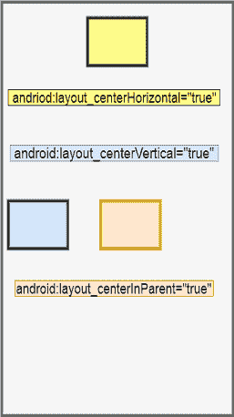
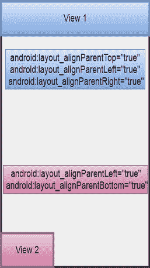
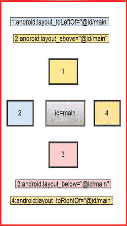
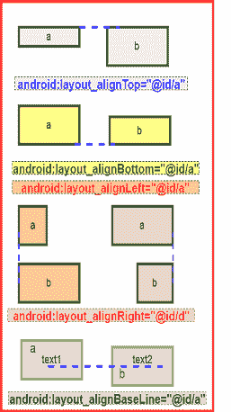
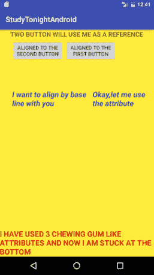

# 安卓中的相对布局

> 原文：<https://www.studytonight.com/android/relative-layout-in-android>

**相对布局**是根据其他视图/小部件/视图组的位置排列视图/小部件/ [视图组](introduction-to-layouts)的布局，即新视图相对于已经存在的视图放置。

例如，在一堂课上，如果学生 A 坐在椅子上，该班的老师要求学生 B 坐在学生 A 的右边，学生 B 将知道他/她必须坐在哪里。

类似地，每个视图的位置可以相对于它的兄弟元素(例如在另一个视图的左边或下面)或者相对于父视图的位置来指定。

相对布局是GUI设计中最常用的布局。为了了解 RelativeLayout 是如何工作的，让我们来看看并理解 RelativeLayout 最常见的属性。

* * *

## RelativeLayout 的公共属性



### 相对于父视图居中

当您想要将视图相对于父视图放置在中心时，可以使用以下 3 个属性:

在我们了解不同的属性之前，我们想指定我们例子中的父项也是一个相对布局，高度和宽度设置为`match_parent`，因此它将覆盖手机的整个屏幕。所以整个屏幕就是我们的父视图。

1.  **android:layout_centerHorizontal="true"**

    这将视图水平放置在父视图的中心。由于我们的父视图覆盖了移动设备的整个屏幕，因此视图被水平放置在移动设备屏幕的中间。(见上图黄色视图)

2.  **android:layout_centerVertical="true"**

    这将视图垂直放置在父视图的中心。由于父视图覆盖了移动设备的整个屏幕，因此视图被垂直放置在移动设备屏幕的中间。(见上图蓝色视图)

3.  **android:layout_centerInParent="true"**

    该属性将视图放置在父视图的中心。因为在我们的例子中，父屏幕覆盖了移动设备的整个屏幕，所以视图被放置在移动设备屏幕的中间，无论是水平的还是垂直的。(参见上图中的奶油色视图)

* * *

### 按父视图对齐

这些类型的属性使视图像口香糖一样，因为它可以使用这些属性固定到父视图的任何一侧。



再举个例子，我们考虑我们的父视图是一个 RelativeLayout，高度和宽度设置为`match_parent`，因此它将覆盖手机的整个屏幕。所以整个屏幕就是我们的父视图。

1.  **android:layout_alignParentTop="true"**

    如果您为视图编写了此属性，则该视图将固定在其父视图的顶部。由于父屏幕覆盖了移动设备的整个屏幕，因此视图将出现在移动设备屏幕的左上角。

2.  **android:layout_alignParentBottom="true"**

    如果您为一个视图编写这个属性，那么该视图将停留在其父视图的底部。因为我们的父母覆盖了手机的整个屏幕，所以视图会出现在手机屏幕的底部。

3.  **android:layout_alignParentLeft="true"**

    如果为视图编写此属性，则该视图将停留在其父视图的左侧。由于我们示例中的父对象覆盖了移动设备的整个屏幕，因此视图将出现在移动设备屏幕的左侧。

4.  **android:layout_alignParentRight="true"**

    如果您为视图编写此属性，则该视图将停留在其父视图的右侧。

> **注意**:这些属性你可以一直使用一个以上。假设使用`android:layout_alignParentLeft="true"`和`android:layout_alignParentBottom="true"`，那么视图会贴在屏幕左下角，如上图粉色视图所示。

* * *

### 相对于现有同级视图放置新视图

在相对视图中，您可以保持新视图相对于其他现有视图的位置。以下属性可用于此目的。



假设中心有一个视图，其`id`为`android:id="@+id/main"`，那么其他新视图可以相对于该视图放置如下:

1.  **android:layout_toLeftOf="@id/main"**

    这告诉新视图，您必须位于视图的左侧，该视图的`id`是**主视图**。

2.  **android:layout_toRightOf="@id/main"**

    这告诉新视图，您必须在视图的右侧，该视图的`id`是**主**。

3.  **android:layout_above="@id/main"**

    这告诉新的观点，你必须在`id`为主的观点之上。

4.  **android:layout_below="@id/main"**

    这告诉新的观点，你必须在`id`为主的观点之下。

> **注**:给视图分配`id`时，写**安卓:id="@+id/main"** 即在`@`符号后写`+`符号，表示给该视图分配`id`。但是当您将`id`用于其他目的时，如上所述，您相对于具有指定值`id`的现有视图添加了一个新视图，因此我们不必提及`+`符号。我们简单称之为**安卓:layout_below="@id/main"** 即没有`+`标志。

* * *

### 相对于现有同级视图对齐新视图

如果要相对于任何现有视图对齐新视图，则可以使用以下属性。



1.  **android:layout_alignTop="@id/a"**

    这将使新视图的上边距与视图的上边距对齐，其中`id`为`a`。

2.  **android:layout_alignBottom="@id/a"**

    这将使新视图的底边与视图的底边对齐，视图的`id`为`a`。

3.  **android:layout_alignLeft="@id/a"**

    这将使新视图的左边距与视图的左边距对齐，其中`id`为`a`。

4.  **android:layout_alignRight="@id/a"**

    这将使新视图的右边距与视图的右边距对齐，视图的`id`为`a`。

5.  **android:layout_alignBaseLine="@id/a"**

    这将使新视图的文本 1 与视图的文本 2 对齐，视图的`id`为`a`。

* * *

## 在布局 XML 中定义相对布局

现在让我们理解以下代码:

```
<?xml version="1.0" encoding="utf-8"?>
<RelativeLayout xmlns:android="http://schemas.android.com/apk/res/android"
    xmlns:app="http://schemas.android.com/apk/res-auto"
    xmlns:tools="http://schemas.android.com/tools"
    android:layout_width="match_parent"
    android:layout_height="match_parent"
    android:background="#FFEB3B"
    tools:context="com.example.android.studytonightandroid.MainActivity">

    <TextView
        android:id="@+id/textView"
        android:layout_width="wrap_content"
        android:layout_height="wrap_content"
        android:layout_alignParentTop="true"
        android:layout_centerHorizontal="true"
        android:textStyle="bold"
        android:textAllCaps="true"
        android:textSize="17sp"
        android:text="Two Button will use me as a reference" />

    <Button
        android:id="@+id/button"
        android:layout_width="wrap_content"
        android:layout_height="wrap_content"
        android:text="Aligned to the\nsecond button"
        android:layout_below="@+id/textView"
        android:layout_alignLeft="@+id/textView"
        android:layout_margin="5dp"
        android:layout_alignStart="@+id/textView" />

    <Button
        android:id="@+id/button2"
        android:layout_width="wrap_content"
        android:layout_height="wrap_content"
        android:text="Aligned to the\nfirst button"
        android:layout_toRightOf="@id/button"
        android:layout_alignTop="@id/button"
        android:layout_below="@+id/textView"
        android:layout_marginRight="21dp"
        android:layout_marginEnd="21dp" />

    <TextView
        android:id="@+id/textView5"
        android:layout_width="wrap_content"
        android:layout_height="wrap_content"
        android:layout_alignLeft="@+id/button"
        android:layout_alignStart="@+id/button"
        android:layout_below="@+id/button"
        android:layout_marginTop="70dp"
        android:textStyle="bold|italic"
        android:textSize="20sp"
        android:textColor="#25c"
        android:text="I want to align by base\nline with you" />

    <TextView
        android:id="@+id/textView6"
        android:layout_width="wrap_content"
        android:layout_height="wrap_content"
        android:layout_toRightOf="@id/textView5"
        android:layout_alignTop="@+id/textView5"
        android:layout_margin="10dp"
        android:textSize="20sp"
        android:textStyle="bold|italic"
        android:textColor="#25c"
        android:layout_marginTop="70dp"
        android:layout_alignBaseline="@id/textView5"
        android:text="Okay,let me use the attribute" />

    <TextView
        android:id="@+id/textView4"
        android:layout_width="wrap_content"
        android:layout_height="wrap_content"
        android:layout_alignParentBottom="true"
        android:layout_alignParentRight="true"
        android:layout_alignParentLeft="true"
        android:textAllCaps="true"
        android:textStyle="bold"
        android:textSize="20sp"
        android:textColor="#D50000"
        android:text="I have used 3 chewing gum like attributes and now I am stuck at the bottom"/>
</RelativeLayout>
```

### 输出屏幕:



在上面的代码中:

1.  我们使用`android:layout_alignParentTop="true"`属性在屏幕顶部放置了一个带有`id` **文本视图**的视图。
2.  这两个按钮位于具有`id` **文本视图**的文本视图下方。这是通过在两个按钮标签中使用`android:layout_below="@+id/textView"`属性来完成的。
3.  我们已经使用`android:layout_alignTop="@id/button"`属性从上边距对齐了两个按钮。
4.  我们还尝试根据文本对齐两个文本视图，即对齐两个视图的文本。
5.  最后，我们使用了粘性属性`android:layout_alignParentBottom="true"`、`android:layout_alignParentRight="true"`和`android:layout_alignParentLeft="true"`将**文本视图 4** 粘贴在屏幕底部。就像口香糖是可拉伸的一样，本例中的 [TextView](android-textview) 也是可拉伸的，因此它的边界会被拉伸并粘到屏幕的左侧、右侧和底部。

* * *

* * *