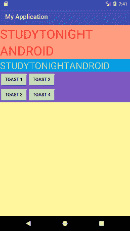

# 使用多个布局和视图设计 GUI

> 原文：<https://www.studytonight.com/android/hierarchical-arrangement-in-android>

正如我们在之前的教程中学习过的不同视图[视图组](introduction-to-views)和[布局](introduction-to-layouts)，现在是时候研究如何在我们的安卓项目中一起使用它们来设计出色的用户界面了。在本教程中，我们将学习如何将不同的布局、视图和视图组放在另一个布局(分层排列)中，为您的安卓应用设计完美的 GUI。

下面我们有一个非常基本的例子来演示如何一起使用多个布局、视图和视图组。

## 在布局 XML 文件中定义设计

```java
<?xml version="1.0" encoding="utf-8"?>
<RelativeLayout xmlns:android="http://schemas.android.com/apk/res/android"
    xmlns:app="http://schemas.android.com/apk/res-auto"
    xmlns:tools="http://schemas.android.com/tools"
    android:layout_width="match_parent"
    android:layout_height="match_parent"
    android:background="#FFF59D"
    tools:context="com.example.android.myapplication.MainActivity">
    <!--Light Yellow Color-->

    <LinearLayout
        android:layout_width="match_parent"
        android:layout_height="wrap_content"
        android:orientation="vertical"
        android:id="@+id/l1"
        android:background="#FF9E80">
        <!--Light Pink Color-->

        <TextView
            android:layout_width="wrap_content"
            android:layout_height="wrap_content"
            android:text="Studytonight"
            android:textAllCaps="true"
            android:textSize="40dp"
            android:textColor="#F44336"/>

        <TextView
            android:layout_width="wrap_content"
            android:layout_height="wrap_content"
            android:text="Android"
            android:textAllCaps="true"
            android:textSize="40dp"
            android:textColor="#F44336"/>

    </LinearLayout>

    <LinearLayout
        android:layout_width="match_parent"
        android:layout_height="wrap_content"
        android:orientation="horizontal"
        android:layout_below="@id/l1"
        android:background="#039BE5"
        android:id="@+id/l2">
        <!--Light Blue Color-->

        <TextView
            android:layout_width="wrap_content"
            android:layout_height="wrap_content"
            android:text="Studytonight"
            android:textAllCaps="true"
            android:textSize="30dp"
            android:textColor="#76FF03"
            />

        <TextView
            android:layout_width="wrap_content"
            android:layout_height="wrap_content"
            android:text="Android"
            android:textAllCaps="true"
            android:textSize="30dp"
            android:textColor="#76FF03"
            />

    </LinearLayout>

    <RelativeLayout
        android:layout_width="match_parent"
        android:layout_height="wrap_content"
        android:layout_below="@id/l2"
        android:background="#7E57C2"
        >
        <!--Light Purple Color-->

        <Button
            android:layout_width="wrap_content"
            android:layout_height="wrap_content"
            android:text="Toast 1"
            android:id="@+id/b1"
            />
        <Button
            android:layout_width="wrap_content"
            android:layout_height="wrap_content"
            android:text="Toast 2"
            android:layout_toRightOf="@id/b1"
            android:id="@+id/b2"
            />
        <Button
            android:layout_width="wrap_content"
            android:layout_height="wrap_content"
            android:text="Toast 3"
            android:layout_below="@id/b1"
            android:id="@+id/b3"
            />
        <Button
            android:layout_width="wrap_content"
            android:layout_height="wrap_content"
            android:text="Toast 4"
            android:layout_below="@id/b2"
            android:layout_toRightOf="@id/b3"
            />

    </RelativeLayout>

</RelativeLayout>
```



*   在上面的 UI 设计中，我们有一个根元素 [RelativeLayout](relative-layout-in-android) 。这意味着它的所有子元素，无论是布局还是视图，都将以相对的方式排列。因此，仔细选择我们的根布局非常重要。
*   接下来，我们有一个线性布局，其方向设置为**垂直**。这意味着该线性布局中的所有元素将以垂直方式排列。
*   接下来，我们有另一个线性布局，其方向设置为**水平**。因此，如您所见，我们可以在根布局中放置不同的布局。
*   接下来，我们将另一个相对布局放置在根相对布局中。这个相对布局里面有 4 个按钮，以相对的方式排列。
*   请记住，所有这些布局都放置在相对布局中。因此，所有这些布局都是相对的。

安卓提供了一种非常结构化和可扩展的用户界面设计方式。既然你已经理解了如何使用各种布局、视图和视图组，那就继续为你的应用设计一些出色的用户界面屏幕吧。

* * *

* * *