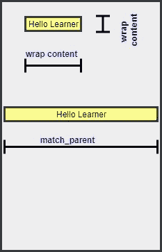
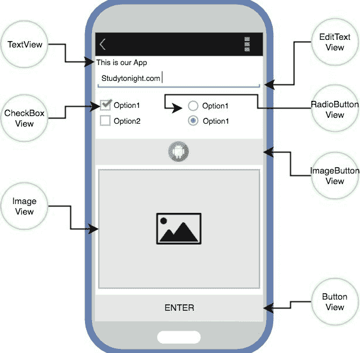

# 安卓视图和视图组简介

> 原文：<https://www.studytonight.com/android/introduction-to-views>

用户与安卓应用的所有交互都是通过用户界面进行的，因此了解安卓应用用户界面的基础知识非常重要。在本教程中，我们将介绍各种`Views`和`ViewGroups`，并尝试解释如何使用它们来设计安卓应用的用户界面。

* * *

## 视图

**视图**是安卓系统 UI(用户界面)的基本构件。视图指的是`android.view.View`类，对于`TextView`、`ImageView`、`Button`等所有 GUI 组件来说都是**超级类**。

`View`类扩展`Object`类，实现`Drawable.Callback`、`KeyEvent.Callback`和`AccessibilityEventSource`。

视图可以被认为是屏幕上显示某种类型内容的矩形。它可以是一张图片、一段文字、一个按钮或任何安卓应用可以显示的东西。这里的矩形实际上是不可见的，但是每个视图都占据一个矩形形状。

可能会困扰你的问题是，这个长方形的大小是多少？

答案是，我们可以手动设置它，通过指定确切的大小(用适当的单位)或通过使用一些预定义的值。这些预定义值是`match_parent`和`wrap_content`。

`match_parent`表示它将占据设备显示屏上的全部可用空间。而`wrap_content`意味着它将只占用显示其内容所需的空间。



在安卓系统中，视图也被称为小部件。任何视觉的(我们可以在屏幕上看到的)和交互的(用户可以与之交互的)被称为小部件。

* * *

### 用于创建视图的 XML 语法

现在，正如我们之前解释的，要在 android 应用中绘制任何东西，您必须在设计 XML 文件中将其分离。为了增加功能，我们将创建 Java 文件。

XML 中的每个视图都有以下格式:

```
<ViewName
    Attribute1=Value1
    Attribute2=Value2
    Attribute3=Value3
    .
    .
    AttributeN=ValueN
/>
```

*   它总是以一个尖括号开始，后面跟着**视图**名称。我们将很快向您介绍各种类型的视图。
*   然后我们编写**属性**，它将定义视图在应用屏幕上的外观，以及属性的**值**。每个视图都有自己的属性，我们将在接下来的几个教程中讨论，这些教程将涵盖各种类型的视图。
*   最后被`/>`关闭

所以，每个`View`子类都需要遵循这种格式，这样才能出现在 app 的屏幕上。这种格式只是默认的 XML 样式。没错。

每个`View`都需要两个属性。这些是:`android:layout_height`和`android:layout_width`。

这些属性定义了视图形成的不可见矩形的大小。使用这些属性，我们可以轻松控制安卓应用中每个视图的大小。

除了上面提到的属性，像`gravity`、`layout_gravity`、`padding`、`margin`等属性也是一些常用的属性。

* * *

### 最常用的安卓视图类

这里我们有一些最常用的安卓`View`类:

*   文字检视
*   编辑文本
*   [按钮](android-button-view)
*   [影像检视](android-imageview)
*   [图像按钮](android-imageview)
*   [复选框](radiogroup-radiobutton-checkbox)
*   [单选按钮](radiogroup-radiobutton-checkbox)
*   [列表浏览](android-listview)
*   [GridView](android-gridview)
*   日期选择器
*   [微调器](spinner-in-android)等。



* * *

### 编程和声明方法

要在安卓应用中创建/定义视图或视图组，有两种可能的方法:

1.  **The Programmatic Approach**: In this we define/create our Views in the Java source file. We will learn about this approach in details later, as of now here is a sample code to add a Button to our view.

    ```
    Button myButton = new Button(this);
    myButton.setLayoutParams(new LinearLayout.LayoutParams(
                                            LinearLayout.LayoutParams.MATCH_PARENT,
                                            LinearLayout.LayoutParams.MATCH_PARENT));

    myLayout.addView(myButton);
    ```

    所以`addView()`是用来给 UI 添加任意视图的功能，`setLayoutParams()`是用来设置各种属性的功能。

2.  **声明性方法**:在这里，我们直接在设计 XML 文件中定义视图和视图组，就像我们将在接下来的几个教程中学习的各种常用视图一样。

* * *

* * *