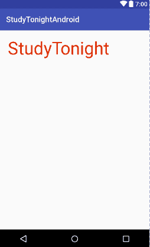

# Android `TextView`

> 原文：<https://www.studytonight.com/android/android-textview>

`TextView`是最广泛使用的[视图](introduction-to-views)用来在显示屏上显示预定义的文本。

这不仅是一个单独使用的视图，也可以和其他视图一起使用，比如当你创建一个表单时，你有`EditText`视图、`CheckBox`视图等，那么要提到标签和其他信息，我们就必须旁边使用`TextView`。

以下是一些最常用的主要属性:

| 属性 | 描述 |
| `android:text` | 用于指定要在`TextView`中显示的文本 |
| `android:textSize` | 使用这个属性，我们可以控制文本的大小。 |
| `android:textColor` | 使用这个属性，我们可以指定文本的颜色。 |
| `android:textAllCaps` | 如果设置为真，这将使文本以大写形式出现。 |
| `android:letterSpacing` | 使用这个属性，我们可以设置文本字母之间的间距。 |
| `android:hint` | 如果`TextView`中没有设置文本，该属性用于显示默认文本。通常，当我们使用来自服务器的动态数据(使用编程方法)填充`TextView`时，我们设置该属性以在`TextView`中显示一些默认文本，直到从服务器获取数据。 |

现在让我们看看如何在设计布局 XML 中定义`TextView`:

```
<TextView
    android:id="@+id/st"
    android:layout_width="wrap_content"
    android:layout_height="wrap_content"
    android:text="Studytonight"
    android:textSize="45sp"
    android:padding="20dp"
    android:textColor="#DD2C00"/>
```

首先，我们用`<`打开标签，输入`TextView`，表示我们正在创建一个`TextView`，它将显示在应用中。现在让我们看看上面提到的属性是做什么的。

如前所述，**安卓:layout _ width =“wrap _ content”**和**安卓:layout _ height =“wrap _ content”**必须为每个视图编写，因为我们必须为创建的每个视图定义宽度和高度。

*   `android:id="@+id/tv_text_gender"`

    这给了这个`TextView`一个`id`(标识)，可以在 Java 文件中使用它来访问这个`TextView`，并动态地对其进行任何更改。例如，假设我们将一些初始文本设置为**“研究”**。但是我们希望触摸屏幕后，文本显示为**“今晚学习”**。因此，我们在我们的 Java 类中使用这个`id`，并使用一些预定义的函数在运行时更改`TextView`的文本，当用户点击它时。我们将很快学会如何做。

*   `android:text="StudyTonight"`

    `TextView`将属性中的给定值显示为文本。

*   `android:textSize="45sp"`

    这用于确定`TextView`中显示的文本大小。

*   `android:padding="20dp"`

    这为文本提供了 20dp 的填充。本教程中有更多关于填充的内容。

*   `android:textColor="#DD2C00"`

    这将设置文本的颜色。`#DD2C00`是颜色有些暗红的六进制代码。您可以从[colorshexa](http://www.colorhexa.com/)或官方材料设计网站- [材料颜色](https://material.io/color/)轻松查找各种颜色的 Hexa 代码

    此外，AndroidStudio中有一些预定义的颜色存储在**值**目录中的 **color.xml** 文件下。要访问这个，可以使用`"@android:color/your_color_name"`作为上述属性中的值。

    您也可以在 **color.xml** 样式文件中定义您在应用中经常使用的颜色。这样做是一个非常好的做法，因为如果您决定更改颜色代码/色调，您所要做的就是在 **color.xml** 文件中更改它，它将在任何地方都被更改。

* * *

### 输出屏



* * *

* * *