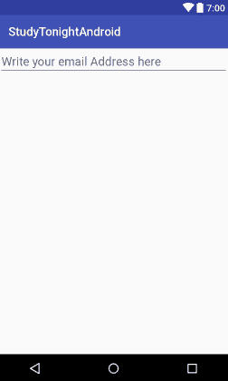

# 安卓中的`EditText`视图

> 原文：<https://www.studytonight.com/android/android-texteditview>

`EditText`是可编辑的`TextView`。它几乎和 T2 有着相似的属性。当您希望在应用中有一个用户可以输入任何文本的文本字段时，可以使用`EditText`。可以是**单线**或**多线**。触摸文本字段位置会激活该字段，放置光标并自动显示键盘。

以下是一些最常用的属性:

| 属性 | 描述 |
| `android:inputType` | 用于指定输入的文本应该是什么样的，以及用于什么目的。如果设置为`none`，则文本无法编辑。此属性的一些常用常量值如下:

*   **文字**
*   **文本自动完成** -这为用户输入文本提供了建议。
*   **文本自动更正** -这将启用用户输入文本的自动更正。
*   **文本密码** -以点或星的形式显示输入的文本。
*   **纹理**
*   **文本电子邮件地址**
*   **电话** -这将只向用户呈现数字键盘。
*   **日期时间**等。

所有可用的常量值都可以在[这里](https://developer.android.com/reference/android/R.attr.html#inputType)检查。我们可以使用多个常量值，通过使用`&#124;`将它们分开，例如:

```
android:inputType="textCapSentences&#124;textAutoCorrect"
```

 |
| `android:imeOptions` | 在大多数输入法中，如键盘或短信发送表单，键盘右下角有一个适合该输入法的操作按钮。可以是**搞定**、**下一个**、**发送**、**去**等。要指定键盘动作按钮，使用带有动作值的`android:imeOptions`属性，如**动作发送**或**动作搜索**等。 |
| `android:minLines` | 它提供的视图的高度相当于屏幕上指定的行数。因此，如果您输入一个值`2`，那么默认情况下，`EditText`视图将有 2 行高，即使没有添加任何文本。它将是默认高度。 |
| `android:maxLines` | 它设置`EditText`视图可以容纳的最大行数，**可视化**。换句话说，当我们说`maxLines`的值为 3 时，这意味着`EditText`视图字段将有 3 行高，此后，随着越来越多的文本添加到其中，它将停止增加大小，通常当行数超过设置的限制时，会显示滚动条。 |
| `android:hint` | 它在任何人输入`EditText`之前显示一条提示消息。 |
| `android:maxLength` | 它允许指定用户可以在字段中输入的最大字符数。 |

以下是默认`EditText`字段的示例:

```
<EditText
    android:id="@+id/et_address"
    android:layout_width="match_parent"
    android:layout_height="wrap_content"
    android:hint="Write your email Address here"
    android:textSize="20sp"
    android:inputType="textWebEmailAddress"
    android:imeOptions="actionDone"
    android:maxLines="3"/>
```

*   `android:hint="Write your email address here"`

    该属性向用户提示应该在框中输入什么。这是一条临时消息，一旦用户开始在字段中写入任何内容，该消息就会消失。

*   `android:inputType="textWebEmailAddress"`

    此属性指定输入的文本应该是什么样的，以及它将用于什么目的。这里，我们使用了`textWebEmailAddress`，它将只允许电子邮件输入。

*   `android:maxLines="3"`

    这显示在最大值。只有 3 行文字。如果您的文本超过 3 行，则第一行文本将上移，即它将不可见，第 2 行到第 4 行的文本将可见。虽然我们应该将电子邮件地址字段的值保持为 1，但我们将其设置为 3 只是为了解释它在这里的用途。

* * *

### 输出屏



* * *

* * *