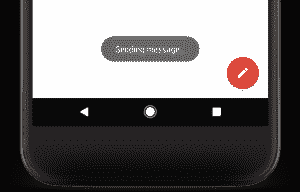
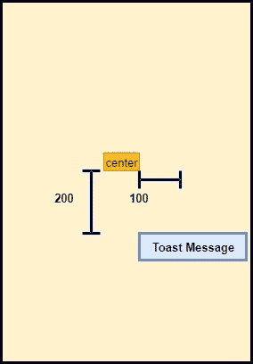
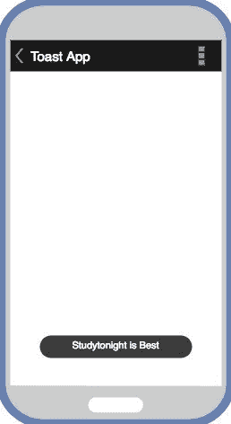

# 安卓吐司

> 原文：<https://www.studytonight.com/android/toast-in-android>

你是否在你使用的任何应用中遇到过如下图所示的消息格式？



这在安卓系统中被称为**吐司**。它用于在安卓应用中显示短消息和临时消息。所以让我们先看看它有什么特点，然后我们会弄脏我们的手，学习如何做这样的祝酒词。

* * *

## 吐司的特点

*   这是一个用于短时间显示消息的**安卓小部件**。
*   过了一会儿就消失了。
*   它不会在运行时阻止“活动”或“片段”。
*   它可以用来给用户关于任何操作的反馈，如表单提交等。

* * *

## 如何制作吐司？

可以使用扩展了`java.lang.Object`类的`android.widget.Toast`类创建吐司。

在此之前，我们继续学习如何创建吐司，让我们花一些时间探索`android.widget.Toast`类。

* * *

### 吐司类的内容

| 常量 | 描述 |
| --- | --- |
| 公共静态最终 int LENGTH_LONG | 这可用于长时间显示吐司。 |
| 公共静态最终 int LENGTH_SHORT | 这可用于长时间显示吐司。 |

常量`LENGTH_LONG`为吐司设定 **3.5 秒**的显示持续时间，而常量`LENGTH_SHORT`为吐司设定 **2 秒**的显示持续时间。

* * *

### 吐司课的方法

以下是`Toast`类中可用的方法，用于创建吐司。

| 方法 | 描述 |
| --- | --- |
| 公共静态吐司**制作文本**(上下文上下文，字符序列文本，int 持续时间) | 此方法使吐司小部件具有指定的文本并持续指定的时间。 |
| 公共作废**显示**() | 这个方法显示了吐司。 |
| 公共空隙**设置边距**(水平浮动，垂直浮动) | 此方法可用于设置水平和垂直边距 |

现在让我们看看如何创建一个吐司:

1.  成为`Toast`类的对象。

    ```java
    Toast t = new Toast(this);
    ```

2.  调用需要三个参数的`makeText(Context c, CharSequence text, int duration)`方法。

    **上下文 c** :上下文是应用环境全局信息的接口。这是一个抽象类，其实现由 Android 系统提供。它允许访问特定于应用的资源和类，以及对应用级操作的调用，如启动活动、广播和接收意图等。我们可以通过`getApplicationContext()`方法得到这个上下文对象

    **字符序列文本**:这是吐司中显示的信息。它可以是任何文本。

    **int duration** :这是您希望消息出现在屏幕上的持续时间。有两个值:`Toast.LENGTH_SHORT`和`Toast.LENGTH_LONG`

    使用我们的 Toast 实例/对象，我们需要以如下方式调用`maketext()`方法:

    ```java
    t.makeText(getApplicationContext(),"StudyTonight Toast",Toast.LENGTH_SHORT);
    ```

3.  然后调用`show()`方法在屏幕上显示吐司

    ```java
    t.show();
    ```

完整的代码将是:

```java
Toast t = new Toast(this);
t.makeText(getApplicationContext(),"StudyTonight Toast",Toast.LENGTH_SHORT);
t.show();
```

* * *

## 将吐司放在屏幕上

默认情况下，吐司消息出现在屏幕底部的中央。如果想在其他位置显示，可以使用`setGravity(int gravity, int x, int y)`方法，该方法有以下参数:

*   **int gravity** :可以使用 gravity 类来使用像`Gravity.RIGHT`、`Gravity.TOP`这样的预定义值，也可以使用**管道(| )** 符号来使用多个值。例如`Gravity.LEFT|Gravity.BOTTOM`
*   **int x** :可以用这个设置水平距离。从哪里开始测量该距离取决于您设置的`int gravity`参数。
*   **int y** :你可以用这个来设置垂直距离。同样，距离的测量取决于您设置的`int gravity`参数。

例如，如果您选择了`Gravity.CENTER`，您的`x=100`和`y=200`，那么它会将吐司放在以下位置:



* * *

## 显示吐司的活动类别的完整代码

```java
package com.studytonight.toast;  
import android.os.Bundle;  
import android.app.Activity;  
import android.view.Menu;  
import android.view.View;  
import android.widget.Toast;  

public class MainActivity extends Activity {  
    @Override  
    public void onCreate(Bundle savedInstanceState) {  
        super.onCreate(savedInstanceState);  
        setContentView(R.layout.activity_main);  

        // Displaying Toast with 'Studytonight is Best' message  
        Toast.makeText(getApplicationContext(),"Studytonight is Best",Toast.LENGTH_LONG).show();  
    }  

    @Override  
    public boolean onCreateOptionsMenu(Menu menu) {  
        getMenuInflater().inflate(R.menu.activity_main, menu);  
        return true;  
    }  
}
```

* * *

### 输出屏



* * *

* * *