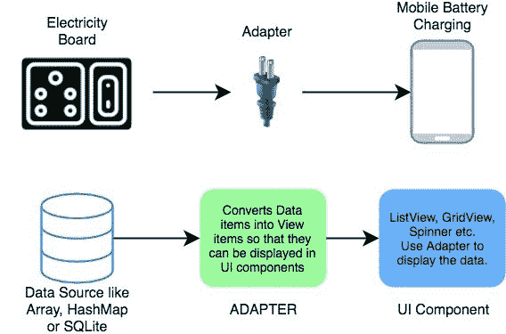

# 适配器和适配器视图

> 原文：<https://www.studytonight.com/android/adapter-and-adapter-view>

适配器和适配器视图非常受欢迎，以至于每次您看到任何带有项目列表或项目网格的应用，您都可以肯定地说它正在使用适配器和适配器视图。

通常，当我们创建任何数据列表或网格时，我们认为我们可以使用循环来迭代数据，然后设置数据来创建列表或网格。

但是如果数据是一组 100 万个产品呢。那么使用循环不仅会消耗大量时间，使应用变慢，而且可能会耗尽所有运行时内存。

所有这些问题都可以通过使用适配器和适配器视图来解决。



Adapter View，是一个`View`对象，可以像我们使用任何其他界面小部件一样使用。这里唯一的问题是，它需要一个`Adapter`来提供内容，因为它不能自己显示数据。

* * *

### 什么是适配器？

适配器就像数据源和用户界面之间的桥梁。它从各种数据源读取数据，将其转换为视图对象，并将其提供给链接的适配器视图以创建用户界面组件。

数据源或数据集可以是数组对象、列表对象等。

您可以通过扩展`BaseAdapter`类来创建自己的适配器类，该类是所有其他适配器类的父类。安卓 SDK 也提供了一些现成的适配器类，比如`ArrayAdapter`、`SimpleAdapter`等。

* * *

### 什么是适配器视图？

适配器视图可以用来以列表或网格等形式有效地显示由适配器提供给它的大数据集。

当我们高效地说**时，我们指的是什么？**

 **适配器视图能够在用户界面上显示数百万个项目，同时保持内存和 CPU 使用率非常低，并且没有任何明显的延迟。不同的适配器遵循不同的策略，但安卓SDK中提供的默认适配器遵循以下技巧:

1.  它只渲染那些当前在屏幕上或即将出现在屏幕上的`View`对象。因此，无论数据集有多大，适配器视图总是一次只加载 5、6 或 7 个项目，这取决于显示大小。从而节省内存。
2.  它还可以在用户滚动时重用已经创建的布局来填充数据项，从而节省了 CPU 的使用。

假设您有一个数据集，如包含以下内容的字符串数组。

```
String days[] = {"Monday", "Tuesday", "Wednesday", "Thursday", "Friday", "Saturday", "Sunday"};
```

现在，**适配器**所做的是从这个数组中获取数据，并根据这些数据创建一个视图，然后，它将这个**视图**提供给一个**适配器视图**。然后，适配器视图以您想要的方式显示数据。

> ***注意:**适配器只负责从数据源获取数据，并将其转换为 View，然后将其传递给 AdapterView。因此，它用于管理数据。AdapterView 负责显示数据。*

因此，您可以从数据库或`ArrayList`或任何其他数据源中获取数据，然后以任何排列显示该数据。您可以垂直显示( [`ListView`](android-listview) )、或按行和列显示( [`GridView`](android-gridview) )、或在下拉菜单中显示( [`Spinners`](spinner-in-android) )等。

有不同类型的适配器视图。让我们来看看其中的一些:

* * *

#### 列表视图


它显示一个可垂直滚动的视图集合，其中每个视图都位于列表中前一个视图的正下方。

* * *

#### 显示数据表格（一种控件）


GridView 是一个视图组，它在一个二维的、可滚动的网格中显示项目。

* * *

#### 纺纱机

微调器提供了从一组值中选择一个值的快速方法。触摸微调器会显示一个包含所有其他可用值的下拉菜单，用户可以从中选择一个新值。


每个适配器视图都使用某种方法来使用适配器。我们将在各自的 AdapterView 教程中讨论这种方法。

* * *

* * ***