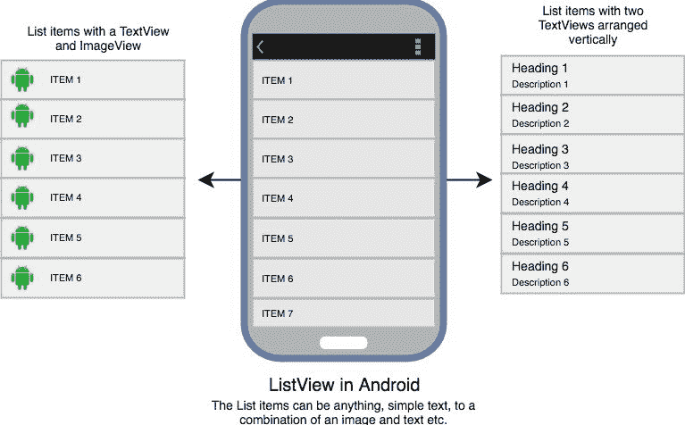
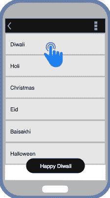

# 安卓系统中的`ListView`

> 原文：<https://www.studytonight.com/android/android-listview>

当您必须在垂直滚动列表中显示项目时，使用`ListView`。最好的例子就是我们设备的**联系人**列表。使用`ListView`，用户可以轻松浏览信息，同时上下滚动。你可以根据你的用户界面设计来设置每一个项目之间的分隔线以及它的高度和颜色。

在`ListView`中，我们可以使用[`TextView`](android-textview)显示文本项目列表，或者使用[`ImageView`](android-imageview)显示图片，或者任何其他视图或视图组合。

由于`ListView`一般用于显示大量数据，因此无法为完整数据手动创建列表项，因此安卓为我们提供了特殊的`Adapter`类，可用于将数据集的数据提供给`ListView`。

以下是一些最常用的主要属性:

| 属性 | 描述 |
| `android:divider` | 使用这个属性，我们可以在列表项之间指定一个分隔符。可绘制或任何颜色都可以指定为该属性的值。 |
| `android:dividerHeight` | 用于指定分隔线的高度。 |

下面我们展示了如何使用布局 XML 将`ListView`添加到您的安卓应用中。

```java
<ListView
    android:id="@+id/listView"
    android:layout_width="match_parent"
    android:layout_height="match_parent"
    android:divider="@android:color/black"
    android:dividerHeight="1dp"/>
```

#### 输出屏



* * *

### 使用带`ListView`的适配器

让我们看看如何使用[适配器](adapter-and-adapter-view)从数组中读取数据，并以列表的形式显示它。

我们将在主布局 XML 文件 **activity_main.xml** 中定义一个 ListView。

```java
<?xml version="1.0" encoding="utf-8"?>
<android.support.constraint.ConstraintLayout xmlns:android="http://schemas.android.com/apk/res/android" xmlns:app="http://schemas.android.com/apk/res-auto" xmlns:tools="http://schemas.android.com/tools"
    android:layout_width="match_parent"
    android:layout_height="match_parent"
    android:background="#FFEB3B"
    tools:context="com.example.android.studytonightandroid.MainActivity">

    <ListView
        android:id="@+id/listView"
        android:layout_width="match_parent"
        android:layout_height="match_parent"
        android:divider="@android:color/black"
        android:dividerHeight="1dp"/>

</android.support.constraint.ConstraintLayout>
```

通过这样做，我们已经定义了一个要在主活动中创建的`ListView`，但是它会显示什么数据呢？什么格式？我们将在哪里声明和定义它？

正如我们在上一个教程中所指定的，适配器用于将数据项转换成视图对象，视图对象可用于显示为用户界面组件。

所以我们需要一个**数据集**和一个**视图**，这个数据集将被适配器转换成这个视图。

这里我们有一个简单的数组，其中包含节日名称:

```java
String[] festivals = {
    "Diwali",
    "Holi",
    "Christmas",
    "Eid",
    "Baisakhi",
    "Halloween"
};
```

由于我们的数据集有简单的文本值，所以我们可以定义一个简单的`TextView`来保存这些值并填充`ListView`。这听起来令人困惑吗？让它陷进去。

如果我们的数据集有图像和一些文本，那么我们也可以定义一个`TextView`和一个`ImageView`来显示列表中的数据。

所以现在我们将创建一个新的 XML 文件，在布局文件夹中命名为 **list_item.xml** ，并在其中添加一个`TextView`，如下所示:

```java
<?xml version="1.0" encoding="utf-8"?> 

<TextView xmlns:android="http://schemas.android.com/apk/res/android"  
    android:id="@+id/textView"  
    android:layout_width="wrap_content"  
    android:layout_height="wrap_content"
    android:textStyle="bold" 
    android:layout_marginLeft="10dp"  
    android:layout_marginTop="5dp"  
    android:padding="4dp"  
    android:textColor="#000000"  
    />
```

现在是大结局的时候了，下面我们有`MainActivity.java`类，其中我们使用了`ArrayAdapter`从数组中的数据创建`TextView`，并通过将这些视图对象提供给`ListView`来创建一个列表。

```java
package listview.studytonightexample.com.listview;  

import android.support.v7.app.AppCompatActivity;  
import android.os.Bundle;  
import android.view.View;  
import android.widget.AdapterView;  
import android.widget.ArrayAdapter;  
import android.widget.ListView;  
import android.widget.TextView;  
import android.widget.Toast;  

public class MainActivity extends AppCompatActivity {  
    ListView listView;  
    TextView textView;  
    String[] festivals = {
        "Diwali",
        "Holi",
        "Christmas",
        "Eid",
        "Baisakhi",
        "Halloween"
    };

    @Override  
    protected void onCreate(Bundle savedInstanceState) {  
        super.onCreate(savedInstanceState);  
        setContentView(R.layout.activity_main);  

        listView = (ListView)findViewById(R.id.listView);  
        textView = (TextView)findViewById(R.id.textView);  

        final ArrayAdapter <string>adapter = new ArrayAdapter<string>(this,  
                R.layout.list_item, android.R.id.textView, festivals);  

        listView.setAdapter(adapter);  

        listView.setOnItemClickListener(new AdapterView.OnItemClickListener() {  
            @Override  
            public void onItemClick(AdapterView<?> adapterView, View view, int position, long l) {  
                // TODO Auto-generated method stub  

                /* appending Happy with festival name */
                String value = "Happy " + adapter.getItem(position);  
                /* Display the Toast */
                Toast.makeText(getApplicationContext(), value, Toast.LENGTH_SHORT).show();  
            }  
        });  
    }  
}</string></string>
```

* * *

#### 输出屏



* * *

* * *