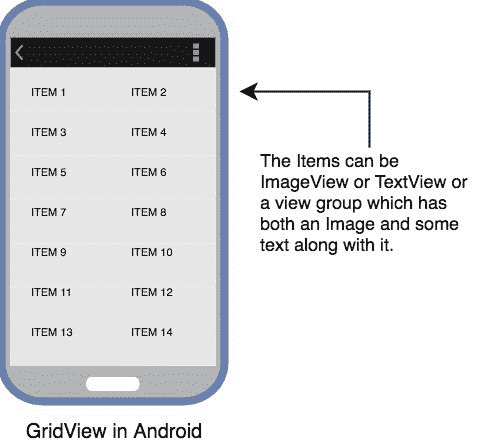
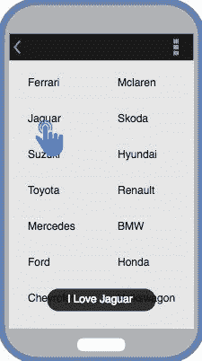

# 安卓系统中的`GridView`

> 原文：<https://www.studytonight.com/android/android-gridview>

`GridView`就像`ListView`一样工作，这一点我们在[上一期教程](android-listview)中详细了解过。唯一的区别是`GridView`用于显示视图对象的网格。

视图对象可以是`TextView`、`ImageView`或既有图像又有一些文本的视图组。这个视图最好的例子是在网格中显示图像的手机图库。我们可以将**列**的数量设置为特定的数量，并将图像自动匹配到列中。

gridView 每一个单项之间的垂直和水平间距可以通过`verticalSpacing`和`horizontalSpacing`设置。

```
<GridView
    android:id="@+id/gridView"
    android:layout_width="match_parent"
    android:layout_height="match_parent"
    android:verticalSpacing="2dp"
    android:horizontalSpacing="2dp"
    android:numColumns="2"/>
```



* * *

### 将适配器用于 GridView

在上一个教程中，我们解释了适配器如何将数据集转换为视图对象，然后在`AdapterView`中填充这些对象以创建用户界面组件。现在我们的`AdapterView`是`GridView`。详细说明可以参考上一篇教程。

我们将在主布局 XML 文件 activity_main.xml 中定义一个 ListView。

```
<?xml version="1.0" encoding="utf-8"?>
<android.support.constraint.ConstraintLayout xmlns:android="http://schemas.android.com/apk/res/android" xmlns:app="http://schemas.android.com/apk/res-auto" xmlns:tools="http://schemas.android.com/tools"
    android:layout_width="match_parent"
    android:layout_height="match_parent"
    android:background="#FFEB3B"
    tools:context="com.example.android.studytonightandroid.MainActivity">

    <GridView
        android:id="@+id/gridView"
        android:layout_width="match_parent"
        android:layout_height="match_parent"
        android:verticalSpacing="10dp"
        android:horizontalSpacing="10dp"
        android:numColumns="2"/>

</android.support.constraint.ConstraintLayout>
```

为此，让我们来看看一些令人惊叹的汽车品牌。

```
String[] carBrands = {
    "Ferrari",
    "McLaren",
    "Jaguar",
    "Skoda",
    "Suzuki",
    "Hyundai",
    "Toyota",
    "Renault",
    "Mercedes",
    "BMW",
    "Ford",
    "Honda",
    "Chevrolet",
    "Volkswagon",
};
```

由于我们的网格只有文本值，因此我们必须定义一个 [`TextView`](android-textview) 。

所以现在我们将创建一个新的 XML 文件，在布局文件夹中命名为 **grid_item.xml** ，并在其中添加一个`TextView`，如下所示:

```
<?xml version="1.0" encoding="utf-8"?> 

<TextView xmlns:android="http://schemas.android.com/apk/res/android"  
    android:id="@+id/textView"  
    android:layout_width="wrap_content"  
    android:layout_height="wrap_content"
    android:textStyle="bold" 
    android:layout_marginLeft="10dp"  
    android:layout_marginTop="5dp"  
    android:padding="4dp"  
    android:textColor="#000000"  
    />
```

而**MainActivity.java**文件将如下所示:

```
package listview.studytonightexample.com.listview;  

import android.support.v7.app.AppCompatActivity;  
import android.os.Bundle;  
import android.view.View;  
import android.widget.AdapterView;  
import android.widget.ArrayAdapter;  
import android.widget.ListView;  
import android.widget.TextView;  
import android.widget.Toast;  

public class MainActivity extends AppCompatActivity {  
    GridView gridView;  
    TextView textView;  
    String[] carBrands = {
        "Ferrari",
        "McLaren",
        "Jaguar",
        "Skoda",
        "Suzuki",
        "Hyundai",
        "Toyota",
        "Renault",
        "Mercedes",
        "BMW",
        "Ford",
        "Honda",
        "Chevrolet",
        "Volkswagon",
    };

    @Override  
    protected void onCreate(Bundle savedInstanceState) {  
        super.onCreate(savedInstanceState);  
        setContentView(R.layout.activity_main);  

        gridView = (GridView)findViewById(R.id.gridView);  
        textView = (TextView)findViewById(R.id.textView);  

        final ArrayAdapter <string>adapter = new ArrayAdapter<string>(this,  
                android.R.layout.grid_item, android.R.id.textView, carBrands);  

        listView.setAdapter(adapter);  

        listView.setOnItemClickListener(new AdapterView.OnItemClickListener() {  
            @Override  
            public void onItemClick(AdapterView<?> adapterView, View view, int position, long l) {  
                // TODO Auto-generated method stub  

                /* appending I Love with car brand names */
                String value = "I Love " + adapter.getItem(position);  
                /* Display the Toast */
                Toast.makeText(getApplicationContext(), value, Toast.LENGTH_SHORT).show();  
            }  
        });  
    }  
}</string></string>
```

* * *

#### 输出屏



* * *

* * *