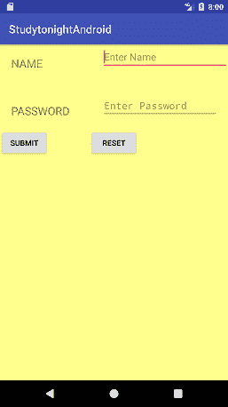
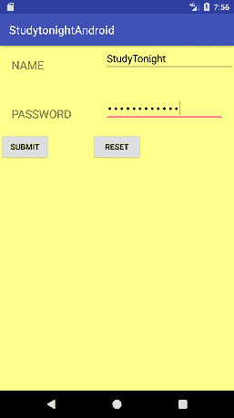
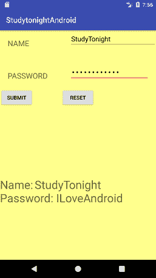

# 从`EditText`中获取值，并为`TextView`设置值

> 原文：<https://www.studytonight.com/android/get-edittext-set-textview>

任何安卓应用都有两个部分——前端**和后端**。前端指的是组件的可视化，即您的应用在其他用户面前的外观。后端部分指的是应用运行背后的逻辑。****

 ****每当我们点击任何[按钮](android-button-view)或提交任何表单时，后端代码都会决定下一步要执行什么操作或如何处理从用户等处接收的数据。

在我们之前的教程中，我们已经看到了不同类型的布局对于作为前端部分的GUI设计是多么有用。在本教程中，我们将关注后端部分并为其编写代码。

在我们的示例中，我们将通过`EditText`视图从用户处获取输入，并将其显示在`TextView`中。此外，我们还将看到一个`buttonClickListener`，用于定义在应用中点击按钮时要执行的操作。

下面是我们将要进行的设计。



```
<?xml version="1.0" encoding="utf-8"?>
<RelativeLayout xmlns:android="http://schemas.android.com/apk/res/android"
    xmlns:app="http://schemas.android.com/apk/res-auto"
    xmlns:tools="http://schemas.android.com/tools"
    android:layout_width="match_parent"
    android:layout_height="match_parent"
    android:background="#FFFF8D"
    tools:context="com.example.akshay.studytonightandroid.MainActivity">

    <TextView
        android:id="@+id/textView"
        android:layout_width="wrap_content"
        android:layout_height="wrap_content"
        android:layout_alignParentLeft="true"
        android:layout_alignParentStart="true"
        android:layout_alignParentTop="true"
        android:text="NAME"
        android:textSize="20sp"
        android:layout_margin="20dp" />

    <TextView
        android:id="@+id/textView2"
        android:layout_width="wrap_content"
        android:layout_height="wrap_content"
        android:textSize="20sp"
        android:text="PASSWORD"
        android:layout_marginTop="38dp"
        android:layout_below="@+id/textView"
        android:layout_alignLeft="@+id/textView"
        android:layout_alignStart="@+id/textView" />

    <EditText
        android:id="@+id/editName"
        android:layout_width="wrap_content"
        android:layout_height="wrap_content"
        android:ems="10"
        android:inputType="textPersonName"
        android:hint="Enter Name"
        android:layout_alignParentTop="true"
        android:layout_alignParentRight="true"
        android:layout_alignParentEnd="true"
        android:layout_alignLeft="@+id/editPassword"
        android:layout_alignStart="@+id/editPassword" />

    <EditText
        android:id="@+id/editPassword"
        android:layout_width="wrap_content"
        android:layout_height="wrap_content"
        android:ems="10"
        android:hint="Enter Password"
        android:inputType="textPassword"
        android:layout_alignBottom="@+id/textView2"
        android:layout_alignParentRight="true"
        android:layout_alignParentEnd="true"
        android:layout_marginRight="18dp"
        android:layout_marginEnd="18dp" />

    <Button
        android:id="@+id/buttonSubmit"
        android:layout_width="wrap_content"
        android:layout_height="wrap_content"
        android:layout_alignParentLeft="true"
        android:layout_alignParentStart="true"
        android:layout_below="@+id/textView2"
        android:layout_marginTop="20dp"
        android:text="SUBMIT" />

    <Button
        android:id="@+id/buttonReset"
        android:layout_width="wrap_content"
        android:layout_height="wrap_content"
        android:text="RESET"
        android:layout_alignBaseline="@+id/buttonSubmit"
        android:layout_alignBottom="@+id/buttonSubmit"
        android:layout_centerHorizontal="true" />

    <TextView
        android:id="@+id/tvResult"
        android:layout_width="wrap_content"
        android:layout_height="wrap_content"
        android:layout_alignParentBottom="true"
        android:layout_alignParentLeft="true"
        android:layout_alignParentStart="true"
        android:layout_marginBottom="143dp"
        android:textSize="30sp" />

</RelativeLayout>
```

在**MainActivity.java**文件中，我们将全局变量定义如下:

```
package com.example.akshay.studytonightandroid;

import android.support.v7.app.AppCompatActivity;
import android.os.Bundle;
import android.widget.Button;
import android.widget.EditText;
import android.widget.TextView;

public class MainActivity extends AppCompatActivity {

    // These are the global variables
    EditText editName, editPassword;
    TextView result;
    Button buttonSubmit, buttonReset;

    @Override
    protected void onCreate(Bundle savedInstanceState) {
        super.onCreate(savedInstanceState);
        setContentView(R.layout.activity_main);
    }
}
```

在`onCreate()`方法中使用`setContentView()`方法设置主布局后，使用如下所示的`findViewById()`方法将我们定义的全局变量附加到GUI视图中。

```
/*
    Using the id of views specified in layout XML
    we can initialize the view using findViewById
*/
editName  = (EditText) findViewById(R.id.editName);
editPassword = (EditText) findViewById(R.id.editPassword);
result = (TextView) findViewById(R.id.tvResult);
buttonSubmit = (Button) findViewById(R.id.buttonSubmit);
buttonReset = (Button) findViewById(R.id.buttonReset);
```

正如该方法的名称所示，`findViewById()`返回布局 XML 中定义的视图的一个实例。换句话说，这个方法用于获取 Java 中的视图实例，您已经在布局 XML 中制作并使用了这个实例。这是通过提到您在 XML 中定义的视图的`id`来实现的。用 XML 创建的视图在 Java 中用来动态操作它。

> **注:** *`findViewById()`方法只返回`View`，但不告诉返回哪个视图，即视图是否为 Button、 [TextView](android-textview) 、 [EditText](android-texteditview) 等。因此，您需要将此方法返回的视图**类型转换为**。*

现在，要启用按钮点击事件，我们需要将点击监听器附加到按钮实例。这是通过编写以下代码来完成的:

```
// Attaching OnClick listener to the submit button
buttonSubmit.setOnClickListener(new View.OnClickListener() {

    @Override
    public void onClick(View v) {

        // Get the Data and Use it

    }
});
```

一旦你添加了这个代码，每当点击提交按钮，方法`onClick`就会被调用，里面的代码就会被执行。

根据您的要求，我们希望获得用户在`EditText`中输入的文本，并在单击提交按钮时显示在[`TextView`](android-textview)中。因此，让我们将以下代码放入`onClick()`方法中:

```
// get text from EditText name view
String name = editName.getText().toString();
// get text from EditText password view
String password = editPassword.getText().toString();
```

我们使用了`getText()`方法来获取在`EditText`视图中输入的文本。但是`getText()`方法返回一个`Editable`实例，因此我们对其进行**类型化**以将其转换为`String`供进一步使用。这可以通过使用`toString()`方法来完成。

> **注:** *我们将`editName`和`editPassword`定义为全局变量，因此它们可以用于任何方法。*

因此，现在我们有了用户输入的名称和密码值，我们可以轻松地在这个数据集上应用任何逻辑，如执行登录验证等。现在，我们将在`TextView`中显示这些信息。为此，我们将在 TextView 实例中使用`setText()`方法来显示其中的信息。这是使用以下代码完成的:

```
result.setText("Name:\t" + name + "\nPassword:\t" + password );
```

现在，每当点击提交按钮时，调用**提交按钮**的`onClick()`方法，并使用`EditText`实例上的`getText()`方法将用户输入值存储在`name`和`password`变量中。然后，使用`setText()`方法，输入值显示在`TextView`中。

现在，当您按下重置按钮时，`TextView`中的文本应该被重置，即清除。为此，我们还必须在重置按钮上实现点击监听器。下面是这样做的代码:

```
buttonReset.setOnClickListener(new View.OnClickListener() {

    @Override
    public void onClick(View v) {
        // clearing out all the values
        editName.setText("");
        editPassword.setText("");
        result.setText("");
        editName.requestFocus();
    }
});
```

您只需要为`EditText`和`TextView`设置文本等于`""`(空)。此外，要获得名称`EditText`字段上的输入光标，我们可以对编辑名称实例使用`requestFocus()`方法。

* * *

### MainActivity.java 的完整代码

```
package com.example.akshay.studytonightandroid;

import android.os.Bundle;
import android.support.v7.app.AppCompatActivity;
import android.view.View;
import android.widget.Button;
import android.widget.EditText;
import android.widget.TextView;

public class MainActivity extends AppCompatActivity {
    // These are the global variables
    EditText editName, editPassword;
    TextView result;
    Button buttonSubmit, buttonReset;

    @Override
    protected void onCreate(Bundle savedInstanceState) {
        super.onCreate(savedInstanceState);
        setContentView(R.layout.activity_main);

        editName  = (EditText) findViewById(R.id.editName);
        editPassword = (EditText) findViewById(R.id.editPassword);
        result = (TextView) findViewById(R.id.tvResult);
        buttonSubmit = (Button) findViewById(R.id.buttonSubmit);
        buttonReset = (Button) findViewById(R.id.buttonReset);
        /*
            Submit Button
        */
        buttonSubmit.setOnClickListener(new View.OnClickListener() {

            @Override
            public void onClick(View v) {
                String name = editName.getText().toString();
                String password = editPassword.getText().toString();
                result.setText("Name:\t" + name + "\nPassword:\t" + password );

            }
        });

        /*
            Reset Button
        */
        buttonReset.setOnClickListener(new View.OnClickListener() {
            @Override
            public void onClick(View v) {
                editName.setText("");
                editPassword.setText("");
                result.setText("");
                editName.requestFocus();
            }
        });
    }
}
```

 

你可以在这里下载整个项目

* * *

### 如果需要，可以添加验证

如果用户将字段名称和密码留空并点击提交[按钮](android-button-view)，您也可以添加验证，如显示消息。

在这种情况下，我们所要做的就是检查`name`或`password`是否为空，如果发现为空，则使用 [`Toast`](toast-in-android) 显示消息，说明这两个字段都是必填的。

```
buttonSubmit.setOnClickListener(new View.OnClickListener() {

    @Override
    public void onClick(View v) {
        String name = editName.getText().toString();
        String password = editPassword.getText().toString();
        if(name == '' || password == '') {
            // If name or password is not entered
            Toast.makeText(getApplicationContext(), "Both Name and Password are required", Toast.LENGTH_LONG).show();
        }
        else {
            result.setText("Name:\t" + name + "\nPassword:\t" + password );
        }
    }
});
```

* * *

* * *****