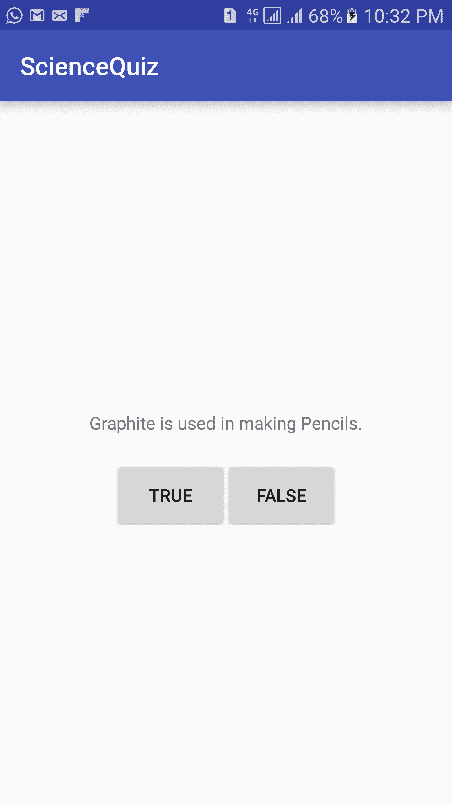
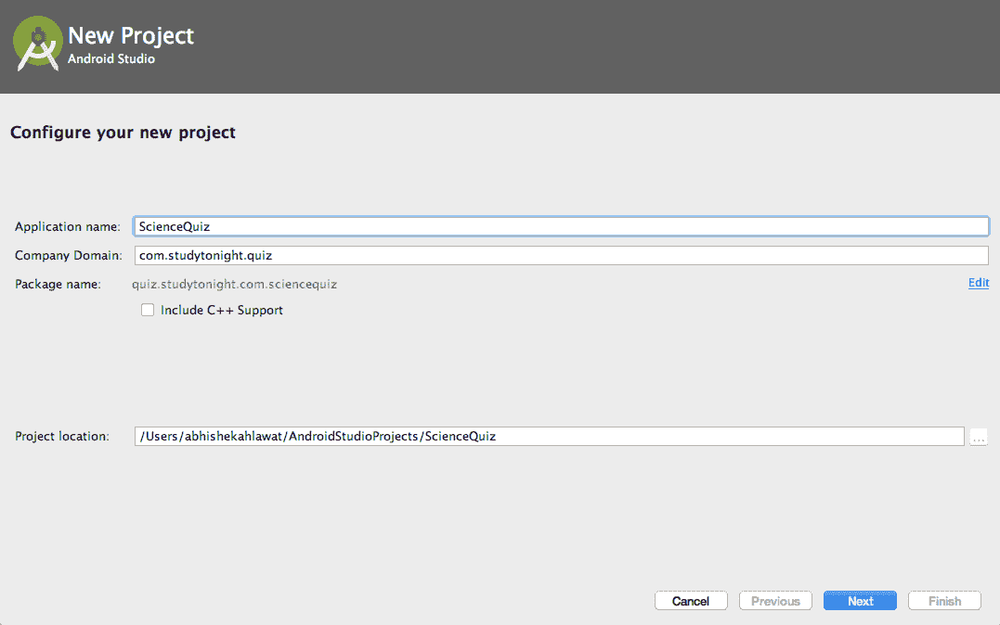
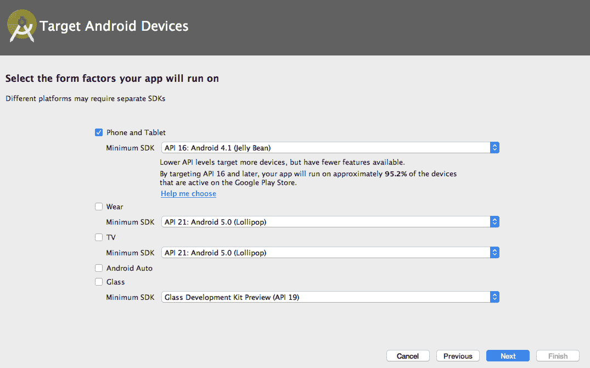
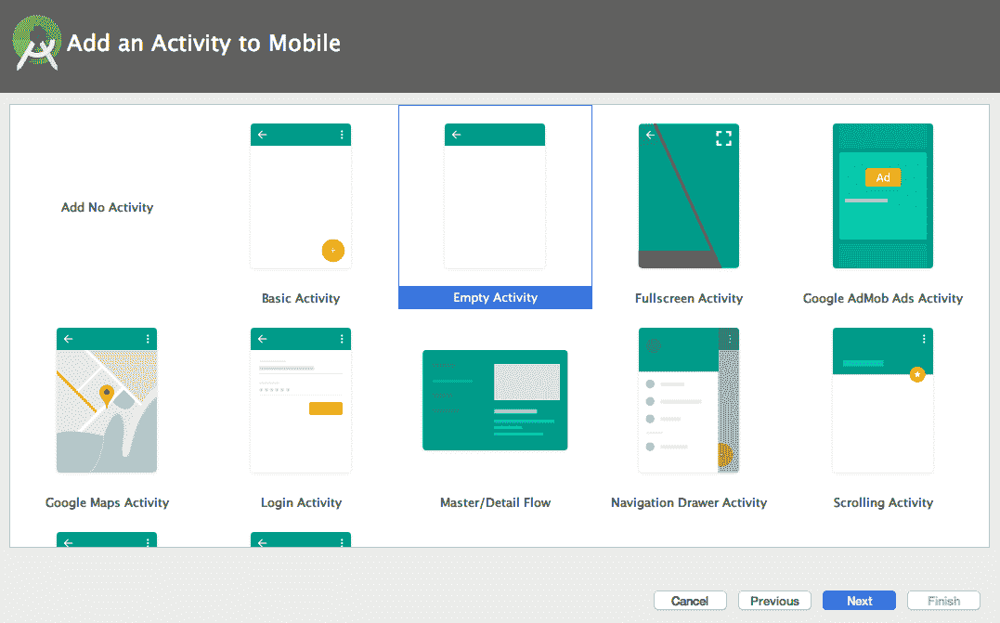
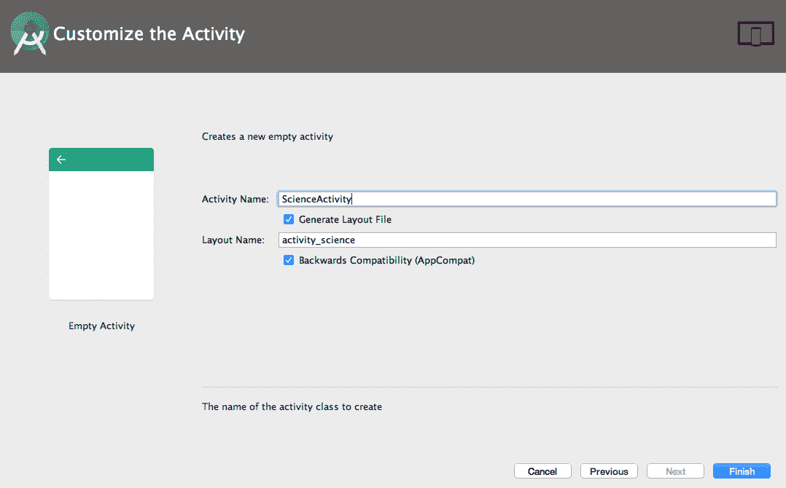
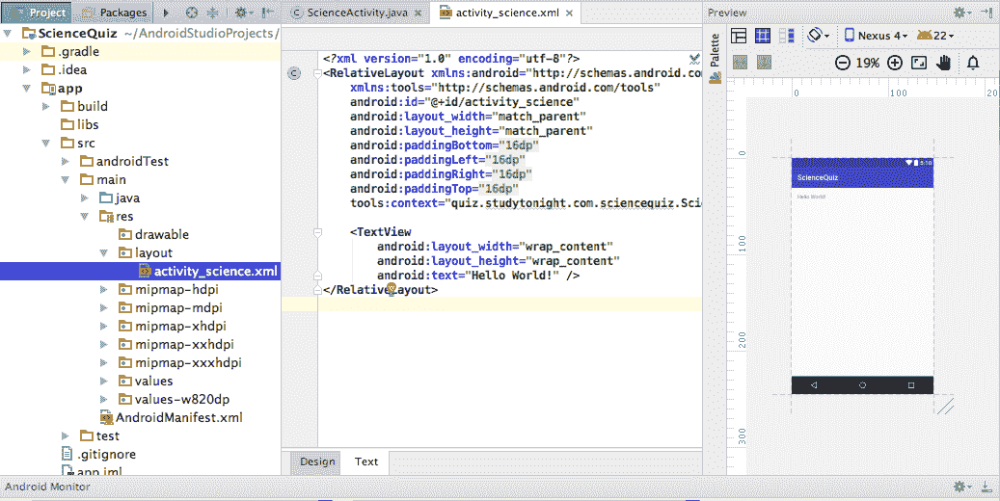

# 科学问答安卓应用

> 原文：<https://www.studytonight.com/android/second-android-application-1>

现在我们已经熟悉了[活动](activity-in-android)、[布局](introduction-to-layouts)、[视图](introduction-to-views)等，是时候动手了，创建我们的第二个应用程序。这个应用程序将有一个科学测验，用户将有选择回答“真”或“假”。根据用户输入的内容，我们将向用户显示，他们是否选择了正确的选项，只需显示一条消息，说明正确或不正确。

* * *

## 科学测验应用程序开发

1.  打开[安卓工作室](android-studio-for-android)，进入**文件→新建→新项目**。在“新建项目”窗口中，输入应用程序名称作为`ScienceQuiz`，输入公司域作为`com.studytonight.quiz`，然后单击“下一步”。

3.  在下一步中，您将被要求选择目标设备，在该设备上将支持您的应用程序。这个应用还是用`Phone and Tablet`吧。在显示*最低软件开发工具包*的下拉列表中，选择`API 16: Android 4.1 (Jelly Bean)`，这意味着我们的应用将在安卓 4.1 版本到 7(最新版本)的所有手机和平板电脑上运行。点击下一步按钮。

5.  现在是时候将第一个活动添加到我们的应用程序中了。从可用选项中选择`Empty Activity`。然后点击下一步。

7.  输入活动名称为`ScienceActivity`，安卓工作室会自动填充布局文件名。在活动名称中添加后缀“活动”是一种标准做法，我们将遵循它。而对于布局 XML 文件，则是所有的字都是小而逆序，用下划线`_`隔开。单击“完成”创建项目。

9.  安卓工作室需要一些时间，来构建一切，所以要有点耐心。一旦安卓工作室完成你的项目构建，你会看到一个新的项目被添加到左边的项目工具窗口中，文件`activity_science.xml`将被打开，在预览工具窗口中你会看到你的应用程序的预览。如果预览工具窗口没有打开，进入**视图→工具窗口→预览**，预览窗口会显示在右侧。

* * *

* * *