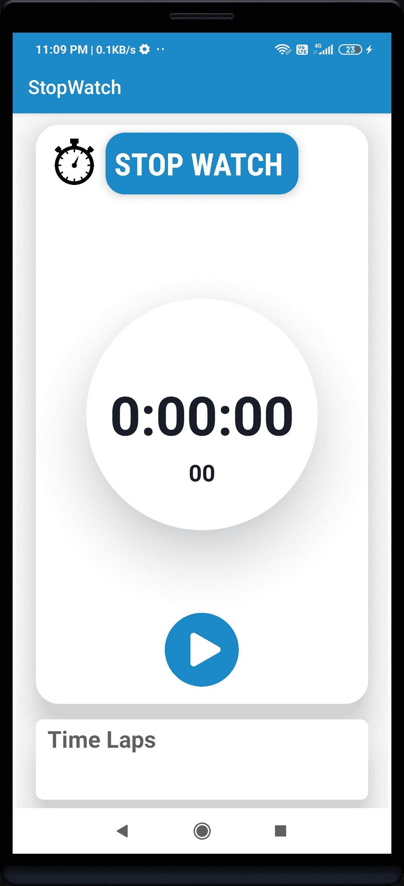

# 秒表安卓应用项目——第 1 部分

> 原文：<https://www.studytonight.com/android/stopwatch-android-app-project-part-1>

在本教程中，我们将一步一步制作一个简单的秒表安卓应用，并在教程中学习一些关于安卓应用开发的基本知识。本教程由 3 部分组成，如下所示:

**第 1 部分:**秒表安卓 App 项目设置

**第二部分:** [秒表安卓 App UI](https://www.studytonight.com/android/stopwatch-android-app-project-part-2)

**第 3 部分:** [秒表安卓应用-对功能进行编码](https://www.studytonight.com/android/stopwatch-android-app-project-part-3)

最终的应用如下所示:



## 秒表应用项目简介:

秒表是一个用来记录或测量时间的简单应用。主要有以下 4 个主要功能:

1.  **开始**:从开始或从暂停状态开始计时。

2.  **停止**:停止秒表时间，将时间归零。

3.  **暂停**:暂停秒表时间

4.  **圈速**:记录秒表计时的圈数(例如在比赛过程中我们可以使用圈速功能记录比赛中不同参与者的时长)

## 创建项目

1.  打开你的AndroidStudio点击“**开始一个新的AndroidStudio项目**”(学习[如何设置AndroidStudio](https://www.studytonight.com/android/setup-android-dev-env)[创建你的第一个安卓项目](https://www.studytonight.com/android/first-android-application))

2.  从项目模板窗口中选择**空活动**，点击**下一步**

3.  输入 **App 名称**、**包名**、**保存位置**、**语言**(**Java**/[T11】Kotlin 语言](https://www.studytonight.com/kotlin) ，本教程我们使用 **Java** )和**最小 SDK** (我们使用的是 API 19: Android 4.4 (KitKat))

4.  填写以上详细信息后，点击**完成**按钮

5.  现在等待项目完成建设。

## 添加所需文件

1.  为了使我们的应用的用户界面更具吸引力，我们将在我们的应用中添加 **CardView** 为此，我们必须在我们的应用中**实现****card view 库**，为此，请遵循以下步骤。

    转到**梯度脚本- >构建.梯度(模块:应用)**部分并导入下面的依赖项，然后单击顶部显示的“**立即同步**:

    ```
    dependencies {
        //Adding the card view library
        implementation 'androidx.cardview:cardview:1.0.0'
    }
    ```

    我们正在添加 cardview，以使我们的应用的用户界面更具吸引力，并给它一个专业的外观，我们还将在整个教程中了解更多关于 card view 及其属性的信息。

2.  现在，我们将添加秒表应用中所需的基本颜色，为此，我们遵循以下步骤转到**应用- > res - >值- > colors.xml** ，然后在 **colors.xml** 文件中添加以下颜色:

    ```
    <?xml version = "1.0" encoding = "utf-8"?>
    <resources>
        <color name = "colorPrimary">#1989C8</color>
        <color name = "colorPrimaryDark">#1989C8</color>
        <color name = "colorAccent">#FF0D3D</color>
        <color name = "textColor">#0B1A37</color>
        <color name = "white">#ffffff</color>
    </resources>
    ```

3.  接下来，我们将添加一些应用所需的图标和图像，只需下载以下图像并将其粘贴到 **app - > res - >可绘制**文件夹中

   

有了这个，我们都准备开始编写我们的秒表安卓应用的实际代码。在下一部分中，我们将为我们的秒表安卓应用创建完整的用户界面，然后开始工作。

* * *

* * *