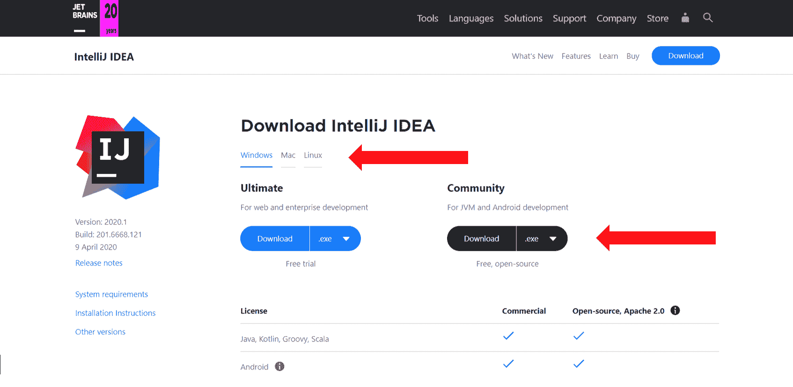
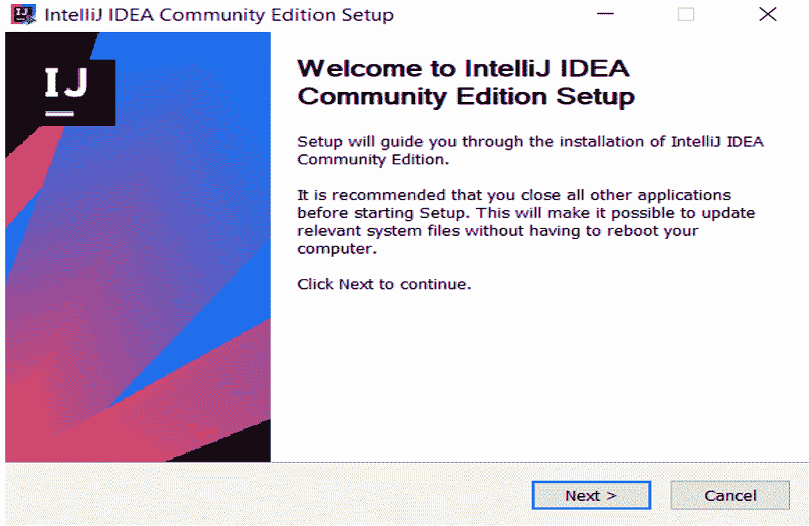
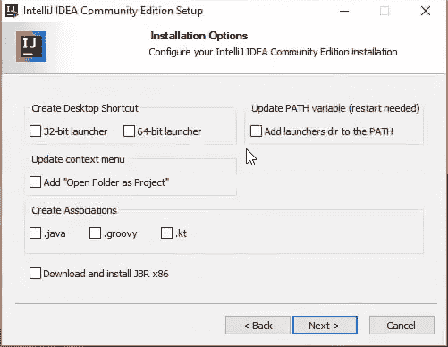
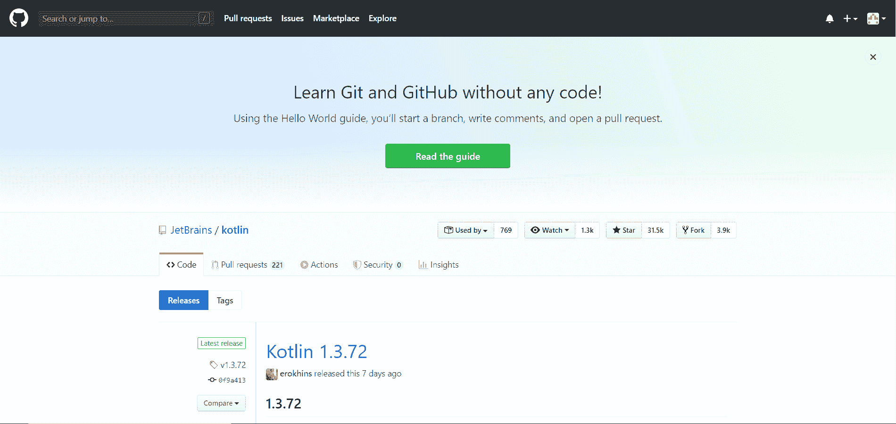
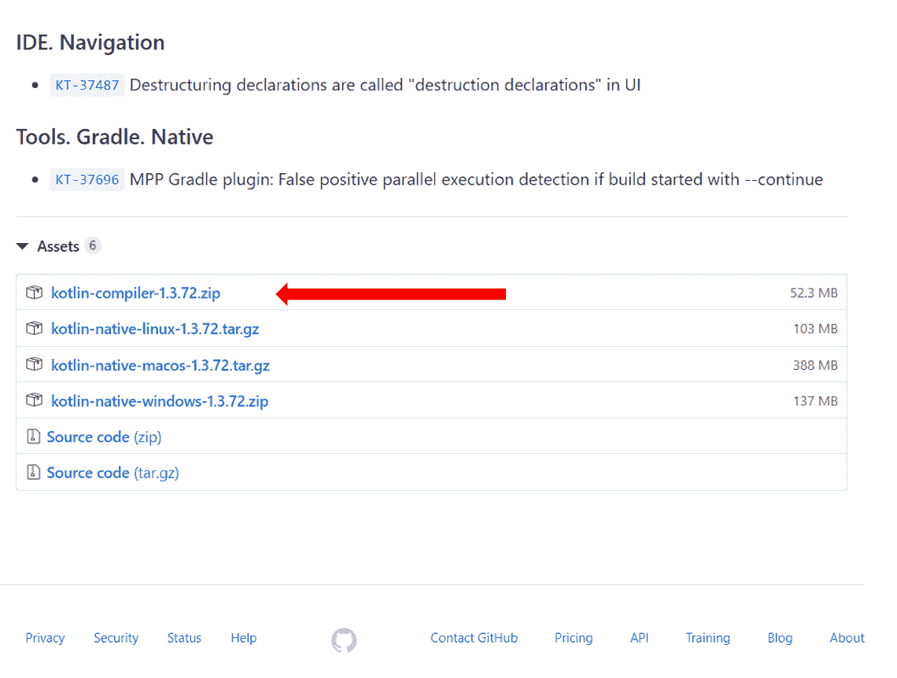
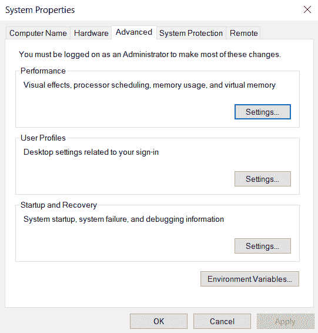
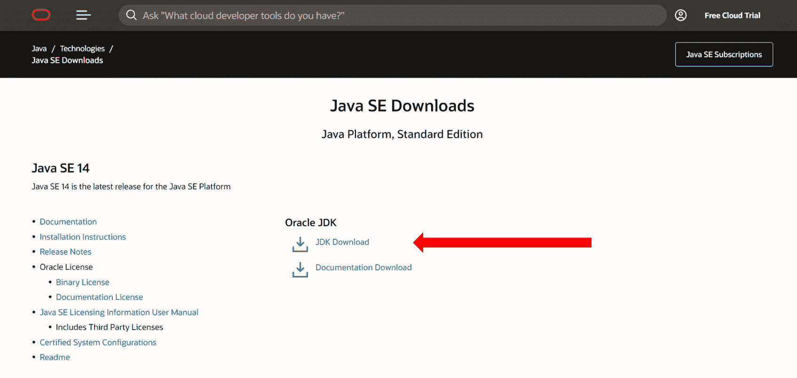
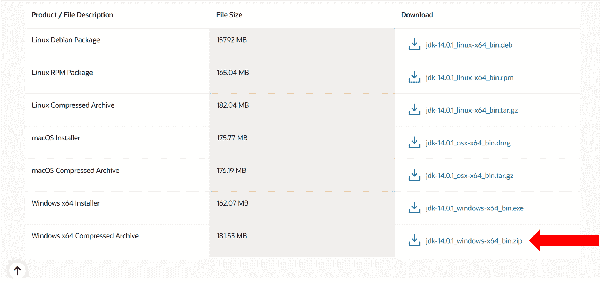
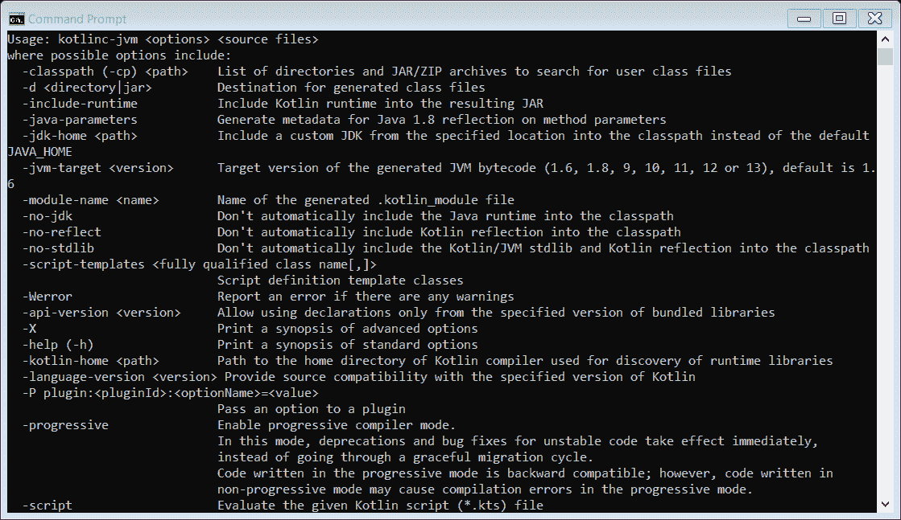

> 原文：<https://www.studytonight.com/kotlin/kotlin-environment-setup>

[← Prev](/kotlin/introduction-to-kotlin "Introduction to Kotlin")[Next →](/kotlin/first-program-in-kotlin-using-intellij-idea "Kotlin First Program")

# 科特林环境设置

在本教程中，我们将讨论如何在本地机器上设置 Kotlin 环境。您可以设置命令行工具来运行 Kotlin 程序，也可以安装 IntelliJ IDEA IDE(IDE)。

对于任何编程语言，最好使用IDE，因为它比简单的文本编辑器提供了更多的功能。对于 Kotlin 来说，最流行的 IDE 是 IntelliJ IDEA。IntelliJ IDEA 是由开发 Kotlin 的同一家公司 JetBrains 建立的。

## 安装 IntelliJ IDEA

要设置 IntelliJ IDEA，请执行以下步骤:

*   首先进入 [IntelliJ IDEA 的官方页面](https://www.jetbrains.com/idea/download/)。你会看到这样的东西:



*   现在，选择您的操作系统并下载社区版本，如上图所示。

*   运行下载的可执行文件。您将看到此屏幕:

    

    Click on **Next**.
*   再次点击下一步。如果你想安装在其他地方，选择目的地，然后点击下一步。

*   现在，将出现此窗口:

    

    According to your system, select 32-bit launcher or 64-bit launcher . Select all other options and click on next.
*   点击安装，IDE将成功安装。

您已经在系统中成功安装了 IntelliJ IDEA。如果你在 start 中搜索它，你就能看到它。

## 安装命令行编译器

如果您运行的是低配置系统(< = 1GB RAM)，或者仍然想使用文本编辑器和命令行工具来运行 Kotlin 代码，这里有一个如何安装和运行命令行工具的指南。要运行 Kotlin 程序，您需要系统中的 Kotlin 编译器和 Java 开发工具包(JDK)。

首先，我们将下载并设置 Kotlin 编译器:

*   第一步是下载 Kotlin 编译器。打开[这个](https://github.com/JetBrains/kotlin/releases/tag/v1.3.72) github 链接。你会看到这样的东西:

    

    向下滚动并从资产部分下载“kotlin-编译器-xx”，如下所示:

    

*   解压缩下载的文件。

*   在提取的文件夹中，导航到 kotlinc 文件夹中的 bin 文件夹并复制路径。大概会是这样的:“C:\ Users \ Deepak \ Downloads \ kot Lin-编译器-1.3.72\kotlinc\bin”。我们必须将这个路径设置为环境变量。

*   在开始菜单中，键入“编辑系统环境变量”并将其打开。

*   该窗口将被打开:

    

*   单击环境变量。

*   在“系统变量”中找到变量“路径”，双击它。将出现一个新窗口。现在，点击“新建”按钮。在这里粘贴 bin 文件夹的路径，点击 ok 按钮。

现在我们下载并安装 Java 开发工具包(JDK):

*   打开[这个](https://www.oracle.com/in/java/technologies/javase-downloads.html)链接下载 Java 开发工具包。你会看到一个类似这样的窗口:< =/p >

    

*   点击“JDK 下载”(用红色箭头标记)。将会打开一个新窗口。

*   根据您的操作系统向下滚动并下载合适的安装程序。对于 windows，请选择此选项:

    

*   解压缩下载的文件。

*   在提取的文件夹中，导航至**箱**文件夹并复制路径。大概会是这样的:“*C:\ Users \ Deepak \ Downloads \ JDK-14 . 0 . 1 _ windows-x64 _ bin \ JDK-14 . 0 . 1 \ bin*”。该路径也需要设置为环境变量。

*   按照相同的步骤将此路径设置为环境变量。

现在我们已经成功地设置了柯特林编译器。要检查是否一切正常，请打开命令提示符，并键入以下命令:

```
kotlinc -help
```

如果你观察到这样的东西:



然后一切都按预期运行。

### 摘要

您已经成功安装了编写 Kotlin 程序的环境。我们将在下一个教程中开发我们的第一个项目和第一个程序。

* * *

* * *