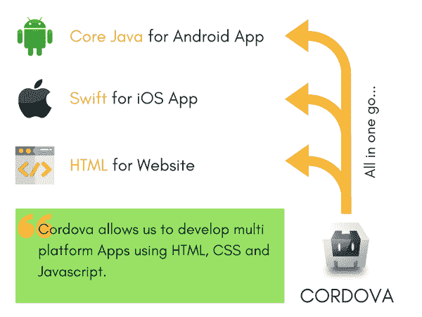
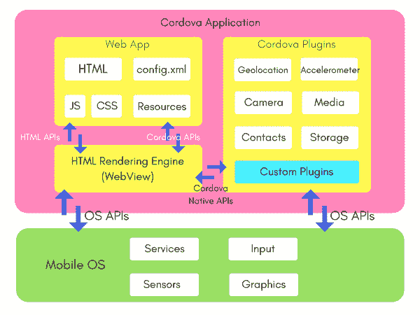

# Cordova：什么是Apache Cordova？

> 原文：<https://www.studytonight.com/apache-cordova/overview-of-apache-cordova>

*   它允许软件程序员用`HTML`、`CSS`和`Javascript`为移动设备(安卓、iOS、视窗、Ubuntu 操作系统等)构建应用。
*   最重要的是- **是开源的**。

这意味着，凭借良好的 HTML、CSS 和 Javascript 编码技巧，人们可以在 Cordova 的帮助下为大多数移动操作系统构建一个 App，而无需为各种平台学习不同的新编程语言。

以下是可以使用Cordova开发应用的平台:

*   机器人
*   ios
*   Windows 操作系统
*   黑莓
*   Firefox 操作系统
*   智能移动终端操作系统
*   蒂森
*   Web 操作系统
*   人的本质

* * *

## Cordova建筑

Cordova 为我们提供了可用于访问和激发原生移动操作系统功能的 API，如**地理定位**、**加速度计**、**摄像头**、**存储**、**通知**等。

**网络应用**不过是一个使用`HTML`创建的简单网页，用户界面使用`CSS`和`Javascript`、`jQuery`等样式。

Cordova，让我们创建一个应用，其中我们的网络应用在**网络视图(HTML 渲染引擎)**中初始化。

**Cordova插件**是可用于利用本机操作系统功能的组件。

* * *

### ApacheCordova的优势

以下是使用 Apache Cordova 开发应用的一些主要优势:

*   如果你选择原生应用，那么你将不得不为不同的操作系统学习不同的语言。比如:安卓的`Java`，iOS 的`Objective C`或者`Swift`，Windows 的`.NET`等等。但是使用 Apache Cordova，您可以一次构建多个平台的应用，而无需学习新的编程语言。
*   发展很快，因为在`HTML`、`CSS`、`Javascript`开发的一个应用可以很容易的转化成其他平台支持的应用。
*   最适合早期初创公司，因为产品可以同时在多个平台上推出。而且维护这个应用非常容易。
*   原型制作非常快。
*   由于设计涉及`CSS`，因此很容易产生优秀的设计，而没有 iOS、安卓等原生用户界面设计的麻烦。

**我们开始学习:**

* * *

* * *