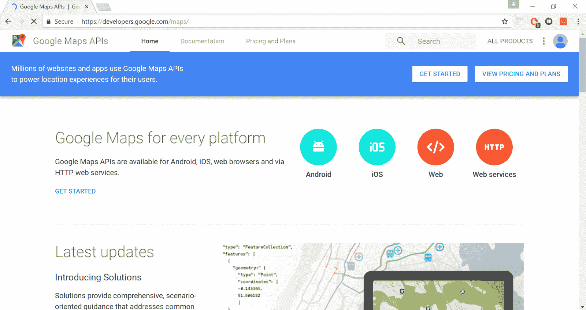
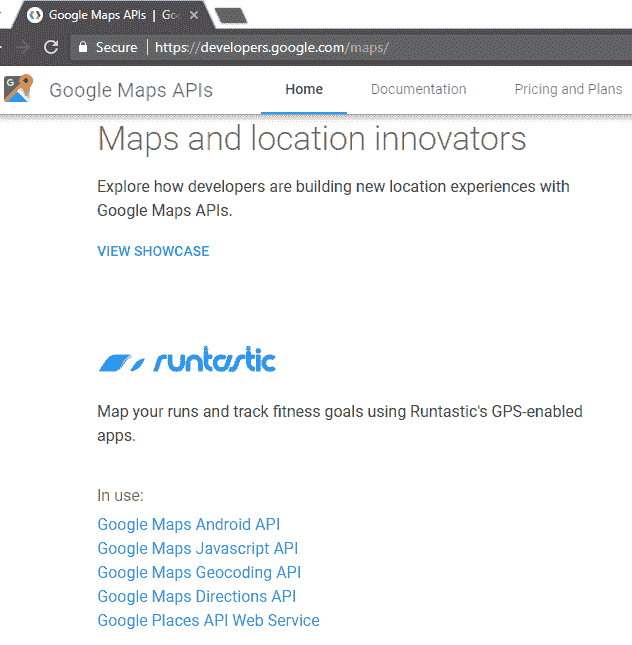
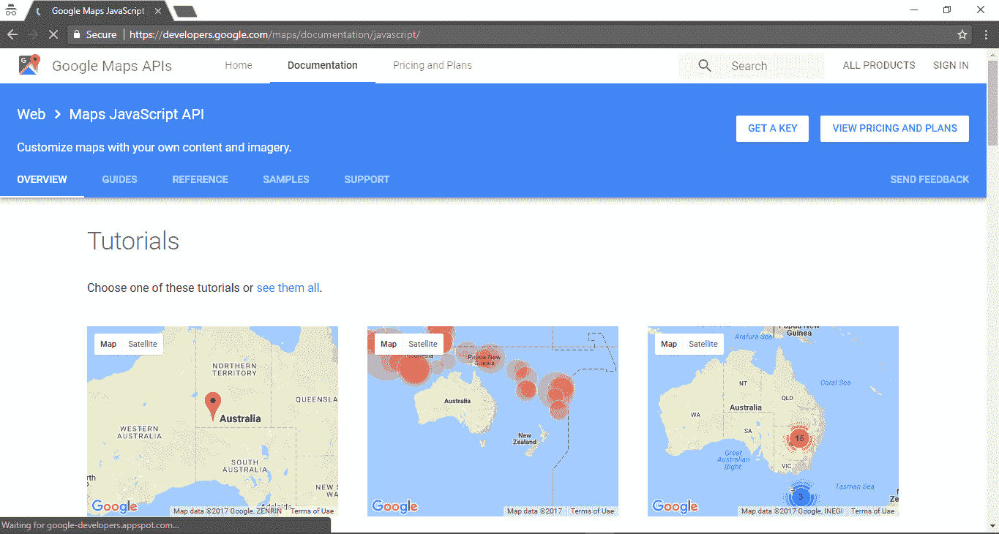
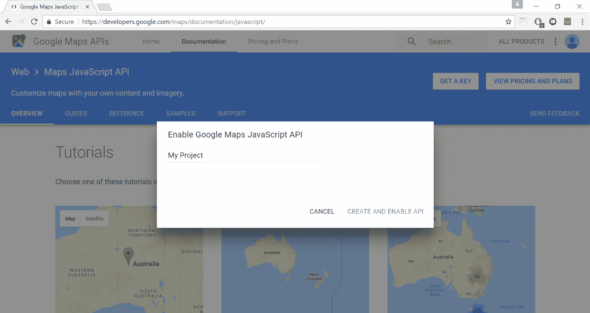
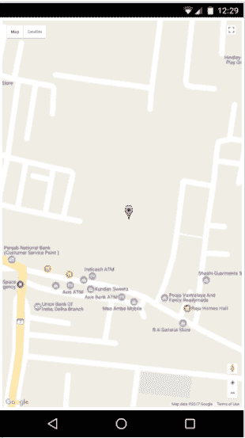

# 科尔多瓦:整合谷歌地图

> 原文：<https://www.studytonight.com/apache-cordova/integrating-google-map>

现在我们将创建另一个快速项目，其中我们将把谷歌地图集成到我们的安卓应用程序中。

1.  创建新项目。你知道怎么做，我们在上一课已经做了。
2.  Now go to Google's Developer Console → [https://developers.google.com/maps](https://developers.google.com/maps)

    

3.  向下滚动点击**谷歌地图 Javascript API**

    

4.  点击**获取一个键**。

    

5.  现在点击**创建项目**，然后命名您的项目并启用 API。

    

6.  把钥匙复制到夹板上。
7.  Now it's time for writing HTML, JS and CSS code.

    我们已经将 JS、CSS 和 HTML 代码集成在一个文件中。如果你愿意，你可以把这段代码分解成 3 个独立的文件。

    *<u>index.html</u>T3】*

    ```
    <html>
        <head>
            <style type="text/css">
            #map_area {
    	        position:fixed;
    	        height:100%;
    	        width:100%;
    	        top:0;
    	        left:0;
            }
            </style>
            <script type="text/javascript">
            function start() {
                var latlong = {lat: 24.801522, lng:84.995989};
                var map = new google.maps.Map(document.getElementById('map_area'), {
                zoom: 17,
                center: latlong
            });
                var marker = new google.maps.Marker({
                    position: latlong,
                    map: map
                });
            }
            </script>
        </head>
        <body>
            <div id="map_area"></div>
            <script src="https://maps.googleapis.com/maps/api/js?key=API_KEY&callback=start"><script>
        </body>
    </html>
    ```

8.  将上述代码放入您的`index.html`文件中，并将该文件放入 **www** 文件夹中。
9.  传递命令生成 **apk** 文件。
10.  Transfer this **apk** to your phone and test it.

    

* * *

* * *