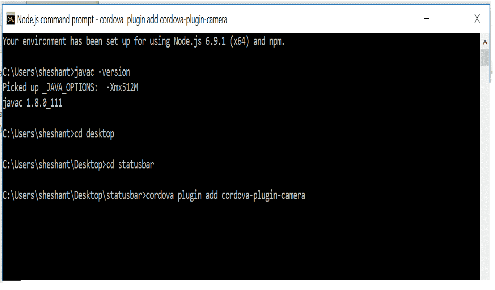
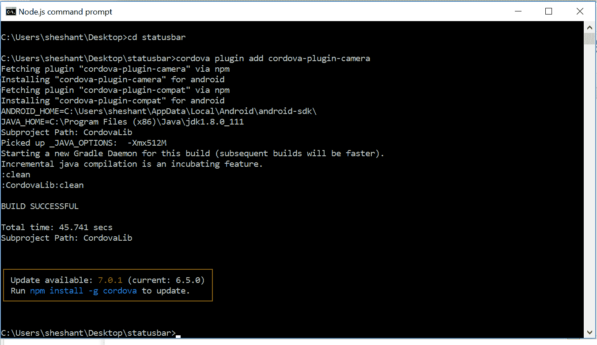

# 在你的应用中使用科尔多瓦插件

> 原文：<https://www.studytonight.com/apache-cordova/plugin-integration>

插件可以通过命令行集成到您的应用中。添加**平台**后，我们传递另一个命令给*集成插件*(可选)。

**例如:**

要添加**相机插件**，请键入`cordova plugin add cordova-plugin-camera`。



上面的命令会添加相机插件，现在你可以用函数来调用它。



* * *

### 科尔多瓦:使用地理定位插件

让我们创建一个应用，收集你的位置坐标，并显示在谷歌地图上。我们已经创建了一个与谷歌地图集成的应用，现在我们将创建另一个应用，它将在谷歌地图上显示您的设备的位置。

1.  创建项目。
2.  添加平台→安卓
3.  添加地理定位插件-键入`cordova plugin add cordova-plugin-geolcation`并按回车键。
4.  现在在您的*index.html*文件中编写以下代码，并将其放入项目文件夹中的 **www** 目录中。

    ```
    <html>
        <head>
        <style type="text/css">
            #map_area {
    	    position:fixed;
    	    height:100%;
    	    width:100%;
    	    top:0;
    	    left:0;
            }
        </style>
        <script type="text/javascript">
        function getLocation() {
            if (navigator.geolocation) {
        	    function showLocation(position) {
                    var latitude = position.coords.latitude;
                    var longitude = position.coords.longitude;
                }
                navigator.geolocation.getCurrentPosition(showPosition);
            } 
            else {
                alert('Not allowed by device');
            }
        }

        function showPosition(position) {
            var lat = (position.coords.latitude);
            var long = (position.coords.longitude);

            start(lat, long);
        }	

        function start(lat, long) {
            var latlong = {lat: lat, lng: long};
            var map = new google.maps.Map(document.getElementById('map_area'), {
              zoom: 15,
              center: latlong
            });
            var marker = new google.maps.Marker({
              position: latlong,
              map: map
            });
         }
        </script>
        </head>
        <body>
            <div id="*map_area*"></div>
            <script src="https://maps.googleapis.com/maps/api/js?key=*API_KEY*&callback=getLocation"><script>

        </body>
    </html>
    ```

    脚本加载成功后，会调用`geo Location`函数。此功能请求设备授予所需的权限。如果设备授予权限，会将经纬度传递给`start`功能。您的设备位置将显示在地图上。

* * *

* * *