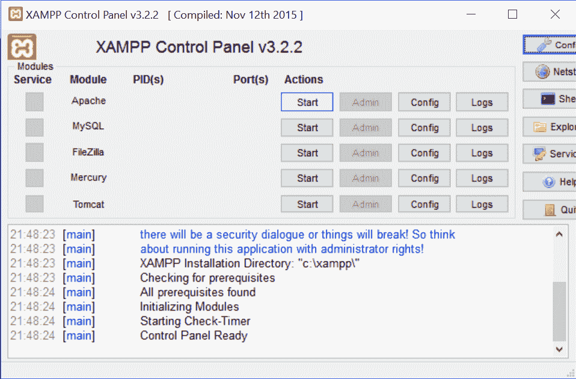
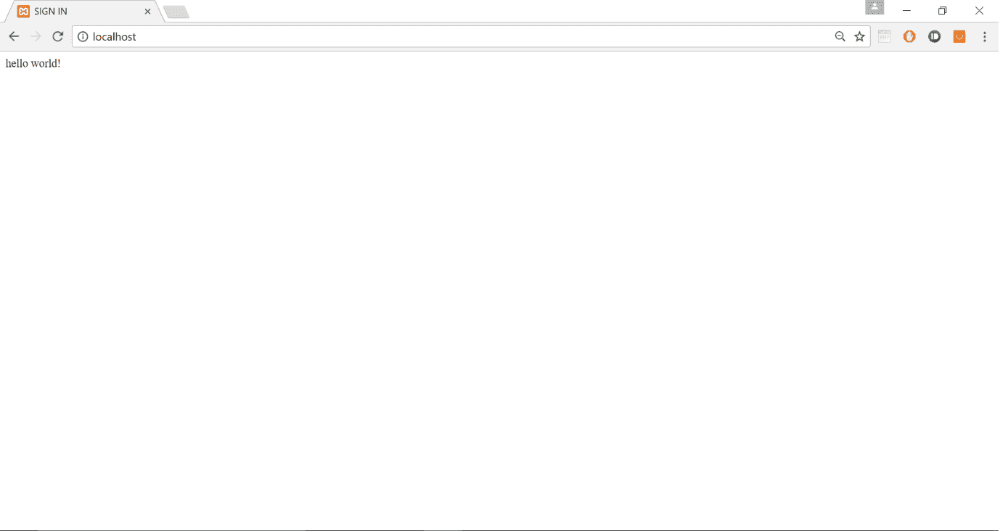
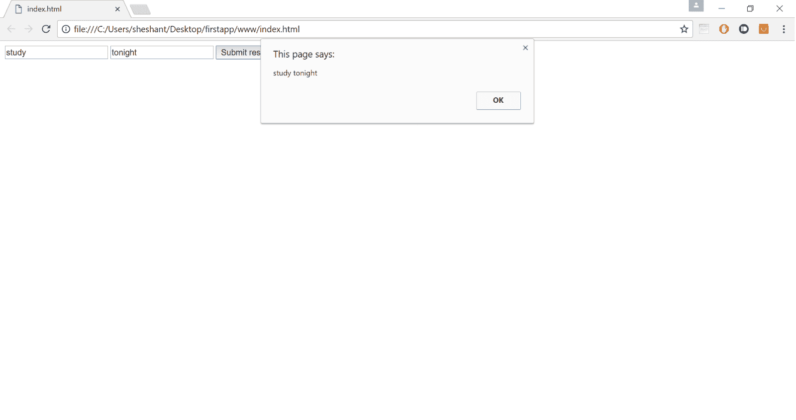
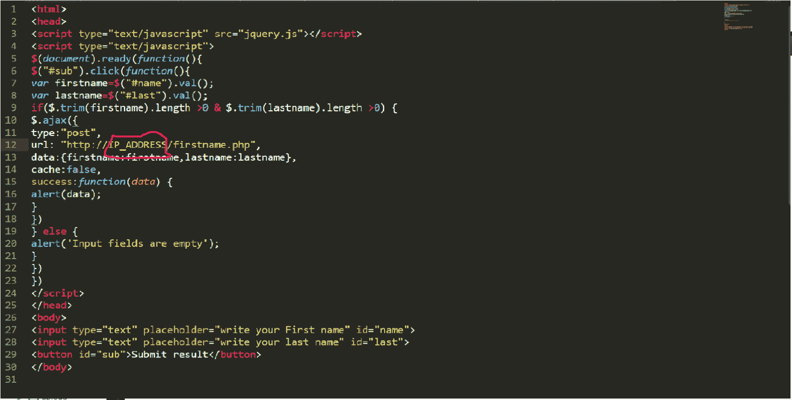
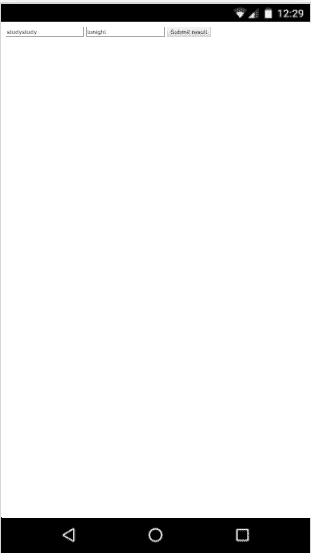
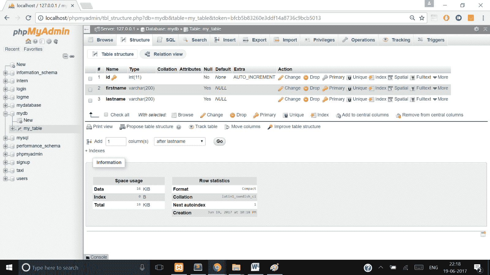
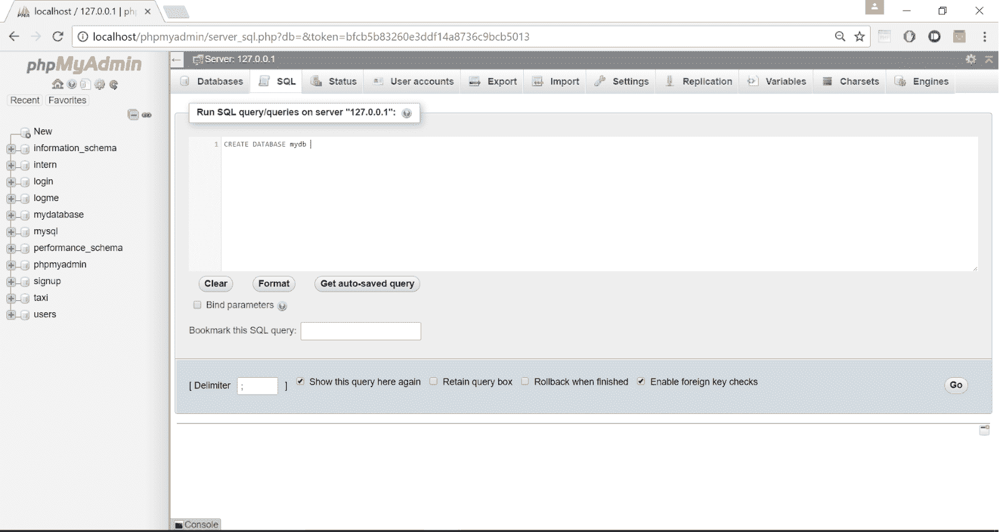
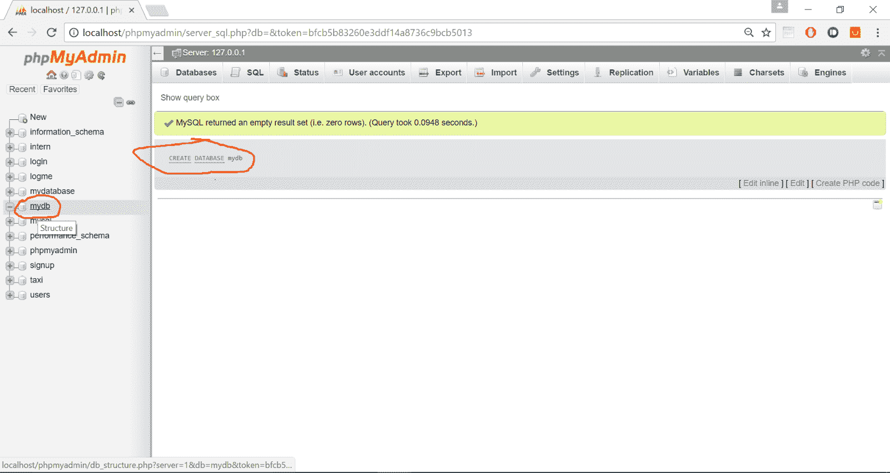
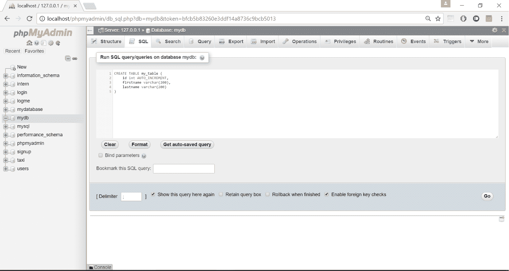
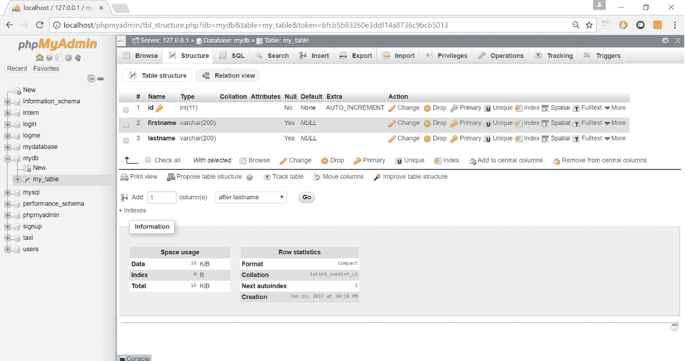

# 科尔多瓦:与后端的连接

> 原文：<https://www.studytonight.com/apache-cordova/connection-with-backened>

现在，我们将学习如何将基于 cordova 的应用与后端连接起来，以动态处理数据。

**后端语言** → PHP

**数据库** → MYSQL

你有没有想过，当你以某种登录形式输入你的用户名和密码时，会发生什么？它如何验证您的凭据？因此，让我们尝试理解并实现凭证验证。

当您输入用户名和密码时，客户端(大多数情况下是浏览器或应用)会将您的用户名、密码和一些头数据发送到服务器(比如基于 PHP 的服务器和基于 MySQL 的数据库)。在那里，Php 接收你的数据并采取相应的行动。执行一个 SQL 查询来获取数据，然后将数据与提交的用户名和密码进行比较。它通过同一个网关发回结果，然后客户端也根据收到的响应做出响应(比如，服务器响应是**参数不正确**，那么客户端会显示**用户名和密码不匹配。**消息)。

现在在本教程中，我们将创建一个与后端通信的应用。为此，我们需要**XAMPP**([https://www.apachefriends.org/index.html](https://www.apachefriends.org/index.html))申请。按照链接下载并安装 XAMPP。XAMPP 是一个本地服务器，运行 Apache、Php 和 MySQL，用于在本地机器上开发和测试网站和应用。它在你的笔记本电脑上本地复制一个 LAMP 网络服务器。

1.  安装完成后，打开 XAMPP 服务器，点击`Apache`、`MySQL`对应的`Start`。

    

    **注意:**服务器默认端口为 80。

2.  现在用 Php 编写一些代码，并把它放在 XAMPP 文件夹内的 **htdocs** 文件夹中。

    *index.php*

    ```
    <?php
        echo "hello world!;
    ?>
    ```

3.  打开浏览器，在地址栏输入: **http://localhost** 或 **http://127.0.0.1** ，应该会显示**你好世界！**在屏幕上。

    

    这意味着我们的 XAMPP 服务器正在成功运行。现在我们准备开发一个动态的手机应用。客户端脚本(HTML、CSS、Javascript 和 jQuery，就像之前的教程一样)。将`jquery.js`文件与`index.html`保存在一起(或两者放在同一个文件夹中)

4.  Here is the `index.html` file.

    ```
    <html>
        <head>
            <script type=”text/javascript” src=”*jquery.js*”></script>
            <script type=”text/javascript”>
                $(document).ready(function(){
                    $(“#sub”).click(function(){
                    var firstname = $(“#firstname”).val();
                    var lastname = $(“#lastname”).val();
                    if($.trim(firstname).length >0 & $.trim(lastname).length >0) {
                        $.ajax({
                            type:”POST”,  //Request type
                            url: “http://localhost/firstname.php”,   
                            data:{firstname:firstname, lastname:lastname},
                            cache:false,
                            success:function(data) {
                                alert(data);
                            }
                        })
                    } 
                    else {
                        alert(‘Input fields are empty’);
                    }
                })
            })
            </script>
        </head>
        <body>
            <input type=”text” placeholder=”write your first name” id=”firstname”>
            <input type=”text” placeholder=”write your last name” id=”lastname”>
            <button id=”sub”>Submit result</button>
        </body>
    </html> 
    ```

    和`firstname.php`

    ```
    <?php
        $firstname = $_POST[‘firstname’];
        $lastname = $_POST[‘lastname’];
        echo $firstname.”  “.$lastname;
    ?>
    ```

    现在把这个 PHP 文件和 HTML 文件放在 **htdocs** 文件夹中。确保您的 XAMPP 服务器正在运行。在浏览器中运行**index.html**，输入并检查输出。

    

* * *

### 科尔多瓦:将代码移植到安卓应用

现在我们将在手机上运行这个代码，所以首先用同一个**热点**连接你的笔记本电脑和手机(在其中你将测试你的应用)。一旦连接建立，打开笔记本电脑中的 **cmd** ，输入`ipconfig`并按回车键。它会显示 IP 地址，如果你的电脑连接了 WIFI 路由器，那么复制**无线局域网适配器 wifi** 的 IP，否则复制局域网 IP 地址。将【index.html】*中`$.ajax`功能内的`localhost` ( `url`属性)替换为该 IP 地址。*

 *

我们只需要 App 中的`index.html`文件，`firstname.php`文件将保留在 XAMPP 目录的 **htdocs** 文件夹中。

现在生成 **apk** 。将它复制到您的设备，并检查它是否工作。



万一它不工作，请确定您的服务器是否正在运行？两台设备是否连接到同一个 wifi 热点网络？如果连接到同一个 wifi 网络，请检查 IP 地址。接下来，我们将把用户的输入保存到 MySQL 数据库中。

为此，首先我们必须创建 MySQL 数据库。

1.  在浏览器中打开**http://localhost/phpmyadmin**。

2.  Click on SQL

    

3.  在文本区域键入以下命令，然后单击开始。

    ```
     CREATE DATABASE mydb;
    ```

    

    该命令将创建数据库 **mydb** ，如果它还不存在的话。

    

4.  现在打开 **mydb** 数据库，在边栏中点击它，然后再次点击 SQL。然后使用以下命令创建表格。

    ```
    CREATE TABLE my_table (
        id int AUTO_INCREMENT,
        firstname varchar(200),
        lastname varchar(200)
    )
    ```

    

    它将在 **mydb** 数据库中创建一个名为 **my_table** 的表。

    

5.  客户端代码，即`index.html`文件，将保持不变，但 Php 端代码将改变。

    **firstname.php**

    ```
    <?php
        /*
            localhost is the location where the server is located
            root is the global username of server
            ' ' this root has no password protection, hence empty
            my_db is db with which we want to connect
        */
        $con = mysqli_connect(‘localhost’,’root’,’’,’my_db) or die (‘unable to connect’);

        $firstname = $_POST[‘firstname’];
        $lastname = $_POST[‘lastname’];
        $sql = “INSERT INTO `my_table`(`firstname`,`lastname`) VALUES(‘$firstname’,’$lastname’);
        $result = mysqli_query($con,$sql);
        if($result) {
            echo $firstname.” “.$lastname;
        } 
        else {
            echo “unable to insert data”;
        }	
    ?>
    ```

    现在尝试一下或者刷新 phpmyadmin 页面，检查数据是否被插入。

* * *

* * **