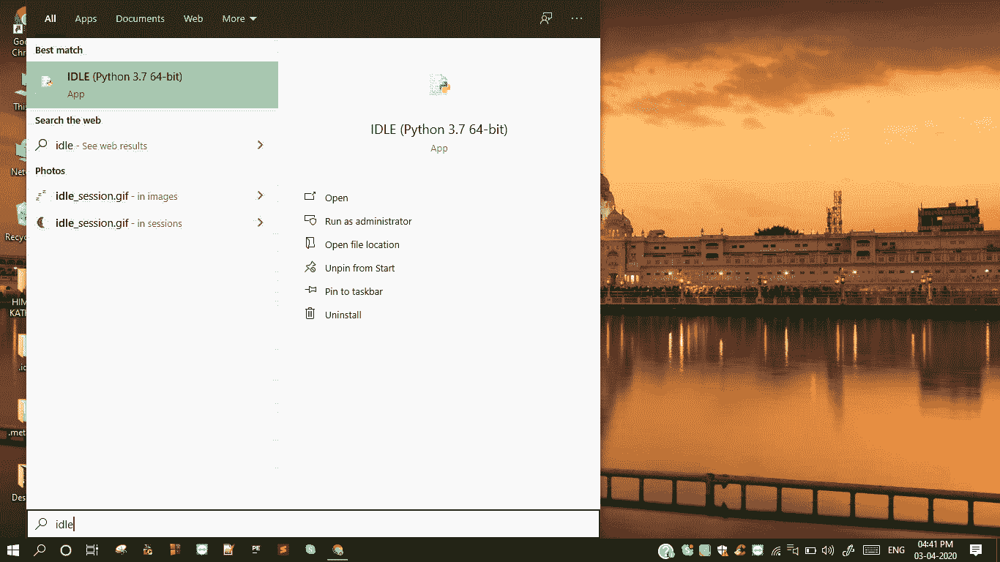
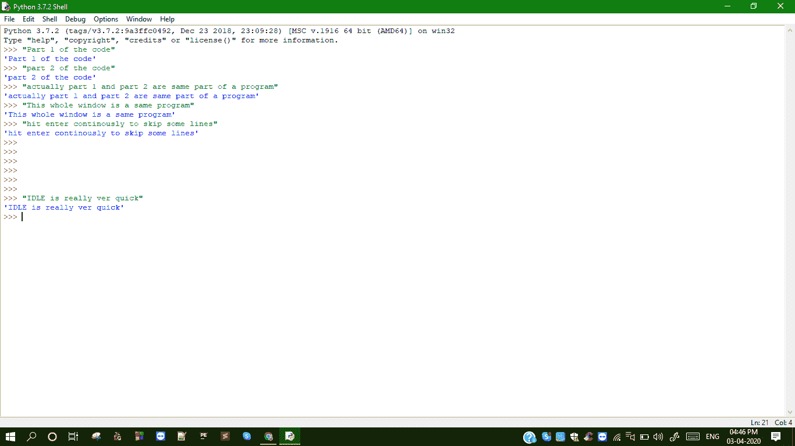
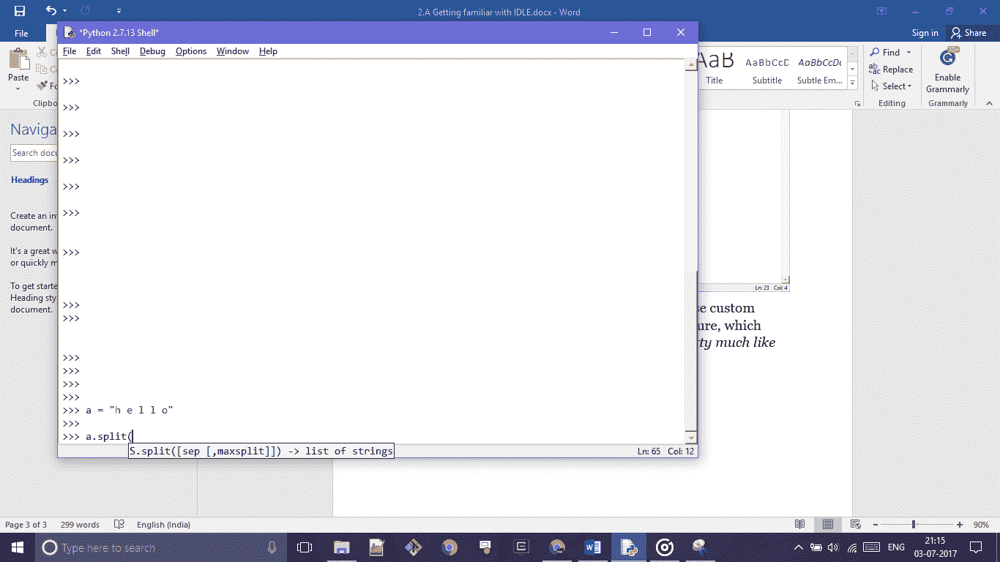

# 空闲默认 Python 集成开发环境简介

> 原文：<https://www.studytonight.com/python/introduction-to-idle>

在本节中，您将熟悉整个教程系列中用来运行 python 代码的开发环境。这可能是学习时编写和执行 python 代码的最佳环境。此外，因为它与 Python 编译器捆绑在一起，所以不需要额外的安装。因此，如果您已经按照上一个教程中给出的安装步骤进行了安装，那么您的系统可能已经处于空闲状态。

现在打开 IDLE 的时间到了，可以在 **Windows/Mac/Linux** 搜索栏输入 IDLE，应该会出现。

差不多就是这个样子。您可以看到光标在`>>>`之后闪烁。这是您将要编写代码的地方。此外，顶部还提到了 Python 的当前运行版本。

在 IDLE 中，我们一行一行地写代码。一条线可以处理一件事。您可以在该行中键入您想要的任何内容，然后按**进入**执行。IDLE 更像一个终端或命令提示符——你写一行，按 enter，它就执行了。

我们还可以创建 python 文件，其中包含完整的多行程序，也可以使用 IDLE 来执行它。python 脚本有一个扩展名`.py`。

Python 编译需要一些时间，它的编译速度并不快，从而将示例代码写在一个文件中，然后一遍又一遍地编译整个代码会变得繁琐，不适合初学者。当我们打开 IDLE 时，会创建一个会话，将您在该窗口中编写和执行的所有代码行保存为一个程序。这就是为什么，你上面写的可能会影响你以后写的，例如，使用一个变量。这是我们将如何在 IDLE 中打字的预览。

IDLE 以它自己的方式非常整洁。您可以为背景和文本选择自定义颜色，以赋予其自己的风格。有一个*自动完成功能*，它可以预测你正在输入的内容并给出建议(很像谷歌搜索)。

最重要的是，它适用于所有主要的操作系统！

* * *

* * *