# Python 数字和内置数学函数

> 原文：<https://www.studytonight.com/python/numbers-and-math-functions>

在本节中，我们将学习数字和 python 语言中可用的各种数学函数。在 Numbers 中，我们将看到一些最常用的数学运算符，我们可以使用它们在 python 中对数字执行各种操作。在数学函数部分，我们将学习一些快捷方式(称为**函数**，它们对计算一些复杂的数学表达式非常有帮助，如*幂*、*正弦/余弦*、*阶乘*等。那么，让我们开始吧。我们建议在阅读时保持IDLE，这样你就可以同时练习和学习。

* * *

## 民数记

在 Python 中，我们有 6 个基本的**数学运算符**，它们是:

1.  添加
2.  减法
3.  增加
4.  分开
5.  以…为模
6.  力量

除了**模**运算符外，大部分人都必须熟悉以上所有运算符。别担心，我们会解释的。让我们从头开始。

* * *

### 添加

正如你可能已经猜到的，这只是简单的数字相加。为了测试操作员，只需转到 IDLE 并输入一个数字，然后加上符号`+`，然后另一个数字加到第一个数字上。按**进入**。这一定是这样的。

**例:**以 8、19 为例，

```py
>>> 8+19
27
```

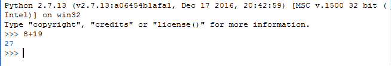

按下**返回**(或*输入*，答案将出现在代码行正下方。这就是输出的显示方式，一直都是- *在你的代码行*的正下方。当您按回车键时，输出将出现在下面的行中。

不要止步于这个例子，尝试对其他数字使用加法运算符。试试带小数位的数字，比如`4.5 + 5.5`等等。

* * *

### 减法

就像加法一样，减法也有同样的语法。只需将操作符改为`-`。再次，选择一些随机数并尝试。

**例:**我们取`89.33``23.67`，给出输出`65.55`。

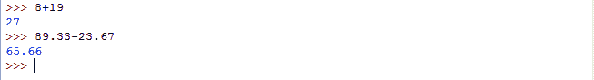

* * *

### 增加

又一样！只需将操作符更改为`*`，也称为一个**星号**。你知道它是用来乘法的，对吧？去吧，在你的IDLE中试试。

**示例:**取任意两个数字，使用`*`运算符相乘，就像我们在下面做的那样。

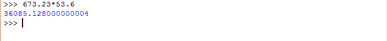

* * *

### 分开

这次用`/`符号。用随机数试试。**注意:**如果你是初学者，你可能会在这本书中发现一些困难。怎么做？让我想想。我们取一些像`16``2`这样的整数(没有小数的数)来除。

```py
>>> 16/2
8
```

很好。接下来，用`15`和`2`试试。你认为答案会是什么？嗯，根据适当的数学，答案显然应该是`7.5`，但是如果你真的在 IDLE 中尝试这个，答案将会是`7`。之所以会这样，是因为如果我们对一个整数进行任何数学运算，那么答案将是一个整数。在我们的例子中，`15`和`2`都是整数，因此，我们的答案是`7`，因为答案必须是整数。

你可能想知道它是否必须是一个整数，为什么它变成了`7`，为什么不是任何其他整数。这是因为答案被确定为与原始答案最接近的较小整数。在我们的情况下，原来的答案是`7.5`，因此与它最接近的整数是 7 和 8，既然我们必须选择较小的一个；选择 7 作为答案。在数学中，它也被称为`floor`函数(在 Python 中也有)。

现在讲上面问题的解决方法，你要做的就是把(你要除的)任意一个整数转换成十进制，即写`15.0`而不是 15 和/或`2.0`而不是 2。

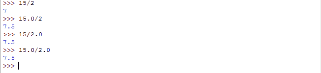

* * *

### 力量

这种数学运算符通常在普通编程语言中找不到。事实上，Python 是我们知道的唯一一种对此有操作符的语言。在其余的语言中，他们使用一些预定义的函数(如我们前面提到的快捷方式)来计算这一点。言归正传，在任意两个数字之间放两个类似`**`的星号即可。例如，要计算`2`到`10`的功率，你必须写:

```py
>>> 2**10
1024
```

至此，我们已经了解了 python 中所有常用的数学运算符。现在，您可以尝试组合多个运算符，并使用它们来形成一个表达式。我们会推荐使用**括号**让 python 能够理解你想要什么作为答案，即不写`2-9.0/2`，写`2-(9.0/2)`。还记得 **BODMAS** 吗，一个有多个算子的数学表达式是如何在数学中求解的。

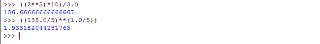

* * *

### 以…为模

模运算符由`%`百分比符号表示。如果你熟悉计算机编程世界，很可能你已经知道这个函数了。如果你没有，没必要担心。你知道组织，对吧？那你知道什么是**余数**了吧？当与两个**操作数**一起使用时，该模运算符返回**余数**作为答案。这里有一些快速的例子。

`12%2 = 0`，既然 2 完美地除了 12。

`13%2 = 1`，因为用 2 除 13 剩下 1 作为余数。

`19%5 = 4`，因为`19/5`还剩下 4 作为余数。

它的使用方式和这里解释的差不多。

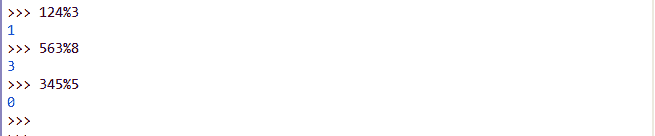

要查看上面介绍的所有数学运算符，请点击“实时示例”按钮，

[现场示例→](/code/python/using-math-operators.php)

数字部分到此结束。现在让我们深入研究数学的函数。

* * *

## Python 中的数学函数

随着您对 python 的了解越来越多，您可能会决定为某个项目或任何事情创建一个科学计算器。为此，除了简单的数学运算，你还必须评估一些复杂的数学运算，如三角运算、对数运算等。忘了计算器吧，可能会有各种情况需要这些功能。就像土木工程师计算他们正在建造的任何结构的各种参数的软件，或者任何航空航天软件——他们需要各种关于卫星轨迹、航天飞机轨迹等等的计算。简而言之，复杂的数学运算被用于各种现实生活的程序和软件中，因此你必须了解它们。

现在在 Python 中，一些好人已经为几乎每一个数学函数创建了代码片段(库)。我们可以毫不犹豫地使用这些代码，好处是，我们不必再次重写。忘记重写，我们甚至不需要知道完整的代码是什么。我们只需要一些关键信息就能使用这些现成的代码片段。

好吧，非正式的功能部分已经开始了。我们将在后面的章节中详细学习函数，因此我们将保持这个简短。

> **函数**可以描述为一段代码，它可能会也可能不会将某个值作为输入，对其进行处理，最后可能会也可能不会返回任何值作为输出。

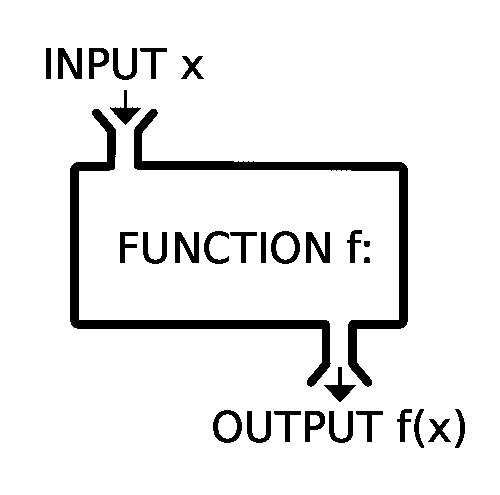

如上图所示，这里的输入`x`被赋予一个函数`f`，它给出了一些值`f(x)`作为输出。虽然在一般的编程世界中，根据函数的用途，输入和输出是完全可选的。但是对于一个数学函数来说，两者兼备是非常重要的。

例如，在三角函数`sin(x)`中，必须有一些`x`的值来计算和返回答案，这基本上确定了为什么数学函数既有**输入**又有**输出**。

在 python 中，有两种类型的预定义函数。

*   **内置函数**:这些函数不需要任何其他(外部)代码文件(称为，**模块**或**库文件**)。这些是 python 核心的一部分，只是构建在 Python 编译器中，因此在我们的代码中导入这些模块/库没有任何麻烦。
*   第二类函数需要一些外部文件(模块)才能使用。在我们的代码中使用这些外部文件的过程叫做**导入**。所以我们所要做的就是将文件导入到我们的代码中，并使用已经写在该文件中的函数。

是时候尝试一些功能了。让我们从幂函数开始。

* * *

### 电源- `pow(x,y)`

我知道你可能在想什么。我们刚刚试过了，不是吗？嗯，我们确实看到了一些可以计算功率的东西，但是它是一个**运算符**，这个是一个内置函数(是的，第一种类型)。所以，考虑一下这个作为计算功率的替代方法。

由于这是一个内置函数，您不需要导入任何其他库文件(或**模块**，因此它非常容易实现。

由于幂函数需要两个数字(输入)来执行运算，即**基数**和**指数**，因此我们必须为函数提供两个数字。继续，打开IDLE并写下:

```py
>>> pow(3,2)
```

现在让我们分析一下我们做了什么，以及将会发生什么。首先，我们写了`pow`，这只是我们试图调用的函数的名称。这将告诉 python 编译器寻找一个名为`pow`的内置函数，并发现它能做什么。接下来，在括号内，我们写了两个用逗号分隔的数字，即`3`和`2`。这里第一个数字 *3 是基数*，第二个数字 *2 是指数*，我们尝试计算 3 <sup>2</sup> 。

一旦 python 编译器确保所有语法(编程的语法)都是正确的，它就会寻找函数`pow`的实现，并使用它来寻找`3<sup>2</sup>`。如您所料，输出将是:

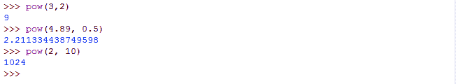

有了这些，我们现在知道了，函数是如何被调用的。特别是对于数学函数，我们可以概括如下:

```py
>>> functionName(input1, optionalInput2, optionalInput3, ...)
```

括号内用逗号分隔的值，我们在函数输入中提到过，叫做**参数**。与上面给出的`pow(x, y)`例子一样，3 和 2 是参数。一个函数中可以有任意数量的参数。正如我们之前讨论的，对于一个数学函数，通常至少有一个参数。让我们看看另一个内置的数学函数。

* * *

### 绝对- `abs(x)`

绝对函数，也称为**模**(不要与**模**混淆)，返回自变量值的**非负**值。因此，任何非负数的绝对值都是相同的，而对于负数，则返回它们的正值。

**例:**绝对值`-3`为`3`，`-8.74`绝对值为`8.74`以此类推。

**语法:**

```py
>>> abs(-99.99)
```

由于`-99.99`是负数，它的正数对应的将是输出，即`99.99`。

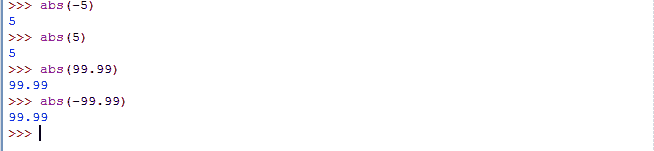

现在让我们尝试一些函数，在那里我们必须导入一些模块(或库文件)。

* * *

### 其 - `sin(x)`

由于我们知道**正弦**是一个三角函数，因此它只接受一个值作为参数，即`x`。这里的 x 应该在**弧度**，所以最好不要和**度**混淆。正如我们之前提到的，我们不能直接使用这个函数。如果你这样做，你可能会得到一个错误，类似这样的东西，它会说**名罪未定义**。

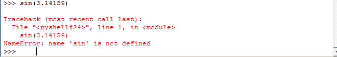

这是因为编译器在遇到`sin()`函数时不知道它应该做什么，因为我们还没有定义这个函数，但是我们正在尝试使用它。因此，为了使用它，我们将不得不导入 python 的**数学模块**，该模块由`sin()`函数的实现组成，它将指导 python 编译器理解当调用`sin()`时该做什么。

我们将要做的叫做**导入一个模块**，通常使用已经可用的**现成功能**来完成。导入模块只需多一行:

```py
>>> import math
```

按回车，你就完成了。现在为了使用`sin()`功能，转到一个新行并键入:

```py
>>> math.sin(3.14159)
```

由于`3.14159`近似为`π`的值，因此答案将接近于零。

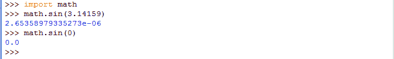

正如您在`math.sin(3.14159)`声明后看到的，返回的答案类似于`2.653589335273e-6`，可能看起来有点混乱，但它是`2.653589335273 × 10^-6`或`0.000002653589335273`的等效表示。

因为`π`值的近似，答案也只是稍微偏离了 0，但是你可以看到这个值几乎为零。同时，你可以看到结果有多准确。

现在数学模块里面当然还有其他几个功能可用，比如`floor()`(地板功能；我们在除法运算符、`exp()`(指数函数)、`log()`(对数函数)、`sqrt()`(平方根)等等中提到了这个。你可以在 Python 的官方网站上查看这个列表、它们的语法、接受的参数数量以及所有内容- [数学函数](https://docs.python.org/2/library/math.html)。Python 在他们的网站上有一个手册，在那里你可以看到列出的所有功能和所有细节。本手册称为**文件**。

* * *

* * *